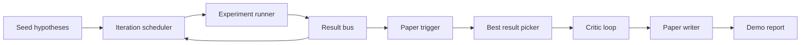
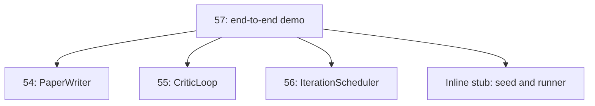
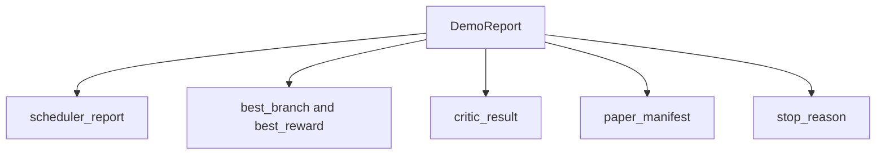

# 端到端研究演示

> 演示是将前面所写的每一个契约组合起来的地方。如果任何一个有漏洞，演示就是抓住它的课程。

**类型:** 构建
**语言:** Python
**前置条件:** 第19阶段第50-53课
**时间:** ~90分钟

## 学习目标

- 将自动研究循环端到端连接起来：假设种子、实验运行器、调度器、评论循环、论文撰写器。
- 通过纯Python导入（而非框架）组合前面Track D四节课中的原语。
- 运行循环直到自终止，并发出一个列出每个阶段输出的单一演示报告。
- 保持演示确定性，以便测试套件可以断言最终形状。
- 当任何阶段的契约被破坏时，暴露清晰的失败模式，使下一个阶段不会用损坏的输入运行。

## 这里组合了什么



五个阶段。种子是一个包含三个假设的列表。调度器通过三个并行槽运行六个实验。总线报告一个或多个论文触发器。选择器选择单一最佳结果。评论循环基于该结果迭代草稿。论文撰写器发出最终的LaTeX、BibTeX和清单。

## 为什么导入而不是复制

每节早期课程都提供带有公共数据类和函数的`main.py`。演示通过将`sys.path`调整到每节课程父目录来导入它们。这不是框架连接；它与早期课程测试文件已经使用的导入相同。



内联存根代替了第五十到第五十三课：一个小的假设种子生成器和同步奖励函数。用户可以通过调整两个导入，将内联存根替换为这些课程的真实原语。

## 确定性保证

演示是构造确定性的。实验运行器使用带种子的numpy。评论循环的修订器按固定顺序遍历固定维度。论文撰写器的散文生成器是第五十四课的模拟版本。调度器的UCB选择器按迭代顺序打破平局，而非随机选择。

给定相同种子，演示发出相同报告。测试通过运行演示两次并比较清单来断言此属性。

## 演示报告形状



每个字段直接来自上游阶段。演示不转换任何输出；它只是组合它们。这就是演示所要测试的。

## 失败模式处理

每个阶段要么成功要么引发类型化错误。

```text
Scheduler ........ returns SchedulerReport with stop_reason
                   in {queue_empty, max_experiments, deadline}
Best-result pick . raises NoTriggerError if no paper trigger fired
Critic loop ...... returns LoopResult with status converged or stopped
Paper writer ..... raises PaperValidationError on contract break
```

任何阶段的失败都会通过类型化异常短路演示。测试固定了此契约：`test_no_triggers_raises_typed_error`和`test_best_picker_raises_when_no_triggers`断言当没有分支触发时选择器会引发`NoTriggerError`/`BestResultError`，且撰写器永远不会被调用。

## 最佳结果选择器

调度器为每个分支发出论文触发器。选择器选择所有触发器中平均奖励最高的分支。平局按分支ID字母顺序打破，以确保演示确定性。选择器是一个小型纯函数；测试在固定调度器报告上固定它。

## 连接评论循环

第五十五课的评论循环在`MiniPaper`上操作。演示通过填充摘要（使用分支ID）、播种两个部分（引言和结果）以及从分支的平均奖励设置`originality_tag`（如果`>= 0.8`则为高，如果`>= 0.6`则为中，否则为低），从选中分支构建`MiniPaper`。

然后修订器迭代草稿至收敛。输出送入论文撰写器。

## 连接论文撰写器

第五十四课的论文撰写器在完整的`Paper`形状（包含图表和参考文献）上操作。演示通过`mini_to_full_paper`升级收敛后的`MiniPaper`，该函数为选中分支附加一个图表，并根据评论建议的引用键的并集构建一个小型合成参考文献。演示添加的每个引用也会添加到参考文献列表中，以便验证通过。

## 如何阅读代码

`code/main.py`定义了`BestResultError`、`NoTriggerError`、`DemoReport`、`pick_best_branch`、`build_mini_paper`、`mini_to_full_paper`和`run_demo`。顶部的导入调整`sys.path`一次，并从它们的课程中拉取`PaperWriter`、`CriticLoop`和`IterationScheduler`。

`code/tests/test_e2e.py`涵盖：演示端到端运行并发出包含所有五个字段的报告、两次运行间的确定性、当没有分支超过阈值时触发NoTriggerError、当撰写器契约被破坏时触发PaperValidationError、论文清单包含选中分支的图表、调度器停止原因属于预期值之一。

## 进一步探索

一旦演示通过，有三个值得连接的扩展。第一，持久状态：每个阶段的结果写入小型JSON存储，以便重启可以继续而不重新运行廉价阶段。第二，仪表盘：来自调度器和评论循环的跟踪事件呈现为单一时间线。第三，真实模型调用：将模拟的散文生成器和确定性评论循环替换为模型驱动版本；连接方式不变。

演示的工作是证明组合即架构。五节课，四个导入，一份报告。下次你添加阶段时，连接恰好增加一行。
