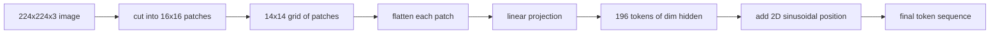

# 视觉编码器补丁

> 一个读取像素的视觉模型需要一个针对像素的Tokenizer（分词器）。Patch Embedding（块嵌入）就是那个Tokenizer。将图像切割成正方形网格，将每个正方形展平，通过一个线性层进行投影，然后添加一个2D位置信号，以便Transformer知道每个方块在原图中的位置。

**类型：** 构建
**语言：** Python
**前置要求：** 阶段19 第30-37课（Track B 基础）
**时间：** ~90分钟

## 学习目标

- 将图像Token化（分词）为固定长度的Patch Embedding（块嵌入）序列。
- 实现一个基于`Conv2d`的Patch Projection（块投影），其数学原理与unfold-then-linear（展开后线性变换）一致。
- 构建一个确定性的2D正弦位置嵌入，使得Token顺序编码空间位置。
- 在合成夹具上验证Patch数量、嵌入形状以及`Conv2d`/unfold的等效性。

## 问题

Transformer处理的是向量序列。图像是一个3通道的网格。将每个像素视为一个Token会导致序列长度爆炸：224x224的RGB图像有150,528个Token，12层Transformer在注意力机制中无法承受。将图像作为一个巨大的扁平向量则会丢弃局部性，而注意力层无法恢复。编码器前端的工作是将像素网格压缩成几百个Token，每个Token总结一个正方形区域。

Patch Embedding通过一次线性投影解决了这个问题。将224x224图像切成16x16的Patch得到14x14共196个Patch。每个Patch从`(3, 16, 16) = 768`个像素值展平为一个向量，然后线性层将其映射到模型的隐藏维度。Transformer看到196个维度为`hidden`（通常为768）的Token，加上一个CLS Token。这是一个网络其余部分可以处理的序列。

## 核心概念



### 为什么是Patch而不是像素

注意力的计算量随序列长度呈二次增长。196个Token的序列每层每个头需要`196 * 196 = 38,416`个注意力分数；150,528个Token的序列则需要`150,528 * 150,528 = 22.6 billion`个。Patch带来了590,000倍的注意力计算量减少，而单个16x16区域承载了足够的高级视觉任务信号。代价是丢失了一个Patch内部的精细空间细节，这就是为什么当下游多模态堆栈需要精确定位时，通常会运行第二个高分辨率分支。

### 为什么线性投影就足够了

每个Patch被视为一个独立的向量。投影学习一个基：边缘检测器、颜色滤波器、简单纹理。一个单一的线性层很小（对于ViT-Base有`768 * 768 = 589,824`个参数），且训练速度快。虽然存在更深的卷积茎（“混合”ViT），但扁平线性投影是标准做法，大多数现代开源权重编码器都采用这种精确形状。

### `Conv2d`技巧

一个无填充的`Conv2d(in_channels=3, out_channels=hidden, kernel_size=patch_size, stride=patch_size)`在数值上得到与unfold-then-linear相同的结果，因为每个输出位置将Patch像素与一个滤波器进行点积。这个卷积就是Patch投影，大多数生产代码库都以这种方式实现，因为它GPU上更快，并且少一次reshape操作。

### 位置嵌入

Token在投影后不携带顺序信息。2D正弦嵌入为每个Token提供一个固定信号，编码其`(row, col)`位置。嵌入维度的一半用多频率的sin/cos编码行位置；另一半编码列位置。该编码是确定性的，因此可以在不重新训练的情况下切换分辨率，并且对模型在训练时从未见过的网格也能干净地插值。

|  组件  |  形状  |  参数数量  |
|-----------|-------|------------|
|  Patch投影（`Conv2d`）  |  `(hidden, 3, patch, patch)`  |  `3 * P * P * hidden + hidden`  |
|  位置嵌入（固定）  |  `(num_patches, hidden)`  |  0（计算得到，非学习） |
|  CLS Token（学习得到）  |  `(1, hidden)`  |  `hidden`  |

对于224分辨率下的ViT-Base/16：投影中有590,592个参数，CLS Token中有768个参数，正弦位置参数为零。下一课（第59课）将在这个前端之上堆叠一个12层Transformer。

### 等效性作为健全性检查

Patch步骤有两种实现方式：`Conv2d`投影和显式的unfold-then-linear。对于相同的权重，它们必须产生相同的输出。如果不相等，则unfold数学计算是错误的，编码器的其余部分就建立在沙子上。本课的测试验证了这种等效性。

## 动手构建

`code/main.py` 实现：

- `PatchEmbed`，一个封装了`Conv2d`的`nn.Module`，用于Patch投影。
- `PatchEmbed`，一个构建2D位置表的无状态函数。
- `PatchEmbed`，将Patch嵌入、CLS前置和位置相加组合为一次前向传播。
- 一个`PatchEmbed`辅助函数，从`nn.Module`构建确定性的224x224x3夹具。
- 一个演示程序，将一个夹具图像通过前端，打印输出形状、CLS Token范数以及一行位置嵌入。

运行它：

```bash
python3 code/main.py
```

输出：224x224夹具被Token化（分词）为形状为`(1, 197, 768)`的序列。第一个Token是CLS；接下来196个是Patch Token。位置嵌入范数在行内是均匀的，这是正弦签名的特征。

## 使用它

相同的Patch前端出现在每个现代视觉-语言模型中：CLIP ViT-L/14、SigLIP、DINOv2、Qwen-VL系列和InternVL堆栈都从一个`Conv2d` Patch投影加上位置信号开始。不同家族之间的差异存在于下游（CLS与无CLS池化、寄存器Token、不同的Patch大小14 vs 16、通过插值位置实现的动态分辨率）。本课的前端是所有这些模型所基于的基础。

## 测试

`code/test_main.py`涵盖了：

- Patch数量与`(image_size / patch_size) ** 2`匹配
- 输出形状与`(image_size / patch_size) ** 2`匹配
- 在小夹具上，`(image_size / patch_size) ** 2`投影等于手动unfold-then-linear
- 正弦位置表在多次调用中具有确定性
- CLS Token跨批次维度广播，无泄漏

运行它们：

```bash
python3 -m unittest code/test_main.py
```

## 练习

1. 将正弦位置替换为学习得到的`nn.Parameter`，并在一个微小的合成分类任务上比较第一个epoch的损失。学习位置在固定分辨率下胜出；而在训练后改变分辨率时，正弦位置胜出。

2. 将`Conv2d`替换为显式的`nn.Unfold`加上`nn.Linear`，并断言输出在浮点容差内匹配。相同的数学，两种实现方式。

3. 添加对非正方形Patch大小（例如，宽高比输入用32x16）的支持，并验证位置表能处理非正方形网格。

4. 在第1、8、64批次大小下对Patch步骤进行性能分析。Patch投影很少成为瓶颈；下游的注意力层占主导。

5. 将前端作为冻结的特征提取器在4类合成形状数据集（圆形、正方形、三角形、星形）上进行训练。CLS token（分类标记）输出应线性可分。

## 关键术语

| 术语  |  含义 |
|------|---------------|
|  Patch  |  图像的方形子区域，通常为14x14或16x16像素 |
|  Patch embedding  |  将展平后的图块线性投影到隐藏维度 |
|  Sequence length  |  图块分词后的token数量，通常加上CLS |
|  Sinusoidal position  |  编码二维网格坐标的固定正弦/余弦信号 |
|  CLS token  |  作为池化头部附加到序列开头的可学习向量 |

## 延伸阅读

- An Image is Worth 16x16 Words (ViT, 2021) 提出了原始的图块嵌入框架。
- Attention Is All You Need (2017) 提出了正弦位置编码公式，此处改编为二维。
- DINOv2论文提出了寄存器标记（register tokens），你可以将其作为练习6的扩展内容。
