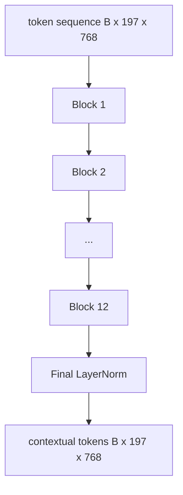
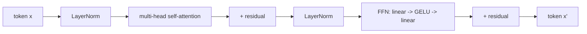

# 视觉Transformer编码器

> 仅仅补丁本身无法产生视觉感知。一个12层、12个注意力头的前LayerNorm(pre-LN)Transformer将补丁令牌序列转换为上下文令牌序列，其中CLS令牌将其最终隐藏状态作为整图特征池化。这一课是每个现代视觉语言模型的引擎室。

**类型：** 构建
**语言：** Python
**前置要求：** 阶段19 第30-37课（Track B 基础）
**时间：** ~90分钟

## 学习目标

- 实现带有多头自注意力( Multi-Head Self-Attention )和前馈子层的前LayerNorm(Pre-LN) Transformer块。
- 堆叠12个块，每块12个头，形成ViT-Base编码器。
- 将第58课的补丁前端接入编码器并运行前向传播。
- 验证CLS令牌是否聚合了每个补丁的信息。

## 问题

补丁嵌入(Patch Embedding)产生197个令牌的序列，每个令牌都是一个向量，彼此之间无感知。一张猫的图片需要每个补丁知道哪些补丁包含胡须、哪些包含背景、哪些包含眼睛。Transformer就是逐注意力层构建这种感知的机制。没有它，补丁前端只是一个聪明的分词器而无理解能力。

标准配方是12层深、12头宽，采用前LayerNorm放置、GELU激活、4倍前馈扩展。该配方是CLIP ViT-L、SigLIP、DINOv2、Qwen-VL系列、InternVL以及2025-2026年所有其他开源权重视觉编码器的骨架。该配方足够稳定，你可以阅读任何这些论文并默认此块形状，除非他们明确说明。

## 核心概念





### 前LayerNorm(Pre-LN) vs 后LayerNorm(Post-LN)

原始Transformer将LayerNorm放在残差之后。前LayerNorm（每个子层之前进行LayerNorm）是所有现代视觉语言模型使用的版本，因为它无需学习率预热技巧即可稳定训练。差异在前向传播中仅一行代码，而在深度12+时的梯度流是天壤之别。

### 多头自注意力(Multi-Head Self-Attention)

每个头将令牌向量投影到其自身的`(query, key, value)`三元组，维度为`head_dim = hidden / num_heads`。给定`hidden = 768`和`heads = 12`，每个头有`dim = 64`个维度。12个头并行注意力，然后其输出拼接回维度768并通过一个输出投影。多头的作用在于一个头可以学习"关注猫眼"，而另一个头学习"关注背景梯度"而不相互干扰。

### 为什么是4倍前馈扩展

前馈网络(FFN)使用`hidden -> 4 * hidden -> hidden`，中间插入GELU。4倍这个因子是经验性的，自2017年以来在语言和视觉Transformer中保持一致。较小的(2x)欠拟合；较大的(8x)在固定数据预算下过拟合。MLP是模型存储大部分习得事实的地方，而更宽的中间层是这些事实的存放位置。

|  组件  |  ViT-Base规模下的参数量  |
|-----------|------------------------------|
|  每块的qkv投影  |  `3 * 768 * 768 = 1.77M`  |
|  每块的输出投影  |  `768 * 768 = 590K`  |
|  每块的FFN（4倍扩展）  |  `2 * 768 * 4 * 768 = 4.72M`  |
|  每块的LayerNorm  |  `4 * 768 = 3K`  |
|  每块总计  |  约7.1M  |
|  12块  |  约85M  |
|  加上前端  |  总计约86M  |

ViT-Base是一个8600万参数的编码器。按2026年标准来看较小（SigLIP-So400M是4亿，Qwen-VL ViT是6.75亿），但架构在宽度和深度上完全一致。

### 因果掩码(Causal Mask)是否需要？

视觉Transformer(Visual Transformers)是纯编码器(Encoder-Only)且是双向的：令牌`i`可以关注任何配对令牌`j`。无掩码。第61课的解码器端交叉注意力将使用因果掩码，但在视觉编码器内部，注意力是全连接的。

### CLS令牌学到了什么

CLS令牌起初是一个学习参数，没有自己的补丁内容，通过每个块的注意力累积信息。到最后一层，CLS行是整个图像的向量摘要；下游头将这个单一向量投影到类别对数(Logits)、对比嵌入(Contrastive Embeddings)或文本解码器的交叉注意力键。

## 动手构建

`code/main.py` 实现：

- `MultiHeadSelfAttention`，包含`qkv`和输出投影、缩放点积注意力数学以及形状断言。
- `MultiHeadSelfAttention`，4倍扩展GELU MLP。
- `MultiHeadSelfAttention`，一个前LayerNorm块，组合注意力和前馈子层以及残差连接。
- `MultiHeadSelfAttention`，12个块的堆叠，最后接一个LayerNorm。
- `MultiHeadSelfAttention`，它将第58课的`qkv`连接到`FeedForward`堆叠，并暴露一个`Block`返回上下文序列和池化后的CLS向量。
- 一个演示，在完整编码器上运行一个合成的224x224固定图像，打印输入形状、输出形状、参数量以及每隔一层的CLS范数。

运行它：

```bash
python3 code/main.py
```

输出：固定图像被编码为一个`(1, 197, 768)`张量。CLS范数随层组合而上升，然后在最终LayerNorm处稳定。总参数报告约为86M。

## 使用它

这里定义的编码器，在宽度和深度上，与2025-2026年每个开源权重视觉语言模型(VLM)中嵌入的块堆叠完全相同。差异在于：

- **宽度和深度。** ViT-Large是`hidden=1024, depth=24, heads=16`；SigLIP So400M是`hidden=1152, depth=27, heads=16`。相同的块。
- **池化头(Pooling Head)。** CLS池化（本课） vs 平均池化(Average Pooling)（SigLIP） vs 注意力池化(Attention Pooling)（后来的VLM）。
- **位置处理。** 固定正弦（第58课） vs 学习的一维(Learned 1D) vs ALiBi vs 二维旋转位置编码(2D RoPE)。块的数学运算不变。
- **注册令牌(Register Tokens)。** DINOv2额外添加4个学习令牌。仅一行代码。

这个块堆叠是基础。接下来的课程（60-63）在此基础上展开。

## 测试

`code/test_main.py`涵盖了：

- 单个块保持形状并独立于输入批量大小
- 注意力分数沿键轴求和为1（softmax合理性）
- 残差路径已连接（零输入仍通过CLS令牌产生非零输出）
- 4层堆叠的前向传播产生正确形状
- 梯度从CLS输出流向补丁投影

运行它们：

```bash
python3 -m unittest code/test_main.py
```

## 练习

1. 添加注册令牌（在CLS后添加4个学习向量）并重新运行。通过最后一层softmax分布的熵比较注意力图的平滑度。

2. 将pre-LN替换为post-LN，并在合成形状分类器上训练一个epoch。观察哪一个在无需学习率预热的情况下稳定训练。

3. 实现因果掩码作为`attn_mask`参数，以便同一模块可以作为解码器模块重用。掩码形状为`(seq, seq)`，下三角。

4. 在批次大小为1、8、64时对前向过程进行分析，使用`torch.profiler`。MLP层主导了墙上时间，而不是注意力。

5. 将一个注意力头的q-k-v投影替换为低秩LoRA适配器，冻结其余部分，并验证梯度只流动在预期的地方。

## 关键术语

| 术语  |  含义 |
|------|---------------|
|  Pre-LN  |  在每个子层之前而非之后应用层归一化  |
|  自注意力  |  每个标记关注同一序列中的其他所有标记  |
|  多头  |  隐藏维度被分割到`H`个独立的注意力头上  |
|  FFN扩展  |  前馈层在收缩之前扩展到`4 * hidden`  |
|  CLS池化  |  使用第一个标记的最终隐藏状态作为图像摘要  |

## 延伸阅读

- 编码器方案采用An Image is Worth 16x16 Words（ViT, 2021）。注册令牌和自监督预训练目标采用DINOv2（2023）。平均池化变体和第62课中使用的sigmoid对比损失采用SigLIP（2023）。
- 
- 
