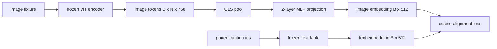

# 用于模态对齐的投影层(Projection Layer for Modality Alignment)

> 视觉编码器(Vision Encoder)产生图像令牌(Image Tokens)。文本解码器(Text Decoder)消耗文本令牌(Text Tokens)。两者位于不同的向量空间中。一个小的两层MLP将图像令牌投影到文本嵌入空间(Text Embedding Space)，并与配对的说明(Caption)之间的余弦对齐损失(Cosine Alignment Loss)将两个空间拉近。这个投影是视觉语言模型(Vision-Language Model)中最小的部分，也是迁移中最重要的部分。

**类型：** 构建
**语言：** Python
**前置要求：** 阶段19 第30-37课（Track B 基础）
**时间：** ~90分钟

## 学习目标

- 构建一个两层MLP投影，将图像特征映射到文本嵌入空间。
- 构建一个模拟的文本嵌入表（没有预训练的分词器，没有真实语料库）。
- 计算投影后的图像令牌与配对的说明嵌入之间的余弦对齐损失。
- 仅训练投影层，冻结视觉编码器和文本表。

## 问题

你有一个视觉编码器（第58-59课），产生维度为`vision_hidden = 768`的令牌。你有一个想要附加其上的文本解码器，其嵌入维度为`text_hidden = 512`（任何其他数字同样可行）。解码器期望文本形状的令牌。图像令牌不是文本形状的：它们存在于编码器在纯视觉预训练期间学习到的基中，与解码器的词向量没有关系。

两层MLP投影（线性层，GELU，线性层）弥合了差距。它足够小（约`768 * 1024 + 1024 * 512 = 1.3M`个参数），可以在单个GPU上几分钟内训练，并且是在对齐阶段唯一需要学习的部分。视觉编码器保持冻结。文本嵌入表保持冻结。只有投影层移动。这是LLaVA在2023年发布时使用的配方，BLIP-2将其重构为Q-Former，此后每个开源权重VLM都以某种形式采用。

## 核心概念



### 投影前的池化(Pooling before projection)

视觉编码器输出197个令牌。文本端有一个单独的说明级嵌入。要对齐它们，每个样本需要一个图像级向量。CLS池化是最简单的：取编码器的第一个令牌并投影。对所有197个令牌进行平均池化是另一种选择，也是SigLIP使用的。两种方法都将197个向量池化为一个。

### 为什么用两层而不是一层(Why two layers and not one)

单线性投影可以旋转和缩放，但如果两个空间存在曲率不匹配，则无法修复基。两个线性层之间的GELU给了投影一个非线性弯曲，经验上足以将CLIP风格的特征与语言模型嵌入对齐。更深的投影（LLaVA-NeXT使用了GLU；Qwen-VL使用了一堆注意力层）是扩展；两层MLP是规范基线，也是BLIP-2的Q-Former投影头内部自带的。

|  层(Layer)  |  形状(Shape)  |  参数(Parameters)  |
|-------|-------|------------|
|  fc1  |  `(vision_hidden, projection_hidden)`  |  `768 * 1024 + 1024`  |
|  激活(activation)  |  GELU  |  0  |
|  fc2  |  `(projection_hidden, text_hidden)`  |  `1024 * 512 + 512`  |

对于一个`768 -> 1024 -> 512`的头部，大约有1.3M参数。

### 余弦对齐损失(Cosine alignment loss)

对齐并不意味`image_emb == text_emb`。对齐意味`image_emb`指向与@SKIP0002@@在联合空间中相同的方向。余弦损失`1 - cos_sim(image, text)`，范围从0（完美对齐）到2（相反方向）。训练使得每对样本的损失趋向于零。第62课将其推广到对比批次(InfoNCE)，其中每个图像必须比批次中的任何其他说明更接近自己的说明；本课使用每对版本，以便动态可见。

### 冻结编码器是关键(Frozen encoder is the trick)

视觉编码器有86M参数。文本表还有几百万个参数。从模拟语料库训练所有这些参数是不可能的。冻结它们意味着投影层的1.3M参数是唯一变化的，在合成对上几百步就足以降低损失。这正是每个基于适配器的VLM的操作形式：重的部分保持冻结，轻的桥接进行训练。

## 动手构建

`code/main.py` 实现：

- `MLPProjector(in_dim, hidden_dim, out_dim)`，带有GELU激活的两层线性MLP。
- `MLPProjector(in_dim, hidden_dim, out_dim)`，一个从种子确定性初始化的冻结嵌入表。
- `MLPProjector(in_dim, hidden_dim, out_dim)`，它合成一个配对的（图像，说明）样本。说明是短id序列；说明嵌入是令牌嵌入的平均池化。
- `MLPProjector(in_dim, hidden_dim, out_dim)`，每对`MockTextEmbedding(vocab_size, dim)`目标。
- 一个训练循环，在32个合成对上运行投影200步（循环），视觉编码器和文本表冻结，每25步打印一次损失。

运行它：

```bash
python3 code/main.py
```

输出：训练报告显示初始损失大约1.07，在200步内下降到大约0.80，表明投影层本身可以将图像令牌拉向文本空间。每对的最终余弦相似度也打印出来。

## 使用它

相同的模式出现在每个开源权重VLM中：

- **LLaVA 1.5.** 从CLIP-ViT-L隐藏状态到LLaMA嵌入维度的两层GELU MLP投影。冻结视觉编码器和LLM，仅训练投影层（然后在第二阶段解冻LLM）。
- **BLIP-2.** Q-Former通过交叉注意力对图像令牌进行32个学习查询令牌，然后投影到LLM嵌入维度。Q-Former最末端的投影头是本课MLP的类比。
- **MiniGPT-4.** 从BLIP-2 Q-Former输出到Vicuna嵌入维度的单线性投影。
- **Qwen-VL.** 具有若干层的交叉注意力适配器，但最后一部分同样是投影到LM嵌入维度。

形状各异但角色相同：池化图像令牌，投影到文本嵌入维度，单独训练。

## 测试

`code/test_main.py`涵盖了：

- 投影器输出形状与配置的`out_dim`匹配
- 冻结的文本嵌入表有零个`out_dim`参数
- 相同向量上余弦损失为零，反平行向量上为2
- 一次反向传播后投影器梯度流动
- 训练循环在第0步和第200步之间降低损失

运行它们：

```bash
python3 -m unittest code/test_main.py
```

## 练习

1. 将CLS池化替换为196个补丁令牌的平均池化，比较200步后的最终损失。平均池化通常在合成数据上训练更快；CLS在自然图像上更样本高效。

2. 向余弦损失添加一个学习的标量温度(`cos / tau`)，观察当`tau`太小时（梯度噪声）或太大时（损失稳定在高值）会发生什么。

3. 将两层MLP替换为单线性层，并量化损失差距。非线性在自然图像特征上更重要，在合成特征上不那么重要。

4. 在投影器权重上添加小的L2惩罚，观察它如何与余弦对齐相互作用（余弦是尺度不变的，因此惩罚主要缩小未使用的方向）。

5. 持久化投影器权重，然后重新加载并在没有视觉编码器反向传播的情况下运行推理，以验证部署时只需要投影器。

## 关键术语

| 术语  |  含义 |
|------|---------------|
|  模态对齐(Modality alignment)  |  使图像和文本嵌入在同一共享空间中可比较的行为  |
| 投影头（Projection head） | 将一种空间映射到另一种空间的小模块，通常是一个两层MLP |
| 余弦相似度（Cosine similarity） | 点积除以L2范数的乘积 |
| 冻结编码器（Frozen encoder） | 视觉（或文本）模型的所有参数都带有`requires_grad=False` |
| 模拟语料库（Mock corpus） | 使用的合成对，使得训练没有数据集下载依赖 |

## 延伸阅读

- LLaVA论文关于两阶段训练（投影，然后解冻语言模型）。
- BLIP-2论文将Q-Former作为可学习的投影替代方案。
- Qwen-VL技术报告将交叉注意力适配器作为更深的投影头。
