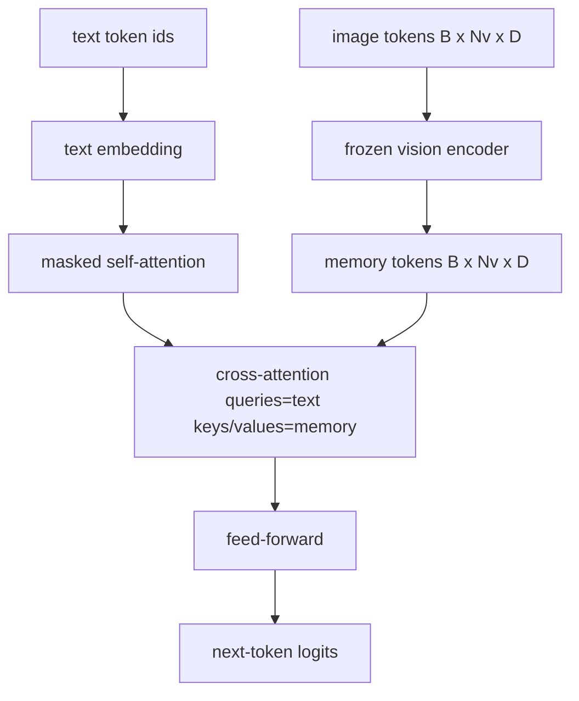
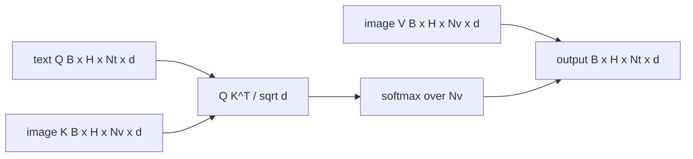

# 交叉注意力融合

> 投影层将一个图像向量与一个描述向量对齐。真正的视觉-语言解码器需要每个文本标记(Text Token)关注每个图像块标记(Patch Token)，以便模型能够将每个词定位到某个区域。交叉注意力(Cross-Attention)就是实现这种定位的方式：文本发出查询，视觉的键和值提供回答。本课将构建交叉注意力模块、因果文本自注意力(Causal Text Self-Attention)以及使两者合法的掩码形状。

**类型：** 构建
**语言：** Python
**前置要求：** 阶段19 第30-37课（Track B 基础）
**时间：** ~90分钟

## 学习目标

- 实现多头交叉注意力，其中查询流来自文本，键/值流来自视觉。
- 组合一个解码器模块：因果自注意力 + 交叉注意力 + 前馈网络。
- 正确设置掩码形状：自注意力使用因果掩码，交叉注意力不使用掩码。
- 使用批处理文本标记和固定图像标记池执行前向传播。

## 问题

将图像标记和文本标记拼接成一个序列是一种融合选项（早期融合，即Chameleon和Emu3采用的方式）。交叉注意力是另一种选项（晚期融合，由Flamingo引入，此后所有Flamingo风格解码器都沿用）。在晚期融合中，文本解码器仅处理文本标记，并通过每层的交叉注意力访问图像流。

晚期融合有两个优点。首先，文本流保持纯净，模型保留了纯文本能力。其次，图像流每张图像只计算一次，并在每个解码步骤中复用，因此即使生成很长的描述也很高效。代价是每个模块多了一个注意力子层。

## 核心概念





### 掩码形状

解码器模块内部的两种注意力需要不同的掩码：

|  注意力类型  |  查询长度  |  键长度  |  掩码  |  原因  |
|-----------|--------------|------------|------|-----|
|  自注意力  |  `Nt` (文本)  |  `Nt` (文本)  |  因果：下三角 `(Nt, Nt)`  |  自回归时，文本标记不能看到未来  |
|  交叉注意力  |  `Nt` (文本)  |  `Nv` (视觉)  |  无掩码  |  每个文本位置可以看到整个图像  |

本课包含一个形状验证函数，以便混淆掩码的错误会表现为 `ValueError`，而不是静默破坏损失曲线。

### 为什么交叉注意力没有掩码

图像在生成任何文本之前已被完全观测。描述中标记 `t` 可以关注图像的任意图像块；图像块之间没有时间顺序。某些Flamingo变体在交错排列多个图像和文本段时会添加逐样本掩码模式，但对于单张图像加一个描述的情况，交叉注意力可以看见全部。

### 键/值缓存

图像的键和值在解码开始时仅计算一次，并保存在缓存中。每个新的文本标记使用缓存而无需重新计算。这就是为什么描述推理速度很快：繁重的ViT仅运行一次；交叉注意力在每个步骤复用其键和值。本课展示了缓存并测试了缓存命中路径。

### 模块组合

解码器模块按以下顺序运行：预层归一化 -> 自注意力 -> 残差连接 -> 预层归一化 -> 交叉注意力 -> 残差连接 -> 预层归一化 -> 前馈网络 -> 残差连接。共三个子层，每层都有自己的层归一化(LayerNorm)。Flamingo论文在交叉注意力上添加了一个可学习的门控，以便模型在训练稳定性成本下可以选择脱离图像路径；这里使用的标准基线没有门控。

```python
class DecoderBlock:
  def forward(self, text_tokens, image_tokens, text_mask, cross_mask):
      text_tokens = text_tokens + self.self_attn(self.ln1(text_tokens),
                                                 mask=text_mask)
      text_tokens = text_tokens + self.cross_attn(self.ln2(text_tokens),
                                                  image_tokens,
                                                  mask=cross_mask)
      text_tokens = text_tokens + self.ffn(self.ln3(text_tokens))
      return text_tokens
```

## 动手构建

`code/main.py` 实现：

- `CrossAttention(hidden, heads)`，多头交叉注意力，具有独立的 `q` 和 `kv` 投影。
- `CrossAttention(hidden, heads)`，来自标准解码器的带掩码自注意力。
- `CrossAttention(hidden, heads)`，组合三个子层，使用预层归一化和残差连接。
- `CrossAttention(hidden, heads)`，一个四层解码器，由模拟视觉编码器输出和小型文本嵌入表提供输入。
- `CrossAttention(hidden, heads)` 返回一个 `q` 下三角布尔张量。
- 一个演示，输入两个长度为10的文本序列批次和长度为197的图像记忆，打印输出形状、自注意力掩码形状以及每位置的交叉注意力输出范数。

运行它：

```bash
python3 code/main.py
```

输出：解码器产生一个 `(2, 10, text_vocab)` logits张量。掩码形状为 `(10, 10)`。KV缓存复用检查确认缓存路径和非缓存路径的logits完全相同。

## 使用它

交叉注意力出现在两个生产系列中：

- **Flamingo和IDEFICS。**每隔K个语言模型模块插入一个交叉注意力子层，并冻结语言模型。视觉-语言适配器就是交叉注意力模块及其门控。
- **BLIP-2。** Q-Former使用来自固定32个查询标记的交叉注意力访问图像特征，然后将查询投影到语言模型嵌入空间。

本课中模块的形状直接对应两者。掩码规则（自注意力使用因果掩码，交叉注意力无掩码）相同。

## 测试

`code/test_main.py`涵盖了：

- 因果掩码是下三角的，并匹配预期的布尔形状
- 交叉注意力输出形状为 `(B, Nt, hidden)`，与键长度无关
- KV缓存路径与非缓存路径在浮点容差内匹配
- 文本流和图像流之间的形状不匹配会引发明确的 `(B, Nt, hidden)`
- 完整的解码器前向传播产生正确的批次和序列形状

运行它们：

```bash
python3 -m unittest code/test_main.py
```

## 练习

1. 在交叉注意力残差连接上添加一个可学习的tanh门控（Flamingo技巧），并验证训练从接近零的初始门控开始收敛。门控从0开始；模型在混合图像流之前先恢复纯文本行为。

2. 实现交错注意力，其中同一个解码器处理多个图像和多个文本段。构建逐样本交叉注意力掩码，防止文本段2关注图像1。

3. 在 `Nt=64, Nv=576`（更高分辨率的24x24网格）上分析交叉注意力层与自注意力层的性能。交叉注意力的成本为 `Nt * Nv`，在高图像分辨率时占主导。

4. 在交叉注意力图上添加查询侧丢弃，并在演示中测量描述多样性（交叉映射中的丢弃增加描述样本方差）。

5. 将交叉注意力层替换为Q-Former风格的注意力模块，其中固定32个查询标记池每层关注一次图像特征。

## 关键术语

| 术语  |  含义 |
|------|---------------|
|  晚期融合  |  文本和视觉保持在独立流中；交叉注意力在每个模块连接它们  |
|  交叉注意力  |  查询来自一个流，键和值来自另一个流  |
| 因果掩码 | 下三角布尔掩码，用于在自回归过程中防止向前看 |
| KV缓存 | 图像键和值，存储一次并在每个解码步骤中重复使用 |
| 记忆令牌 | 解码器访问的冻结图像令牌 |

## 延伸阅读

- Flamingo（2022）——采用门控交叉注意力的经典晚期融合设计。
- BLIP-2（2023）——Q-Former，这是一个交叉注意力块，被设计为可学习的查询池。
- IDEFICS（2023）——Flamingo方案的开放权重复现。
