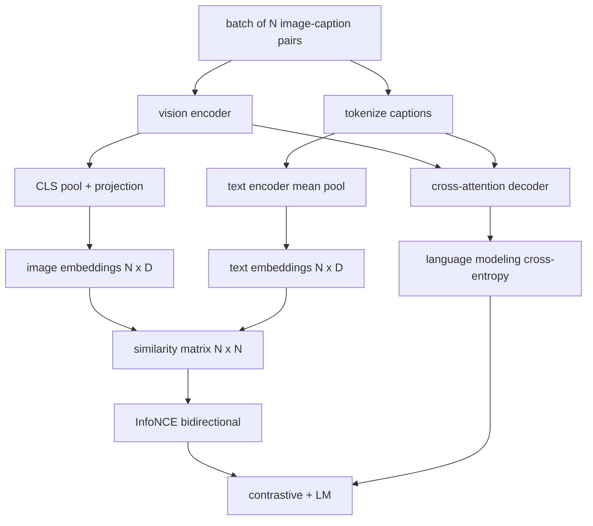

# 视觉语言预训练(Vision-Language Pretraining)

> 编码器、映射器和解码器已连接。现在一起训练它们。两个目标驱动学习：一个对比性图文损失(InfoNCE)将匹配对在联合嵌入空间中拉近，以及一个语言建模损失要求解码器为每张图像生成描述。结合后，它们教会网络既能找到正确图像对应描述，也能为图像写出描述。

**类型：** 构建
**语言：** Python
**前置要求：** 阶段19 第30-37课（Track B 基础）
**时间：** ~90分钟

## 学习目标

- 在一个批次的图文对上实现InfoNCE对比损失。
- 将对比损失与自回归语言建模损失组合。
- 合成一个200对的模拟图文语料库，无需下载真实数据集。
- 运行50步演示训练循环，观察两种损失均下降。

## 问题

一个视觉语言模型需要两种技能。它必须能够排序：给定一个描述，在众多图像中找到正确的那个。它必须能够生成：给定一张图像，写出描述。仅针对一种技能预训练模型只会得到半个系统。CLIP擅长排序但无法生成描述。GPT-4V可以生成描述但使用独立的检索头进行排序。多目标预训练在一次过程中获得两者。

InfoNCE处理排序部分。对于一个有N对的批次，模型将N个匹配对视为正样本，将`N^2 - N`个不匹配对视为负样本，然后在得到的`(N, N)`相似度矩阵上运行交叉熵损失。LM损失处理生成部分：以图像为条件的标准下一个词元预测。两种损失都是可微的，并且可以共享编码器、映射器和解码器的权重。

## 核心概念



### InfoNCE简述

将N个图像嵌入作为行堆叠，N个文本嵌入作为行堆叠。对两者进行L2归一化。计算`N x N`矩阵`S = I T^T / tau`，其中`tau`是学习到的温度参数。对角线元素是匹配对；非对角线元素是负样本。以目标`argmax`沿对角线向下应用交叉熵：行`i`在列`i`上的条目应最高。沿列对称地执行相同操作。总损失是两者的平均值。这就是CLIP损失的八行实现。

### 温度参数的重要性

温度参数`tau`控制softmax的尖峰程度。过小（例如`tau = 0.01`）时，梯度仅来自最难负样本，训练噪声大。过大时，softmax变平，梯度消失。CLIP将`tau`作为参数学习；本演示同样如此。

### 语言建模损失

解码器通过交叉注意力消耗图像记忆词元，并在每个位置预测下一个文本词元。损失是与下一个位置目标的标准交叉熵。填充位置被掩码排除在损失之外。

### 组合损失

`total = contrastive + lm_weight * lm`，其中`lm_weight`是一个标量（通常为1.0）。两种损失将梯度共享到编码器和映射器；只有解码器接收LM损失的梯度。这是CoCa、BLIP和SigLIP风格模型都使用的多任务方案，权重各有不同。

| 组件  |  损失面  |  影响范围 |
|-----------|--------------|---------|
| InfoNCE  |  联合空间中的配对排序  |  编码器 + 映射器 + 文本头 |
| LM  |  以图像为条件的词元预测  |  编码器 + 映射器 + 解码器 |
| 组合  |  多任务  |  整个堆栈 |

### 为什么50步足够演示

模拟语料库是一个合成的200对集合，包含随机的图像和随机的描述ID。经过50步SGD（批次大小为16），两种损失均明显下降，尽管绝对值仍高于真实数据模型所能达到的水平。演示的目的是确认梯度管道端到端工作正常，并且添加LM损失不会破坏对比目标。

## 动手构建

`code/main.py` 实现：

- `MultimodalModel`，结合一个小型ViT编码器、MLP映射器、一个小型文本侧编码器（对嵌入ID进行平均池化）以及第61课的交叉注意力解码器。
- `MultimodalModel`，双向CLIP风格对比损失。
- `MultimodalModel`，掩码下一个词元交叉熵。
- `MultimodalModel`，返回200个确定性的（图像，描述ID）对。
- 一个训练循环，运行50步，批次大小为16，Adam优化器，以及学习到的对数温度参数。每5步打印两种损失。

运行它：

```bash
python3 code/main.py
```

输出：对比损失从大约`ln(16) = 2.77`下降到约2.4；LM损失从随机均匀基线`ln(512) ≈ 6.24`下降到约4.7。两者的下降证明梯度连接正确。真实模型训练数百万步；动态过程相同。

## 使用它

这与以下模型中使用的损失配方相同：

- **CLIP (2021)**。仅图文对比损失，带有独立的冻结编码器描述探针。
- **CoCa (2022)**。在同一个模型中的图文对比损失加上图像描述LM损失。本课构建的正是这个模式。
- **BLIP (2022) 和 BLIP-2**。对比损失加LM损失加图文匹配头。三种损失组合。
- **SigLIP (2023)**。将InfoNCE替换为Sigmoid配对损失；相同的对比作用，不同的函数形式。
- **LLaVA系列**。两阶段训练，第一阶段是对齐（在冻结LM上的余弦），第二阶段添加LM损失并解冻LM。第60课对应第一阶段；本课对应第二阶段。

## 测试

`code/test_main.py`涵盖了：

- InfoNCE损失在图像/文本行上是对称的
- 信息NCE损失在相似度矩阵为完美对角且为大正数时返回0
- LM损失正确掩码了填充位置
- 模型前向传播同时产生两种损失且无错误
- 5步训练循环降低了组合损失

运行它们：

```bash
python3 -m unittest code/test_main.py
```

## 练习

1. 将InfoNCE替换为SigLIP风格的Sigmoid配对损失，并在模拟语料库上比较收敛情况。

2. 添加难负样本挖掘步骤：每隔一个批次，从前一个批次中选择最难的非对角对并附加到当前批次。训练并检查对比损失是否下降更快。

3. 在联合嵌入之上添加一个图文匹配二分类头（True/False：是否匹配？）作为第三个损失，复制BLIP的三头设置。

4. 将模拟语料库替换为从一个马尔可夫链中抽取的描述ID序列，该链的转移矩阵以图像哈希为条件。描述损失应该进一步下降，因为存在实际可学习的信号。

5. 分别用`lm_weight = 0`和`lm_weight = 1`训练相同的模型。比较对比损失；LM损失不应使排序目标退化。

## 关键术语

| 术语  |  含义 |
|------|---------------|
| InfoNCE  |  噪声对比估计：对相似度矩阵的交叉熵 |
| 温度(Temperature)  | 控制对比式softmax峰度的标量 |
| 难负样本(Hard negative)  | 模型感到困惑的非对角线对，对采样有用 |
| 语言模型损失(LM loss)  | 描述侧的标准下一个词元交叉熵 |
| 联合嵌入空间(Joint embedding space)  | 投影后图像和文本向量所在的共享空间 |

## 延伸阅读

- 原始对比方法的CLIP论文。
- 在一个模型中结合对比与描述的CoCa论文。
- 使用sigmoid对损失变体及其规模优势的SigLIP论文。
