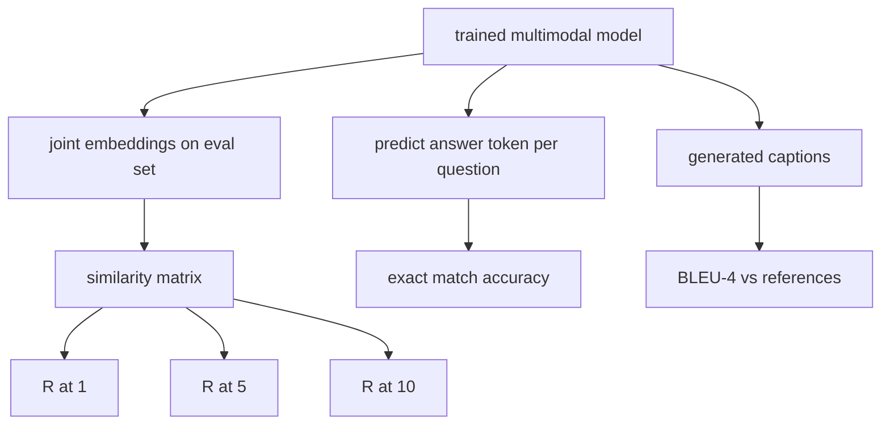

# 多模态评估(Multimodal Evaluation)

> 训练只是循环的一半。另一半是度量。本课从基础组件构建三个评估面：图像-文本检索，报告R@1、R@5、R@10；视觉问答，报告精确匹配准确率；以及图像描述，报告BLEU-4。每个指标都是对模型输出和合成评估套件的函数，该套件可在数秒内运行。

**类型：** 构建(Build)
**语言：** Python
**先修知识：** 阶段19第58-62课（Track E基础：编码器、Transformer、投影、交叉注意力融合、预训练）
**时间：** ~90分钟

## 学习目标

- 从图像和文本嵌入之间的相似度矩阵计算Recall@K。
- 从将(图像, 问题)对映射到固定答案词汇表的模型计算精确匹配VQA准确率。
- 在没有任何外部库的情况下，从生成的标记序列和参考标记序列计算BLEU-4。
- 在第62课训练的模型基础上，对合成套件运行所有三个评估。

## 问题

当训练损失趋于平稳时，人们很容易宣称多模态模型已经完成。训练损失衡量的是在训练分布上的拟合程度；它不能衡量模型是否能在保留批次中排序对、回答问题或写出人类可接受的描述。三个标准评估面如下：

- **检索(Retrieval)（R@1、R@5、R@10）。** 为查询文本构建联合嵌入；按余弦相似度对评估池中的每张图像排序；报告匹配图像是否位于前1、前5、前10位。对称形式（图像到文本）以相同方式运行。
- **视觉问答(Visual Question Answering)（精确匹配）。** 给定(图像, 问题)，模型输出一个答案标记。精确匹配是每个样本的1位：预测答案是否等于参考答案？在评估集上求平均。
- **图像描述(Captioning)（BLEU-4）。** 生成一个描述。计算1-gram到4-gram精度相对于参考描述的几何均值，并加上简短惩罚。多参考是标准形式（一张图像，多个参考描述）。

每个指标都是一个简单的函数。本课通过代码构建它们，使数学具体化，并使评估面处于你的控制之下。实际基准套件（MS-COCO、VQA v2、GQA、OK-VQA）可接入相同的函数形式。

## 核心概念



### 从相似度矩阵计算Recall@K

构建图像嵌入和文本嵌入之间的`(N, N)`余弦相似度矩阵。对每一行，按降序相似度对列排序。Recall@K是对角线列索引位于前K个位置内的行数占比。对称的Recall@K（文本到图像）在转置矩阵上计算。两个数值都会被报告。对于一个N=100的评估，R@1 = 0.6意味着100个文本中有60个检索到了它们正确的图像作为最佳匹配。

### VQA精确匹配(VQA Exact Match)

对于每个(图像, 问题, 答案)，对图像编码，嵌入问题，通过解码器融合，并读出下一个标记。预测的标记ID与参考ID比较；如果相等则正确。在评估集上求平均。实际的VQA数据集每个问题带有多个人工标注的答案，并使用软准确率公式（如果10个标注者中至少有3个一致则为1.0，否则按比例缩放）；本课为清晰起见使用单答案精确匹配。

### BLEU-4

```text
BLEU-4 = BP * exp(mean(log p1, log p2, log p3, log p4))
```

其中`p_n`是修正的n-gram精度（生成n-gram中出现在任何参考中的裁剪计数，除以总生成n-gram数），`BP`是简短惩罚：

```text
BP = 1                if generated length > reference length
   = exp(1 - r/g)     otherwise, where r is reference length and g is generated
```

当某些`p_n`为零时，小样本需要平滑处理。实现使用Chen和Cherry的“方法1”（对任何零计数给分子和分母加1），这是低计数情况下最安全的默认设置。

### 合成评估套件(Synthetic Eval Suite)

一个包含50个样本的评估套件在内存中构建，使用与第62课相同的模拟语料模式，但使用保留种子。该套件由三个列表组成：

- `pairs`：用于检索的50个(图像, 描述ID)对。
- `pairs`：用于VQA的50个(图像, 问题ID, 答案ID)三元组。
- `pairs`：用于图像描述的50个(图像, [参考描述ID, ...])条目，每张图像最多3个参考。

该套件由种子决定，并保留在训练语料之外，因此指标是在模型从未见过的数据上计算的。将套件持久化到JSON留作练习（见下文）。

|  指标(Metric)  |  范围(Range)  |  随机基线(Random Baseline) (N=50)  |
|--------|-------|------------------------|
|  R@1  |  0 到 1  |  0.02 (1 / N)  |
|  R@5  |  0 到 1  |  0.10  |
|  R@10  |  0 到 1  |  0.20  |
|  VQA EM  |  0 到 1  |  1 / vocab  |
|  BLEU-4  |  0 到 1  |  很小但非零(Small but nonzero)  |

对于在合成数据上进行的50步训练，指标预计不会很高；它们预计会高于随机基线，这正是演示所检查的。

## 动手构建

`code/main.py` 实现：

- `recall_at_k(sim_matrix, k)`，返回一个浮点数在`[0, 1]`范围内，双向都有。
- `recall_at_k(sim_matrix, k)`，返回`[0, 1]`等式上的均值。
- `recall_at_k(sim_matrix, k)`，支持多参考。
- `recall_at_k(sim_matrix, k)`，返回三个确定性的评估列表。
- `recall_at_k(sim_matrix, k)`，运行所有三个指标并返回一个`[0, 1]`数值。
- 一个演示，加载第62课中新初始化的多模态模型，评估它，然后训练50步并再次评估，打印训练前后的指标。

运行它：

```bash
python3 code/main.py
```

输出：训练前后的指标表显示检索从接近随机向模型学习到的信号改善，VQA改善超过随机，BLEU-4改善（合成结构足以提升4-gram精度）。

## 使用它

每个指标直接映射到生产基准：

- **检索(Retrieval)。** MS-COCO 5K验证集、Flickr30K、ImageNet零样本(Zero-shot)都是基于同一相似度矩阵的R@K问题。将合成评估替换为真实文件，函数签名不变。
- **视觉问答(VQA)。** VQA v2、GQA、OK-VQA使用相同精确匹配形式（VQA v2使用软准确率而非单答案精确匹配）。
- **描述(Captioning)。** MS-COCO描述、NoCaps、Flickr30K描述都使用BLEU-4加上CIDEr和METEOR。添加CIDEr只需再增加一个函数。

对于实际基准，将`build_eval_suite`替换为真实加载器，并保持函数体不变。数学与基准无关。

## 测试

`code/test_main.py`涵盖了：

- 当k<N时，recall@k在完美单位相似矩阵上返回1.0，在翻转矩阵上返回0.0
- recall@k遵守`k <= N`的上界
- 当生成文本与某个参考文本完全相同时，bleu4返回1.0
- 在词汇不重叠时，bleu4返回0.0
- vqa精确匹配等于相等对的比例
- build_eval_suite返回期望的对数、vqa项数和标题条目数

运行它们：

```bash
python3 -m unittest code/test_main.py
```

## 练习

1. 将CIDEr添加到标题评估指标中。CIDEr对n-gram使用TF-IDF加权，奖励信息量大的标记。

2. 实现软准确率VQA：每个问题有多个人类答案，如果任一匹配，准确率为`min(human_count / 3, 1)`。复制VQA v2。

3. 添加`bleu4`的NaN安全变体，能够处理空生成序列而不崩溃。

4. 同时计算平均倒数排名(MRR)和R@K。MRR对正确项落在前K名之外的位置敏感；R@K对是否落在前K名内敏感。

5. 在训练过程中的五个检查点（第0、10、20、30、40、50步）对模型运行评估，并绘制学习曲线。确认指标轨迹与损失轨迹一致。

## 关键术语

| 术语  |  含义 |
|------|---------------|
|  R@K  |  正确匹配出现在前K名结果中的查询比例  |
|  精确匹配  |  最简单的VQA评分：预测答案等于参考答案  |
|  BLEU-4  |  1至4元精确度的几何平均值，并带有简短惩罚  |
|  多参考  |  标题评估指标接受每张图像的多个参考标题  |
|  留出集  |  评估集从与训练语料不相交的种子中采样  |

## 延伸阅读

- 关于软准确率公式和数据集统计的VQA v2论文。
- 关于TF-IDF加权n-gram标题的CIDEr论文。
- 关于平滑变体的原始BLEU论文（Papineni等人，2002）。
- 关于标准参考实现的MS-COCO标题评估脚本。
