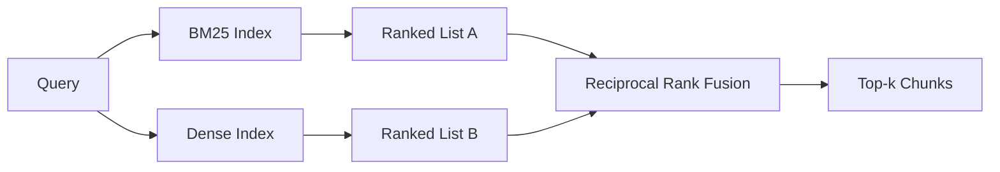

# 使用 BM25 和稠密嵌入的混合检索

> 在相反的查询分布上，词法检索和语义检索都会失败。基于倒数秩融合的混合检索并非插值，而是投票——对于每一类查询，投票都胜出。

**类型：** 构建
**语言：** Python
**先决条件：** 阶段 11 第 04 课（嵌入），第 06 课（RAG）；阶段 19 轨道 B 基础（第 20-29 课）；阶段 19 第 64 课（分块策略）
**时间：** ~90 分钟

## 学习目标
- 根据 Robertson 和 Sparck Jones 公式从零实现 BM25，包含字段加权、文档长度归一化以及可调节的 k1 和 b。
- 在确定性模拟嵌入之上构建稠密检索器，使循环离线运行。
- 完全按照 Cormack、Clarke 和 Buettcher 在 2009 年发表的方式实现倒数秩融合，并解释为何它优于基于分数的加权插值。
- 调优 RRF 的 k 常数以及每个模态的权重，并在一小部分固定语料库上观察权衡。

## 问题

当查询包含语料库中逐字出现的字面标识符时，词法搜索胜出。对 `AbortMultipartOnFail` 的查询在微秒内通过 BM25 返回正确的 Go 函数。同样的查询，经过嵌入后，位于三个相似性簇的边界，稠密检索器将错误的文件排在首位。

当查询与语料库的字面标记不匹配（即被改写）时，稠密搜索胜出。用户询问“我们如何处理取消的上传”时，从未输入单词 abort 或 multipart。BM25 返回了关于“上传大文件”的文档块，因为该页面包含单词 uploads。稠密检索找到了其摘要提及取消的 abort 函数。

两者之间的选择并非静态的。查询分布是一个变量。生产环境中的 RAG 系统从同一端点处理两类查询，因此检索必须同时处理两者。这就是混合检索。合并步骤是关键所在。

## 核心概念



### BM25 简述

BM25 通过将每个查询词项的逆文档频率因子与一个饱和的词频因子（包含长度归一化修正）相乘并求和，来计算查询-文档对的分数。两个调节参数。`k1` 控制词频饱和程度；默认值 1.5 是已发表文献推荐的值，没有基准测试不应调整。`b` 控制文档长度的影响程度；默认值 0.75 表示对较长文档进行惩罚，但并非线性。

IDF 公式使用平滑的 Robertson 和 Sparck Jones 定义，即 `log((N - df + 0.5) / (df + 0.5) + 1)`。对数内的加一操作确保当某个词出现在超过一半的语料库时 IDF 为正。这在小语料库中很重要，因为停用词在技术上较为稀有。

字段加权允许你告知 BM25，在符号名称上的匹配比正文中的匹配更重要。实现方式是在索引时对词项计数乘以乘数，而非在评分阶段。这样数学形式不变，避免了每个字段独立评分。

### 稠密检索简述

使用嵌入模型将每个块嵌入为固定维度的向量。查询时，对查询进行嵌入，按余弦相似度对所有块排序，返回前 k 个结果。模型是决定质量的关键变量。检索算法本身仅需两行代码：点积和排序。

本课程使用基于哈希的确定性嵌入，以便在不进行网络调用的情况下理解融合数学。哈希将基于词项的偏移量求和为 96 维向量并进行归一化。余弦排序在各次运行中保持一致，这是测试套件所需。

### 倒数秩融合，已发表的公式

两个排序列表。对于出现在任一列表中的每个候选项，将其倒数秩贡献求和。2009 年的论文使用了 `1 / (k + rank)`，默认 k 值为 60。按总分排序。这就是完整的算法。

已发表的常数 k = 60 并非随意选择。当 k = 60 时，排名第一的贡献为 1/61，排名第十的贡献为 1/70。贡献衰减缓慢，因此深度候选项仍能投票。较小的 k 使顶部结果占主导。较大的 k 使贡献曲线趋于平缓。

我们的实现中有两个可调参数。`k` 常数。以及一对每个模态的权重，以便在你有先验证据表明某一模态在语料库上更好时可以提升 BM25 或稠密检索。将秩贡献乘以权重是最简单的原则性实现；它保持了秩衰减的形状且保持无量纲。

### 为何融合优于基于分数的加权插值

BM25 分数是无界的且依赖于语料库。余弦相似度在 -1 到 1 之间。线性组合 `alpha * bm25 + (1 - alpha) * cosine` 需要针对每个语料库调整 alpha，且每次重新索引时都需要调整。基于秩的融合则不需要。两个秩在不同模态间是可比较的。自 2010 年以来，已发布的 RRF 基准在每个公开的 TREC 轨道上都优于分数插值。

这与你在 Vespa 和 Weaviate 文档中听到的关于 RankFusion 与 RRF 的论证相同。它们得出了相同的结论：除非有非常强的证据支持分数插值，否则坚持基于秩的方法。

## 动手构建

`code/main.py` 实现：

- `tokenize(text)` - 快速的正则表达式分词器。
- `tokenize(text)` - 字段加权，包含 `BM25Index` 和 `add` 以及可调节的 k1、b。
- `tokenize(text)`, `BM25Index` - 与第 64 课相同的确定性嵌入，以保证块的可比性。
- `tokenize(text)` - 已发表的融合方法，支持多模态权重。
- `tokenize(text)` - 结合了 BM25 和稠密检索。
- 一个演示 `tokenize(text)`，加载一小部分固定语料库，运行三个分别针对每个检索器优势与弱点的查询，并打印每个模态生成的排序以及融合后的列表。

运行它：

```bash
python3 code/main.py
```

对照阅读演示输出。字面标识符查询在 BM25 中排名第 1，稠密检索排名第 4，RRF 排名第 1。改写后的查询在 BM25 中排名第 6，稠密检索排名第 1，RRF 排名第 1。模糊查询在 BM25 中排名第 3，稠密检索排名第 3，RRF 排名第 1。融合并非打破平局，而是一个对每类查询都胜出的系统。

## 调节参数

|  参数  |  默认值  |  何时调高  |  何时调低  |
|------|---------|----------------|------------------|
|  BM25 k1  |  1.5  |  词项在文档中重复出现，你希望词频更重要  |  文档短，词项重复是噪声  |
|  BM25 b  |  0.75  |  长文档确实每个词信息量更少  |  文档长度与主题不相关  |
|  RRF k  |  60  |  深度候选项应继续投票  |  顶部结果应占主导  |
|  BM25 权重  |  1.0  |  你的语料库包含字面标识符且查询匹配它们  |  查询是用户改写的  |
|  稠密权重  |  1.0  |  查询是改写的  |  查询是字面的  |

通过重新运行第68课的评估套件在你的保留查询集上进行调优，而不是凭直觉。

## 演示会隐藏的失败模式

**词汇外令牌(Out-of-vocabulary tokens)**。BM25的IDF是从语料库计算的，因此仅在查询中的词贡献为零。稠密嵌入(Dense embeddings)为同一词幻觉出一个向量。对于语料库外的标识符，稠密模态返回看似合理但错误的邻居。融合吸收了这个效应，因为BM25返回空且排名贡献消失，但前提是你按文档去重，而不是按块。

**停用词主导(Stop-token domination)**。对单词“the”使用BM25会在语料库上产生均匀排名。在索引器中过滤停用词，或者接受高IDF词自然占据主导。

**跨模态相同内容(Identical content across modalities)**。如果你的语料库足够小，使得BM25的top-1也是稠密模态的top-1，RRF会给出相同的top-1和相同的邻居。这是正确行为，不是失败，但它使融合看起来不可见。在你的评估中添加一个对抗性查询对来验证融合是否实际工作。

## 使用它

生产模式：

- 在进程中索引BM25；瓶颈是词频词典，而不是向量。
- 在单独的存储中索引稠密向量（在本课中我们使用平面列表；在生产中你会使用HNSW）。
- 并行运行两个查询；融合是对并集的常数时间合并。
- 持久化每个检索结果的模态，以便下游重排序器可以看到哪个模态为其投票。

## 发布

第66课使用本课得到的融合top-k并用交叉编码器重排序。第68课用精确率、召回率、MRR和nDCG评估整个流程。本课的混合检索器是第69课端到端系统的第一阶段。

## 练习

1. 将`mock_embed`替换为你供应商的真实模型。重新运行演示并报告仅稠密排名在改写后的查询上的变化。
2. 添加第三种模态：块摘要单独索引并作为第三个排名列表融合。测量增益。
3. 将RRF的k值在10, 30, 60, 100, 200之间扫描。绘制来自第68课的recall@k曲线。报告在你的语料库上曲线峰值处的k值。
4. 正确实现BM25F（按字段长度归一化而不是乘数技巧），并在符号匹配最重要的语料库上进行比较。

## 关键术语

|  术语  |  人们的说法  |  实际含义  |
|------|-----------------|------------------------|
|  BM25  |  “词汇搜索(Lexical search)”  |  概率排名(Probabilistic ranking)，使用idf x饱和tf x长度归一化 |
|  RRF  |  “排名融合(Rank fusion)”  |  跨排名列表求和1/(k + 排名)；k = 60 默认 |
|  k1  |  “TF饱和(TF saturation)”  |  控制重复词停止增加分数的速度 |
|  b  |  “长度惩罚(Length penalty)”  |  0表示忽略文档长度，1表示完全归一化 |
|  字段权重(Field weighting)  |  “符号提升(Symbol boost)”  |  在索引期间重复令牌以提升该字段中的匹配 |
|  基于排名 vs 基于分数的融合(Rank-based vs score-based fusion)  |  “为什么RRF优于线性(Why RRF beats linear)”  |  排名在不同模态间可比；分数不可比 |

## 延伸阅读

- Cormack, Clarke, Buettcher, “Reciprocal Rank Fusion outperforms Condorcet and individual rank learning methods”, SIGIR 2009
- Robertson, Walker, Beaulieu, Gatford, Payne, “Okapi at TREC-3”（原始BM25论文）
- [Vespa: Hybrid Retrieval with BM25 and Embeddings](https://docs.vespa.ai/en/tutorials/hybrid-search.html)
- [Vespa: Hybrid Retrieval with BM25 and Embeddings](https://docs.vespa.ai/en/tutorials/hybrid-search.html)
- 第11阶段第06课 - RAG基础
- 第19阶段第64课 - 其输出在此索引的分块器
- 第19阶段第66课 - 消费融合top-k的交叉编码器重排序器
