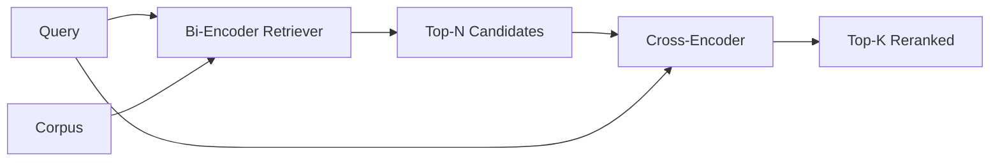

# 交叉编码器重排序器(Cross-Encoder Reranker)

> 双编码器(Bi-encoder)独立嵌入查询和文档。交叉编码器(Cross-encoder)将它们拼接并同时读取两者。交叉编码器是最智能但最慢的读取器。作为双编码器top-k结果的第二阶段，它能自给自足。

**类型：** 构建
**语言：** Python
**先修知识：** 阶段11 第06课(RAG)，阶段11 第07课(高级RAG)；阶段19 轨道B基础(第20-29课)；第19阶段第65课(混合检索供应该阶段)
**时间：** 约90分钟

## 学习目标
- 通过输入形状、参数数量和每次查询的成本来区分双编码器检索器和交叉编码器重排序器。
- 从头实现一个小型交叉编码器，作为一个Transformer块，处理拼接的(查询, 文档)序列并输出单个相关性标量。
- 构建一个两阶段的检索-然后-重排序流水线：使用廉价检索器检索top-N，使用交叉编码器将N重排序为top-K，返回K。
- 在小型固定语料库上测量延迟与质量的权衡，并在给定延迟预算下选择合适的N。

## 问题

双编码器将查询和文档映射到同一个向量空间，并通过余弦相似度进行排序。两个编码器互不交流。模型必须将文档所有有用的信息压缩到单个向量中，而不考虑查询。这种方式很快——索引时每文档一个嵌入，查询时每查询一个嵌入——并且是在全语料库规模下进行排序的唯一可行方法。

代价是精度。两个整体主题相同的文档可能具有几乎相同的嵌入，即使其中一个回答了查询而另一个没有。双编码器无法区分它们。

交叉编码器通过同时读取查询和文档来解决这个问题。模型将`[query] [SEP] [document]`作为单个序列接收，在整个拼接序列上运行完整的注意力机制，并产生一个相关性标量。文档的每个标记都可以关注查询的每个标记。模型在有完整上下文的情况下决定得分。

代价是吞吐量。双编码器嵌入一次、查询永远使用，而交叉编码器每(查询, 文档)对运行一次。对于一个1000万文档的语料库，每次查询需要1000万次前向传播。这在请求预算内是无法运行的。

解决方案是分阶段进行。使用双编码器检索top-N。使用交叉编码器将N重排序为top-K。N很小（50到200），交叉编码器的质量提升集中在关键部分。总延迟保持在请求预算内。总质量是交叉编码器的质量，上限为双编码器在N处的召回率。

## 核心概念



### 交叉编码器的输入形状

标准拼接方式是`[CLS] query_tokens [SEP] document_tokens [SEP]`。CLS位置的输出被输入到一个线性层，输出相关性标量。一些实现使用平均池化(mean-pooling)代替CLS；差异不大。关键在于模型每对产生一个数值。

一个22M参数的交叉编码器（已发布的`ms-marco-MiniLM-L-6-v2`权重级别）是典型的生产环境选型。更小的模型节省延迟的速度落后于质量下降的速度。更大的模型（例如`bge-reranker-v2-m3`，568M参数）保留用于离线重排序或K很小的第一页重排序。

### 为什么这节课训练一个小模型

真实的交叉编码器是一个微调后的编码器Transformer。在生产中，你加载一个检查点并运行它。在这节课中，目标是展示模型的形状和延迟-质量曲线的形状，而不是训练最先进的排序器。因此，我们构建一个小型`nn.Module`，包含一个Transformer块、多头注意力（默认为4个头）和一个回归头。它通过种子确定性初始化，以便演示可重现，无需磁盘上的权重。

玩具模型从固定语料库中学习了正确的形状：相关的查询-文档对具有比不相关对更高的预测分数。端到端流水线对双编码器的输出进行重排序，重排序后的top-k与黄金标签相关。

### 延迟与质量

两阶段流水线有一个可调参数：N。在保留查询集上从5到100扫描N，可以得到曲线。

|  N  |  阶段2的Recall@1  |  每查询的交叉编码器前向传播次数  |  延迟  |
|---|--------------------|---------------------------------------|---------|
|  5  |  0.62  |  5  |  低  |
|  20  |  0.81  |  20  |  中  |
|  50  |  0.86  |  50  |  高  |
|  100  |  0.86  |  100  |  非常高  |

上述数字仅说明曲线形状，并非该固定语料库的实际测量值。形状是真实的。通常在20到50个候选者处存在一个拐点，重排序提升趋于饱和。超过拐点后，你只是在白白付出代价。

从评估曲线和延迟预算中选择N。交叉编码器无法将召回率提高到双编码器在N处的召回率以上，因此低的N不仅限制了延迟，也限制了质量。

## 动手构建

`code/main.py` 实现：

- `CrossEncoder` - 一个小型`torch.nn.Module`：词嵌入，一个包含多头注意力和前馈网络的Transformer块，平均池化的头产生一个标量。
- `CrossEncoder` - 将两个字符串打包成一个带有标记边界的类型ID的单一ID序列，确定无误且使用标准库。
- `CrossEncoder` - 在手标注的(查询, 文档, 相关性)三元组列表上进行一轮有监督训练，使模型对固定语料库产生合理的分数。
- `CrossEncoder` - 生产接口。
- `CrossEncoder` - 两阶段流程。
- 一个演示`CrossEncoder`，从第65课的模式加载语料库，检索top-N，重排序为top-K，并排打印两个列表，并报告每个阶段的延迟。

运行它：

```bash
python3 code/main.py
```

输出显示双编码器的top-N、交叉编码器的top-K以及时间摘要。交叉编码器每次调用耗时较长，但无需在整个语料库上运行。两阶段的总延迟保持在请求预算内，同时选出双编码器排名第二或第三的答案。

## 演示会隐藏的失败模式

**交叉编码器不是对称的。** `rerank(q, d)`和`rerank(d, q)`是不同的分数。始终先将查询作为输入。如果意外交换，召回率将骤降。

**N设置得太低以至于暴露不出问题。** 如果你设置N = K，交叉编码器无法重新排序，只能重新加权。提升看起来为零。选择N至少为K的三倍。

**训练数据泄漏到评估中。** 如果手标注的训练对包含评估查询，重排序看起来会非常神奇。即使是在固定语料库上，也要严格分开训练和评估。

**生产环境的权重是密集的。** 一个22M参数的交叉编码器在float32下为88MB。在承诺95百分位延迟低于100毫秒之前，先规划好模型服务器的内存。

**批处理很重要。** 一个真正的交叉编码器(Cross-encoder)会在一个批次中处理N个候选。本课在`_batch_encode`中实现了这一点，它使用`torch.tensor(...)`构建批处理的id和type-id张量，并运行一次前向传播。如果跳过分批，延迟会乘以N。

## 使用它

生产模式：

- 将双编码器(Bi-encoder)、交叉编码器(Cross-encoder)和N固定在一起。更改任何一个都会导致评估无效。
- 按（查询，文档ID）哈希缓存重排序器(Reranker)的输出。针对稳定语料库的相同查询会重排序为相同顺序；缓存命中可以免费降低延迟。
- 记录排名第一的交叉编码器分数。如果查询的最高分低于特定于语料库的阈值，则属于领域外命中；将其作为“我不确定”呈现给LLM。

## 发布

第68课端到端评估这个两阶段流水线。第69课将重排序器(Reranker)连接到第65课的混合检索器(Hybrid retriever)之后、答案生成器之前。重排序器是端到端系统的第二阶段。

## 练习

1. 将N从5扫描到50，并绘制重排序输出的recall@1。找到该固定数据集上的拐点。
2. 将交叉编码器(Cross-encoder)训练十个周期而不是一个。测量每个周期正负对之间的分数差值。
3. 用CLS令牌头替换平均池化头。比较该固定数据集上的收敛情况。
4. 添加第二个交叉编码器头，用于预测二元标签“答案是否在文档中”。推理时使用两个头：一个用于排序，一个用于阈值。
5. 将确定性的模拟双编码器(Bi-encoder)替换为第65课中的双编码器，并将两个阶段串联。测量top-K相对于单独使用双编码器的变化。

## 关键术语

|  术语  |  人们的说法  |  实际含义  |
|------|-----------------|------------------------|
|  双编码器(Bi-encoder)  |  "向量检索器"  |  独立编码查询和文档；余弦相似度排序  |
|  交叉编码器(Cross-encoder)  |  "重排序器"  |  联合编码(查询, 文档)；输出一个相关性标量  |
|  两阶段流水线  |  "检索并重排序"  |  廉价检索器返回N个，昂贵重排序器保留K个  |
|  N（候选预算）  |  "重排序池"  |  交叉编码器每次查询评分的候选数量  |
|  平均池化头  |  "最后隐藏层均值"  |  将编码器最后一层的输出平均为一个向量  |

## 延伸阅读

- Nogueira, Cho, "Passage Re-ranking with BERT", 2019 - 经典的交叉编码器(Cross-encoder)排序论文
- Reimers, Gurevych, "Sentence-BERT: Sentence Embeddings using Siamese BERT-Networks", 2019 - 关于双编码器(Bi-encoder)与交叉编码器的比较
- [SentenceTransformers Cross-Encoders documentation](https://www.sbert.net/examples/applications/cross-encoder/README.html)
- [SentenceTransformers Cross-Encoders documentation](https://www.sbert.net/examples/applications/cross-encoder/README.html)
- 第19阶段第65课 - 向此重排序阶段提供输入的混合检索器(Hybrid retriever)
- 第19阶段第68课 - 衡量此重排序带来的提升的评估
