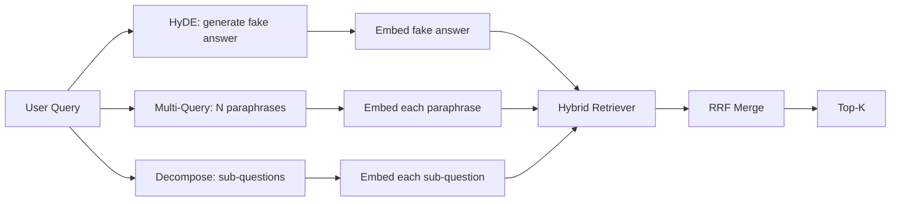

# 查询重写：HyDE、多查询与分解

> 用户输入的查询并非检索器想要的查询。重写(Query Rewriting)在检索前弥合了这一差距，使索引看到更接近答案样子的内容。

**类型：** 构建
**语言：** Python
**先修知识：** 第11阶段第04课（嵌入(embeddings)）、第06课（RAG）；第19阶段B轨道基础（第20-29课）；第19阶段第64和65课
**时间：** 约90分钟

## 学习目标
- 实现假设文档嵌入(Hypothetical Document Embeddings, HyDE)：生成一个假答案，对其进行嵌入，然后使用该向量而非查询向量进行检索。
- 实现多查询扩展(Multi-Query Expansion)：将一个查询重写为N个同义改写，对每个改写进行检索，然后通过倒数排名融合(Reciprocal Rank Fusion, RRF)合并结果。
- 实现查询分解(Query Decomposition)：将一个复杂问题拆分为子问题，对每个子问题进行检索，然后合并。
- 在同一个测试集上头对头比较这三种重写器，并解释每种策略何时胜出。
- 编写一个模拟LLM(Mock LLM)，使其在测试集上产生确定性的输出，以便重写器循环可以离线运行。

## 问题

用户输入"上传失败且预算用完时，我们的团队该怎么办？"。语料库中有一篇文档写道"AbortMultipartOnFail在上传失败时中止正在进行的S3分段上传，并减少每个存储桶的重试预算"。查询和文档没有共享名词短语。BM25无法命中。双编码器(Bi-encoder)将该文档排在第三或第四位，因为查询向量落在嵌入空间中偏向于讨论取消作业的文档区域，而不是讨论中止上传的文档区域。第66课的两阶段重排可以在答案位于top-N时挽救回来，但如果它甚至没有进入top-N，重排器(reranker)永远看不到它。

解决方法是，在查询接触检索器之前对其进行重写。2023年的论文《无需相关性标签的精确零样本密集检索》(Gao等人)提出了HyDE：让LLM编写能够回答查询的文档，嵌入该假设文档，然后使用其嵌入作为检索向量。假设文档位于嵌入空间的正确区域，因为它是以语料库的口吻编写的。而查询向量则不然。

两种类似的技术与HyDE搭配使用。多查询扩展（微软GraphRAG使用的术语）生成查询的N个同义改写，并分别进行检索，然后合并。分解（在2024年斯坦福DSPy工作中被称为"子查询分解(subquery decomposition)"）将"上传失败且预算用完时，我们的团队该怎么办"拆分为两个问题："上传失败时会怎样"和"重试预算用完时会怎样"。两次检索，一个合并结果，答案的两个部分都可获取。

本课实现了所有三种方法，并在同一个测试集语料库上运行它们。

## 核心概念



### HyDE详解

HyDE用LLM编写的假设文档向量替换用户的查询向量。提示词很短：

```
You are a domain expert. Write a one-paragraph passage that answers the question
below. Use the same vocabulary and phrasing the documentation in this domain would
use. Do not refuse. Do not say you do not know.

Question: {user_query}

Passage:
```

LLM的答案作为事实性回答是错误的，因为LLM不了解你的语料库。但这没关系。检索器并不关心事实正确性，只关心词元(token)分布。假设段落包含"abort"、"multipart"、"bucket"、"budget"等词汇，因为关于该主题的文档段落就会这么说。对该段落进行嵌入。该向量会落在真实段落附近。

在生产环境中，你将假设文档限制为两到三个句子。更长的假设会引入更多噪声，而更短的则会丢失HyDE所需的词汇信号(lexical signal)。

### 多查询扩展详解

生成用户查询的N个同义改写。最简单的提示词：

```
Rewrite the following question in {N} different ways. Each rewrite must preserve
the original intent. Number them 1 to {N}. Do not add explanations.
```

对每个同义改写检索top-k。使用RRF（与第65课相同的算法）合并N个排序列表。廉价、并行、确定性强。

当用户的措辞是多种同样有效的提问方式之一，且任何改写都能更好地表达该问题时，多查询胜出。当所有改写同样糟糕（因为原始查询本身就同样糟糕）时，多查询失败。

### 分解详解

单次检索无法满足多层面问题。分解要求LLM将问题拆分为子问题，系统对每个子问题分别检索。提示词：

```
The following question may require information from multiple distinct topics.
Decompose it into a list of sub-questions. Each sub-question must be answerable
independently. If the question is already atomic, return it unchanged.

Question: {user_query}
```

对每个子问题进行检索，然后合并。分解适用于包含连词、多从句比较或两个不相关主题的问题。不适用于原子性问题(atomic question)；在这种情况下，分解器的工作是返回单个问题，而不是编造虚假的子问题。

### 三种方法为何并存

这三种方法是互补的。HyDE弥合了查询与语料库之间的词元差距(token gap)。多查询覆盖了同义改写的变化。分解覆盖了多主题查询。生产系统会运行所有三种方法，并根据每个查询选择合适的策略（第69课的端到端系统展示了选择器）。

## 模拟LLM

本课离线运行。模拟LLM是一个小的查找表，以用户查询为键，并包含未见过查询的回退机制。该查找表包含：

- 对于每个测试集查询：一个编写的假设段落、三个同义改写和一个分解。
- 对于未知查询：确定性的转换：提取查询的内容词，通过同义词映射扩展，并返回结果。

模拟的结构很重要，而不是数据。在生产环境中，你将模拟替换为真实的模型调用。检索器保持不变。

## 动手构建

`code/main.py` 实现：

- `MockLLM` - 上述确定性的临时替代。
- `MockLLM` - 调用LLM编写假设文档，将重写器输出作为`HyDERewriter`返回，包含假设文本和检索器应使用的查询。
- `MockLLM` - 调用LLM获取N个同义改写，返回查询列表。
- `MockLLM` - 调用LLM进行分解，返回子问题。
- `MockLLM` - 接收重写器和检索器，运行重写，融合结果。
- 一个演示程序，在测试集上运行三种重写器，并打印哪种策略首先返回了黄金答案文档。

检索器的结构复用了第65课（混合BM25+密集检索）。融合方法同样是RRF。唯一的新结构是重写器接口，它很小。

运行它：

```bash
python3 code/main.py
```

输出是每个策略的排序和最终总结。HyDE在措辞不匹配的查询上胜出。多查询在同义改写变化大的查询上胜出。分解在多主题查询上胜出。回退（不使用重写器）在至少一个查询上失败。

## 演示会隐藏的失败模式

**HyDE错误地幻觉出语料库特定的标识符。** 模型编造了一个函数名。假设文档在正确文档上的BM25得分骤降，因为编造的名称现在成为了一个不在索引中的高权重词元。限制假设文档的长度，并在融合中降低BM25的权重。

**多查询改写全部趋同。** 弱模型产生三个几乎相同的同义改写。N次检索返回相同的top-k。RRF合并并不比单次检索更好。在改写提示词中添加明确的多样性指令，并通过Jaccard相似度检测重复。

**分解过度拆分。** 分解器将一个原子问题转化为一个列表。检索结果都返回同一文档，但排名降低。合并效果不如原始查询。在扇出之前通过一个“这些子问题是否足够不同”的检查来检测这一点。

**延迟倍增。** HyDE 耗费一次 LLM 调用。多查询耗费一次 LLM 调用生成 N 个改写，然后进行 N 次检索。分解耗费一次 LLM 调用进行分解，然后进行 M 次检索。检索可以并行进行；LLM 调用是延迟的下限。

## 使用它

生产模式：

- 按查询长度选择每个查询的策略：原子短查询使用多查询，复杂多子句查询使用分解，术语密集查询使用 HyDE。\n按查询哈希缓存改写器输出。许多查询会重复。\n并行运行所有三种策略，使用 RRF 融合三个结果集。代价是三次 LLM 调用和一次融合；质量是三种策略覆盖范围的并集。
- 
- 

## 发布

第69课将改写器阶段连接到第65课的检索器和第66课的重排序器之前。第68课评估改写器对检索召回率提升的效果。

## 练习

1. 实现 RAG-Fusion（多查询的2024变体），其中改写器的改写结果故意多样化，然后重排序步骤（第66课）选出最终列表。\n添加第四种策略：退步提示（询问 LLM 更一般的问题，检索该问题，然后缩小范围）。在测试集上进行比较。\n训练分解器通过添加“问题是否原子”的头部来识别原子查询。测量分解前后的过度拆分率。\n用真实模型调用替换模拟 LLM。测量你的堆栈上每种策略的延迟。\n为每个改写添加置信度分数。丢弃低于阈值的改写。测量对召回率的影响。
2. 
3. 
4. 
5. 

## 关键术语

|  术语  |  人们的说法  |  实际含义  |
|------|-----------------|------------------------|
|  HyDE  |  "假文档检索"  |  LLM 写出答案；对答案进行嵌入和检索，而不是对查询进行 |
|  多查询  |  "改写扩展"  |  查询的 N 个改写；检索 N 次，通过 RRF 合并 |
|  分解  |  "子查询拆分"  |  多主题查询拆分为子问题，分别检索 |
|  原子查询  |  "单主题"  |  无法在不捏造虚假子问题的情况下进行分解 |
|  退步  |  "抽象查询"  |  询问更一般的问题，检索，然后缩小范围 |

## 延伸阅读

- Gao, Ma, Lin, Callan, "Precise Zero-Shot Dense Retrieval without Relevance Labels" (HyDE), 2023\nMicrosoft Research, "Multi-Query Expansion for Retrieval"\nStanford DSPy, "Subquery Decomposition for Multi-Hop QA"\n[LlamaIndex query transformations documentation](https://docs.llamaindex.ai/en/stable/optimizing/advanced_retrieval/query_transformations/)\n第11阶段第07课 - 高级RAG模式\n第19阶段第65课 - 该改写器馈送的检索器\n第19阶段第68课 - 衡量改写器提升的评估
- 
- 
- 
- 
- 
- 
