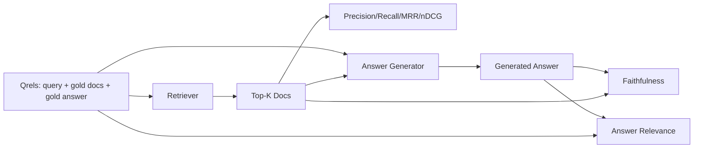

# RAG评估：精确率、召回率、MRR、nDCG、忠实性、答案相关性

> 如果你不能同时评估检索和答案，你就无法交付系统。这两者不是同一个指标，同一个提示在不同维度上会失败。

**类型：** 构建
**语言：** Python
**前置条件：** 第11阶段第6课（RAG）、第10课（评估）；第19阶段轨道B基础（第20-29课）；第19阶段第64、65、66、67课
**时间：** 约90分钟

## 学习目标
- 从黄金qrels计算四个检索指标：precision@k、recall@k、MRR（平均倒数排名）和nDCG@k。
- 计算两个答案质量指标：忠实性（每个声明都基于检索到的上下文）和答案相关性（答案是否针对问题）。
- 构建一个固定qrels文件（查询、黄金文档ID、黄金答案文本），供评估端到端读取。
- 读取指标值以诊断流水线失败环节：检索、排序、生成或基础依据。

## 问题

一个RAG系统至少有四个活动部件：分块器、检索器、重排序器、生成器。其中任何一个都可能导致错误答案。没有每个阶段的指标，你就是在盲目飞行。

用户报告了一个错误答案。是因为分块器切断了答案跨度？还是因为检索器未将块包含在top-k中？还是因为重排序器将正确的块推到了位置一之后？还是因为生成器忽略了块并编造了内容？仅凭答案你无法判断。你需要：

- 检索指标：评估检索器输出的内容。
- 排序指标：评估正确的块在顺序中的位置。
- 忠实性：评估生成器是否保持在检索到的上下文内。
- 答案相关性：评估答案是否针对问题。

本课基于一个固定qrels文件构建所有六个指标。评估是离线且确定性的；在生产环境中，你将模拟的LLM判断器替换为真实的。

## 核心概念



### Precision@k

在检索器返回的前k个文档中，有多少比例属于黄金集合？如果黄金集合有三个文档，前3个返回了两个正确和一个错误，则precision@3为2/3。当不相关检索块的成本很高时（生成器在其上浪费令牌，或块污染答案），使用精确率。

### Recall@k

在黄金文档中，有多少比例出现在前k个中？如果黄金集合有三个文档，前5个包含了全部三个，则recall@5为1.0。当错过答案的成本很高时（你宁愿多看到一个错误的块，也不愿完全错过答案块），使用召回率。

在生产级RAG中，人们通常引用的指标是recall@k。生成器可以轻松丢弃不相关的块；但它不能从未见过的块中凭空发明答案。

### MRR（平均倒数排名）

对于每个查询，找到排序列表中第一个相关文档的位置。倒数排名为1/位置。在所有查询上取平均值。MRR是一个单一数字，总结了检索器将最佳答案放在顶部的能力。

MRR高度加权位置1。黄金文档在排名1的查询贡献1.0。排名2贡献0.5。排名10贡献0.1。该指标由列表顶部主导。

### nDCG@k

归一化折损累计增益。完整公式为每个检索到的文档分配一个增益（通常相关为1，不相关为0），按位置的对数进行折损，求和，然后除以理想DCG（完美排序时的DCG）。范围0到1。

nDCG支持分级相关性：黄金可以指定“文档A为3，文档B为2，文档C为1”。MRR和recall@k将所有内容简化为二值。当语料库中每个查询有多个部分相关文档时，使用nDCG。

### 忠实性

对于生成答案中的每个声明，检查该声明是否得到检索到的上下文的支持。标准实现使用LLM作为判断器的提示，输入(声明, 上下文)并返回是或否。该指标是通过的声明所占的比例。

忠实性捕捉生成器失败模式，即模型编造内容。即使检索器返回了正确的块，产生幻觉的生成器也是故障的。忠实性也称为基础性、支持、归因。

本课使用一个确定性的模拟判断器实现忠实性，该判断器检查每个声明的令牌是否与检索到的上下文重叠超过阈值。在生产环境中，你将其替换为真实模型调用。该指标的形状相同。

### 答案相关性

答案是否真正针对问题？忠实性问的是“答案是否基于上下文？”。答案相关性问的是“答案是否基于问题？”。一个忠实但离题的答案在忠实性上得分高，在相关性上得分低。一个简短、切题但忽略上下文的答案在相关性上得分高，在忠实性上得分低。

标准实现也使用LLM作为判断器：输入(问题, 答案)并询问答案是否针对问题。本课实现了一个令牌重叠加判断器的替代方案。

## 固定qrels

```python
{
  "qid": "q1",
  "query": "what is the abort threshold for multipart uploads",
  "gold_doc_ids": ["d1", "d3"],
  "gold_answer_substring": "three failed parts",
  "graded_relevance": {"d1": 3, "d3": 2},
}
```

每个查询携带：
- 查询字符串、
- 一组黄金文档ID（用于精确率/召回率/MRR）、
- 一个分级相关性字典（用于nDCG）、
- 黄金答案子串（作为每个qrel的参考元数据保留；本课中的忠实性是通过判断提取的声明与检索到的上下文，而不是与此子串进行比较来计算的）。

在生产环境中，你需要标注这些。本课附带一个手动构建的固定文件，因此评估开箱即用。

## 动手构建

`code/main.py` 实现：

- `precision_at_k(retrieved, gold, k)` - 字面定义。
- `precision_at_k(retrieved, gold, k)` - 字面定义。
- `precision_at_k(retrieved, gold, k)` - 查询上的平均值。
- `precision_at_k(retrieved, gold, k)` - 具有二值或分级增益的DCG/IDCG。
- `precision_at_k(retrieved, gold, k)` - 将答案拆分为句子形式的声明。
- `precision_at_k(retrieved, gold, k)` - 经判断支持的声明比例。
- `precision_at_k(retrieved, gold, k)` - 判断答案是否针对问题。
- `precision_at_k(retrieved, gold, k)` - 确定性令牌重叠判断器，以便评估离线运行。
- `precision_at_k(retrieved, gold, k)` - 运行每个指标的组织器。
- 一个演示，针对qrels运行三种流水线变体（分块器基线、混合检索、混合+重排序），并打印指标表格。

运行它：

```bash
python3 code/main.py
```

输出在一个单一指标表中显示了每个变体的precision@k、recall@k、MRR、nDCG@k、忠实度和答案相关性。混合检索行在召回率上超过了分块基线；重排行在MRR上超过了混合检索。

## 阅读指标以诊断失败

|  症状  |  可能原因  |  修复措施  |
|---------|-------------|-------------|
|  低recall@k、低precision@k  |  分块器截断了答案或检索器找不到它  |  分块边界（第64课）或检索器模态（第65课）  |
|  不错的recall@k、低MRR  |  正确的块在top-k中但不在第1位  |  重排器（第66课）  |
|  高MRR、低忠实度  |  生成器在正确上下文中仍然编造内容  |  生成提示；强制引用或拒绝  |
|  高忠实度、低相关性  |  答案有依据但偏离主题  |  查询重写器（第67课）或生成提示  |
|  四个指标都高，用户仍然抱怨  |  评估集不具代表性  |  用真实用户查询扩展qrels  |

## 演示会隐藏的失败模式

**LLM作为评判者的偏差。** 模型评判自己的输出比实际更忠实。使用与生成器不同的模型族作为评判者，或人工评判样本。

**Qrels退化。** 随着语料库变化，黄金答案发生偏移。2024年1月作为q1黄金答案的文档，到2024年10月不再是正确答案，因为团队重命名了函数。安排每季度一次的qrels审查。

**忠实度微观检查遗漏宏观主张。** 逐句忠实度可能通过，但整体答案的结构具有误导性。在自动指标之上增加样本级定性审查。

**Recall@k掩盖了按查询的失败。** 90%的平均召回率可能隐藏了某一类查询总是失败的。按查询类别（字面、释义、多主题）切片qrels，并按切片报告。

## 使用它

生产模式：

- 在每次检索器或生成器更改时运行评估。将recall@k的回归视为测试失败。
- 持久化每次查询的指标痕迹。当用户抱怨时，查找匹配的qrels条目，看看是否本应被捕获。
- 对qrels进行分层：烟雾集20个查询在CI中运行；回归集200个查询每晚运行；深层集2000个查询每周运行。

## 发布

第69课将整个流水线（分块器、检索器、重排器、生成器）连接起来，并针对端到端系统运行此评估。

## 练习

1. 添加第五个检索指标：hit-rate@k。将其与recall@k比较。解释它们何时不同。
2. 实现分级忠实度：0（无支持）、1（部分支持）、2（完全支持）。相应更新指标。
3. 将模拟评判者替换为真实模型调用。测量模拟评判者与真实评判者在固定数据集上的分歧。
4. 添加一个查询类别切片（"字面"、"释义"、"多主题"）。报告每个切片的指标。
5. 添加一个"答案长度"指标，并使其与忠实度相关。绘制曲线。

## 关键术语

|  术语  |  人们的说法  |  实际含义  |
|------|-----------------|------------------------|
|  Precision@k  |  "检索中的命中率"  |  top-k中黄金文档的比例  |
|  Recall@k  |  "黄金中的命中率"  |  黄金文档在top-k中的比例  |
|  MRR  |  "首次命中位置"  |  1 / 首个相关文档排名的均值  |
|  nDCG@k  |  "分级排序质量"  |  top-k的DCG除以理想DCG  |
|  Faithfulness  |  "依据性"  |  答案中由检索上下文支持的句子比例  |
|  Answer relevance  |  "是否回答了问题？"  |  答案是否匹配问题的意图  |
|  Qrels  |  "黄金标签"  |  标记的查询及其黄金文档和答案集合  |

## 延伸阅读

- Buckley, Voorhees, "Evaluating Evaluation Measure Stability", SIGIR 2000 - 关于排序指标的经典论文
- Jarvelin, Kekalainen, "Cumulated Gain-based Evaluation of IR Techniques" - nDCG论文
- [Ragas: Automated Evaluation of RAG Pipelines](https://docs.ragas.io)
- [Ragas: Automated Evaluation of RAG Pipelines](https://docs.ragas.io)
- 阶段11第10课 - 评估框架基础
- 阶段19第64-67课 - 此处评估的组件
- 阶段19第69课 - 此评估评分的端到端流水线
