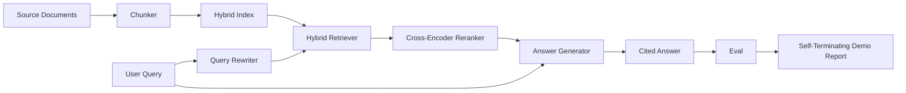

# 端到端RAG系统

> 六个组件课。一条流水线。一个评估循环。一个自终止演示。这就是你要交付的系统。

**类型：**构建
**语言：**Python
**先决条件：**第11阶段第06课（RAG）、第10课（评估）；第19阶段B基础课（第20-29课）；第19阶段第64、65、66、67、68课
**时间：**约90分钟

## 学习目标
- 将分块器、混合检索器、查询重写器、交叉编码器重排序器和答案生成器组合成一个完整的端到端流水线。
- 实现一个答案生成器，能够通过块锚点引用其声明，并带有低置信度拒绝回退。
- 对组装好的流水线运行第68课的评估，并证明分级构建在每个指标上都优于单独使用相同组件。
- 构建一个自终止的命令行演示，该演示接收固定语料库，运行一组固定查询，并以零退出状态和摘要报告结束。

## 问题

六个孤立的组件证明不了什么。分块器可能在语料库上的recall@5获胜，但在系统的recall@5上失败，因为检索器无法对分块器输出的结果进行排序。重排序器可以在合成候选池上提高MRR，但在真实双编码器候选上失败，因为双编码器在重排序预算内的召回率太低。查询重写器可以在单个查询上提升黄金文档，但在下一个查询上失败，因为LLM模拟返回了退化假设。

集成测试是对整个流水线进行端到端运行，使用相同的固定qrels、相同的指标，以及一个将所有组件连接起来的编排器文件。这正是本课所要构建的。如果集成流水线上的指标超过了每个阶段独立演示的指标，那么你就证明了系统的有效性。

## 核心概念



### 连接选择

流水线是一个小图。每个阶段都是一个具有清晰签名的函数。

|  阶段 | 输入 | 输出  |
|-------|-------|--------|
|  分块器 | 文档文本 | Chunk记录列表  |
|  检索器 | 查询字符串 | 前N个Chunk记录  |
|  重写器（可选） | 查询字符串 | 重写列表 + 假设  |
|  重排序器 | 查询、候选 | 带交叉分数的前K个Chunk记录  |
|  生成器 | 查询、前K个Chunk记录 | 带引用的答案字符串  |

当每个签名稳定时，组合就很简单。本课的`Pipeline`类持有五个阶段和一个按顺序运行它们的`query`方法。每个阶段都是可替换的：传入不同的分块器、检索器、重写器、重排序器或生成器，流水线仍然可以运行。

### 带引用的答案生成器

生成器是最后一个阶段，也是最容易出问题的。本课提供了一个确定性的模拟生成器，它：

1. 获取重排序后的前K个块。
2. 选择最多两个其文本包含与查询最高内容标记重叠的块。
3. 输出一个答案，该答案是每个选定块中一句话的拼接，每句话后跟一个`[doc_id:chunk_index]`锚点。
4. 如果没有块的其重叠度超过拒绝阈值，则输出“我不知道”且不带引用。

在生产中，你将模拟替换为带有提示模板的真实LLM调用：

```
You are answering a question using only the snippets below.
Cite every claim with the anchor in parentheses.
If the snippets do not answer the question, say "I do not know".

Question: {query}

Snippets:
{enumerated chunks with anchors}

Answer:
```

低置信度拒绝路径是记录交叉编码器排名第一分数的全部原因。如果它低于语料库阈值，生成器就会拒绝。这是针对幻觉答案的安全阀。

### 自终止演示

演示运行完整的端到端流程。它打印一个查询的逐阶段分解，对四个固定qrels运行评估，打印指标表，并以零状态退出（如果所有第68课的指标都满足演示中设置的阈值）。如果任何指标低于阈值，演示以非零状态退出，并显示命名失败指标的消息。

这就是CI冒烟测试的形态。流水线离线运行，速度快，确定性高。阈值故意在固定集上设置得严格，以便六课中的任何回归都会导致演示失败。

## 动手构建

`code/main.py` 实现：

- `Chunk` - 所有阶段携带的记录（扩展了第64课的形状，增加了chunk_index和source doc_id）。
- `Chunk` - 从第64课中选择策略（默认递归拆分）。
- `Chunk` - 捆绑了第65课的BM25 + 稠密 + RRF。
- `Chunk`（可选）- 根据查询长度和连词存在情况，从第67课中选择HyDE、多查询、分解中的一种。
- `Chunk` - 来自第66课的训练好的交叉编码器，使用较小的固定训练集以便在几秒钟内收敛。
- `Chunk` - 带引用和低置信度拒绝的确定性模拟生成器。
- `Chunk` - 组合五个阶段，带有一个返回`HybridIndex`的`Chunker`方法。
- `Chunk` - 接收语料库，运行三个固定查询，运行评估，打印结果，根据阈值设置退出码。

运行它：

```bash
python3 code/main.py
```

输出是一个打印的查询跟踪、完整的评估表和最终的通过/失败状态。在固定集上返回退出码0。

## 演示会隐藏的失败模式

**分块器边界漂移。** 如果你在评估qrels标记阶段和演示之间交换分块器策略，黄金文档ID将不再对齐。在qrels文件中锁定分块器策略。演示包含一个命名分块器的头部。

**重排序器训练集泄漏到评估中。** 第66课的14个训练三元组包含与评估查询相似的查询。在生产中，严格保留评估查询。演示的评估查询故意与重排序训练集不相交。

**模拟生成器隐藏幻觉风险。** 模拟不会产生幻觉，因为它只从检索到的块中输出文本。本课注意到了这一点，并指明了生产替换路径到真实模型。

**无流式输出。** 流水线在每个阶段结束时返回完整答案。生产系统会流式输出生成器的结果。流式输出不在范围内；答案质量指标无论如何都适用于最终字符串。

**延迟离线。** 模拟LLM调用是常数时间。真实LLM调用占主导地位。在请求范围内规划延迟预算；本课的逐阶段计时仅测量CPU工作。

## 使用它

生产模式：

- 将管道文件放在一个编排器下，并使用显式的阶段接口。避免将连接分散在仓库中。
- 在每次合并涉及某个阶段之前运行评估。如果评估下降，合并将不会被批准。
- 为每次CI运行持久化指标跟踪，以便将回归归因于阶段交换。
- 添加一个包含20个查询的烟雾测试集（回归集的子集），运行时间在30秒以内；完整的回归集每晚运行。

## 发布

本课程中的管道文件是第19阶段F轨其余课程所假定的形态。后续课程将添加摄入自动化、增量重新索引、遥测和顶部的服务层。检索、重排序、重写和评估部分在此完成。

## 练习

1. 在重写器中添加每个查询的策略选择器：来自第67课的启发式规则（长度、连词、术语比例）选择HyDE、多查询或分解。
2. 为生成器添加一个真正的LLM调用，通过环境标志控制。默认为模拟。测量延迟差异。
3. 扩展演示以接受一个`--corpus path`标志，加载真实语料库。重新运行评估和阈值检查。
4. 为分块器添加一个`--corpus path`标志。测量每个策略对端到端召回率的贡献。
5. 添加一个流式生成器接口，并将其输入评估。确认忠实度是在最终字符串上计算的，而不是在流式前缀上。

## 关键术语

|  术语  |  人们的说法  |  实际含义  |
|------|-----------------|------------------------|
| 管道 | "RAG管道" | 从摄入到引用答案的组成阶段 |
| 引用锚点 | "源链接" | 附加到每个声明的(doc_id, chunk_index)引用 |
| 低置信度拒绝 | "我不知道" | 当重排序器top-1分数低于阈值时，生成器不返回答案 |
| 烟雾测试集 | "CI评估" | 在每个PR检查中运行的最小qrels子集 |
| 阶段接口 | "函数签名" | 每个管道阶段的稳定输入和输出类型 |

## 延伸阅读

- [Anthropic, Building search and retrieval](https://www.anthropic.com/news/contextual-retrieval)
- [Anthropic, Building search and retrieval](https://www.anthropic.com/news/contextual-retrieval) - 参考生产架构
- [Anthropic, Building search and retrieval](https://www.anthropic.com/news/contextual-retrieval)
- 第11阶段第06课 - RAG基础
- 第19阶段第64-68课 - 此处组合的组件
