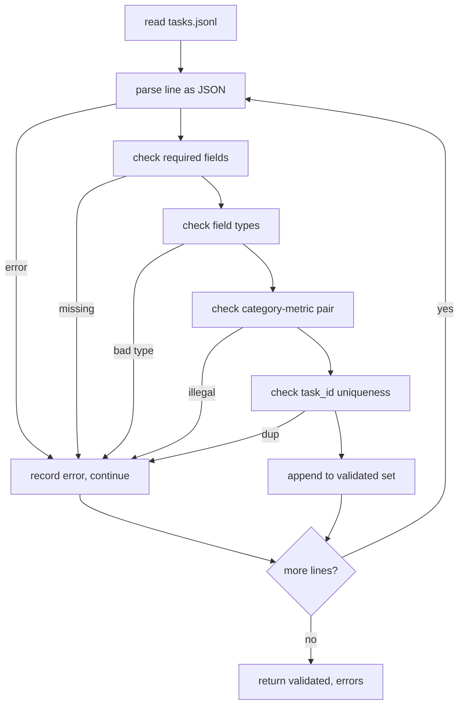

# 任务规范格式

> 一个评估框架的好坏取决于其任务所遵循的契约。在编写任何评分函数之前，请先冻结JSONL形状和指标词汇表。

**类型：** 构建
**语言：** Python
**前置条件：** 阶段19 轨道B的基础知识
**时间：** 约90分钟

## 学习目标

- 定义一个JSONL任务记录模式，该模式在一个形状中覆盖算术、多项选择、代码执行、分类和自由文本摘要。
- 固定一个封闭的指标名称词汇表，以便后续课程（71-73）可以在单个字段上分发。
- 将少样本示例和后处理规则指定为任务的一部分，而不是运行器的一部分，这样相同的提示在不同模型上产生相同的目标。
- 实现一个严格的验证器，在记录到达运行器之前拒绝格式错误的记录。
- 提供一个10任务的夹具集，该集合覆盖规范中的每个分支，以便验证器有实际内容可以处理。

## 为什么需要冻结规范

一个研究代码库积累评估脚本的速度会比积累测试的速度更快。六个月后，每个笔记本都有自己的JSON形状，每个指标都被重写了两次，并且没有任何内容可以在运行之间进行比较。解决方法很枯燥：选择一个模式，编写一个验证器，拒绝其他所有内容。这就是本课所做的。

这种形状借鉴了BIG-bench、HELM和lm-eval风格框架的思想，但字段名称是我们自己的。每个字段只有一个所有者。运行器读取任务，指标读取目标，后处理步骤标准化生成结果。没有字段在管道中间是可变的。

## 记录形状

一个任务是单个行上的JSON对象。框架逐行读取并独立验证每一行。错误的行会中止该记录，而不是整个运行。

```json
{
  "task_id": "arith_001",
  "category": "arithmetic",
  "prompt": "Compute the result. Question: 17 + 24\nAnswer:",
  "targets": ["41"],
  "metric_name": "exact_match",
  "few_shot_examples": [
    {"prompt": "Question: 2 + 2\nAnswer:", "completion": "4"}
  ],
  "post_process": "strip_whitespace",
  "metadata": {"difficulty": "easy"}
}
```

必填字段是`task_id`、`category`、`prompt`、`targets`、`metric_name`、`post_process`。`few_shot_examples`和`metadata`是可选的。未知的顶级字段会导致验证失败。

## 字段规则

`task_id`是一个没有空格的字符串。验证器确保整个文件中的唯一性。

`category`是`arithmetic`、`mcq`、`code_exec`、`classification`、`summary`之一。类别限制了哪些指标和后处理组合是合法的。`code_exec`任务必须使用`metric_name = code_exec`，而`mcq`任务必须针对单字母目标使用`metric_name = exact_match`。

`prompt`是一个非空字符串。验证器禁止尾随空白，并且拒绝提示主体中已经包含少样本块的记录。少样本渲染发生在运行器中，而不是作者。

`targets`是一个非空字符串列表。对于`exact_match`，任何匹配的元素都算数。对于`f1`和`rouge_l`，得分最高的目标获胜。对于`mcq`，列表恰好包含一个元素。

`metric_name`是`exact_match`、`f1`、`bleu_4`、`rouge_l`、`accuracy`、`code_exec`之一。词汇表是封闭的。一个新的指标需要一门新的课程和这里的一个新条目。

`few_shot_examples`是一个包含`{prompt, completion}`对的对列表。验证器将列表限制为八个条目，以保持提示有界。

`post_process`是`none`、`strip_whitespace`、`lower`、`extract_letter`、`extract_code_block`、`extract_first_line`之一。每个规则都有一个单一确定性的行为。验证器禁止组合规则。

## 验证器行为



验证器返回两个列表：验证通过的记录和错误记录（包含违规行、违反的规则和出错的字段）。如果错误列表非空，则运行器拒绝启动，除非设置了显式的`--allow-bad-tasks`标志。

## 少样本渲染

运行器将少样本示例连接在提示前面，并用空行分隔。相同的代码路径对每个模型运行，因此唯一的差异来源是模型本身。作者只编写一次示例，而不是每个提供商一次。

```python
def render(task):
    parts = []
    for ex in task.get("few_shot_examples", []):
        parts.append(ex["prompt"] + " " + ex["completion"])
    parts.append(task["prompt"])
    return "\n\n".join(parts)
```

## 后处理规则

后处理步骤在生成之后、指标之前运行。它是确定性的且无状态的。

- `none`返回字符串不变。
- `none`去除前导和尾随空白。
- `none`将字符串转换为小写。
- `none`返回第一个匹配`strip_whitespace`的字符，用于MCQ。
- `none`返回第一个三重反引号围栏块的主体，用于代码执行。
- `none`返回第一个非空行，用于摘要分类。

需要此列表之外规则的任务应属于新课程。

## 本节课不做什么

它不进行评分。它不调用模型。它不运行代码。这些将在课程71、72和75中介绍。本课程冻结了所有这些课程所尊崇的契约。

10项任务夹具包括两项算术项、两项MCQ项、两项代码执行项、两项分类项和两项摘要项。验证器对所有10项通过。另一个夹具（`tasks_bad.jsonl`）触发每条规则，验证器返回恰好那么多错误。

## 如何阅读代码

`main.py`定义`TaskSpec`、`validate_task`、`validate_file`和一个CLI入口点。夹具加载器是`load_fixtures`。渲染和后处理辅助函数与验证放在一起，以便课程75中的运行器导入单个模块。

从上到下阅读 `main.py`。然后阅读 `code/tests/test_spec.py`。测试固定了每一个验证规则和每一个后处理行为。`main.py` 底部的演示验证了捆绑的测试夹具并打印了摘要。

## 进一步探索

真正的评估套件像模式( Schema )增加列一样增加类别。明智的做法是拒绝添加一个类别而不同时添加一个度量( Metric )、一个后处理规则和至少一个夹具任务( Fixture Task )。将规范视为数据库迁移。每一次更改都要经过审查、版本控制，并伴有测试。本课中的验证器就是大门。
