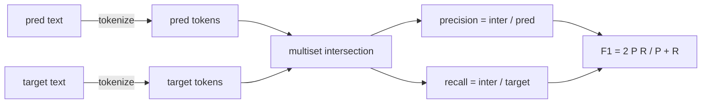
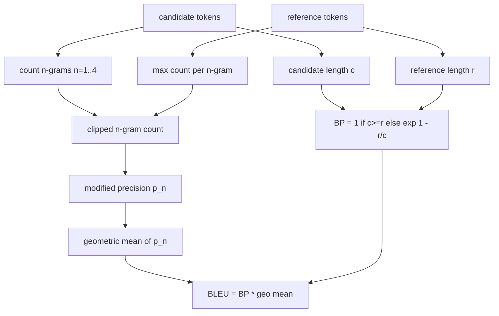

# 经典指标

> BLEU、ROUGE-L、F1、精确匹配(Exact-Match)、准确率(Accuracy)。这五个指标仍然构成了大部分已发表的LLM评估数字。从第一原理实现每个指标，这样你就能知道数字的含义。

**类型：** 构建
**语言：** Python
**前置条件：** 阶段19 Track B基础，第70课
**时间：** ~90分钟

## 学习目标

- 实现基于显式分词规则的词元级精确匹配、F1和准确率。
- 从头实现BLEU-4：修改后的n-gram精确率、n=1到4的几何平均数、简洁性惩罚(Brevity Penalty)。
- 使用最长公共子序列实现ROUGE-L，并采用精确率与召回率的F-beta组合。
- 根据第70课的metric_name字段进行分发，使运行器保持指标无关性。
- 通过从工作示例中抽取参考向量来固定行为，而不是从第三方库中获取。

## 为什么重新实现

你会读到论文报告BLEU 28.3，而另一篇报告BLEU 0.283。你会发现两个库的ROUGE-L分数相差十分，因为一个库截断为小写而另一个没有。停止困惑的最快方法是自己编写指标，然后指出决定分词器(Tokenizer)的行以及应用平滑(Smoothing)的行。之后，比较论文间的数字就变成阅读指标设置的问题，而不是争论库的问题。

标准库加NumPy就足够了。BLEU是计数和钳位。ROUGE-L是动态规划。F1是词元上的集合交集。最难的部分是选择一个分词器并坚持使用它。

## 分词(Tokenisation)

分词器是`re.findall(r"\w+", text.lower())`。小写、字母数字序列、去掉标点。本课中的每个指标都使用这个精确的分词器。运行器不能选择。如果你切换分词器，你就在运行不同的基准测试。

```python
TOKEN_RE = re.compile(r"\w+", re.UNICODE)
def tokenize(text):
    return TOKEN_RE.findall(text.lower())
```

这是故意简化。生产环境会关心CJK、缩写和代码标识符。本课的重点是分词器是一个契约，而不是一个旋钮。

## 精确匹配(Exact Match)

```python
def exact_match(pred, targets):
    return float(any(pred.strip() == t.strip() for t in targets))
```

每个任务返回1.0或0.0。整个数据集的聚合结果是均值。这是算术、多项选择(MCQ)和短分类任务的主力。

## 词元级F1

为预测和目标设置词元多重集。精确率是多重集交集除以预测的多重集。召回率是相同的交集除以目标的多重集。F1是调和平均数。实现处理空预测和空目标的边缘情况。



对于多目标任务，我们取目标列表中的最佳F1。这与文献中广泛报道的SQuAD式行为一致。

## BLEU-4

BLEU是标准的机器翻译指标，仍然出现在摘要工作中。我们使用的公式是语料库级别的BLEU-4，带有标准的简洁性惩罚以及对修改后n-gram计数的加一平滑，这样单个缺失的4-gram不会将分数推至零。

对于每个候选-参考对，我们计算n=1,2,3,4时的修改后n-gram精确率。修改精确率将候选n-gram计数裁剪为任何参考中该n-gram的最大计数，因此候选不能通过重复一个短语来膨胀。四个精确率的几何平均数由简洁性惩罚包裹。



平滑规则是Lin和Och称为方法1的规则：在取对数之前，每个n-gram精确率的分子和分母都加一。这避免了当参考没有匹配的4-gram时出现`log 0`，并在长候选上保持接近未平滑的值。

## ROUGE-L

ROUGE-L比较候选和参考词元序列的最长公共子序列。LCS捕捉词序而不强制连续性，这就是为什么它是默认的摘要指标。我们使用标准的动态规划表计算LCS长度，然后推导召回率为`lcs / reference length`，精确率为`lcs / candidate length`，并与F-beta结合，其中beta等于1以获得对称的F1形式。

```python
def lcs_length(a, b):
    n, m = len(a), len(b)
    dp = numpy.zeros((n + 1, m + 1), dtype=int)
    for i in range(n):
        for j in range(m):
            if a[i] == b[j]:
                dp[i+1, j+1] = dp[i, j] + 1
            else:
                dp[i+1, j+1] = max(dp[i+1, j], dp[i, j+1])
    return int(dp[n, m])
```

NumPy表使实现清晰易读；纯Python列表也可以工作。选择ROUGE-L的任务每个任务付出O(n m)的代价。对于典型的摘要长度，这保持在毫秒以下。

## 准确率(Accuracy)

对于多目标分类任务，准确率简化为与单个标准化目标的精确匹配。我们将其作为一个单独的函数公开，以便调度器可以在`metric_name`上进行分发，而无需在运行器内部进行字符串比较。

## 分发契约

单一入口点是`score(metric_name, prediction, targets)`。它在`[0, 1]`中返回一个浮点数。运行器不会根据指标名称分支。它将调用传递并写入结果。这是第75课将粘合到第70课任务规范的界面。

```python
def score(metric_name, pred, targets):
    if metric_name == "exact_match":
        return exact_match(pred, targets)
    if metric_name == "f1":
        return max(f1_score(pred, t) for t in targets)
    if metric_name == "bleu_4":
        return max(bleu4(pred, t) for t in targets)
    if metric_name == "rouge_l":
        return max(rouge_l(pred, t) for t in targets)
    if metric_name == "accuracy":
        return accuracy(pred, targets)
    raise ValueError(f"unknown metric_name: {metric_name}")
```

`code_exec`在第72课中处理并插入到那里的调度器中。

## 本节课不做什么

它不调用模型。它不会对生成结果进行超出第70课后处理规则之外的标准化。它不计算置信区间。它不做BLEURT或BERTScore（这些需要模型，属于不同的课程）。重点是基础：五个指标，一个分词器，一个调度表。

## 如何阅读代码

`main.py`将每个指标定义为自由函数加上调度器。参考向量位于文件底部的`_reference_examples`块中。演示对八个示例运行调度器并打印每个指标的分数。`code/tests/test_metrics.py`中的测试固定参考向量并强调每个边缘情况（空预测、空参考、无共享词元、精确匹配、重复短语裁剪）。

从头到尾阅读`main.py`。函数按复杂度排序。exact_match和accuracy各一行。F1有六行。BLEU和ROUGE-L是重头戏，它们包含关于平滑规则和LCS递归的详细注释。

## 进一步探索

经典指标是必要的，但不是充分的。它们奖励表面重叠而忽略含义。解决方法是在你信任经典基础之后，在上面叠加基于模型的指标（BLEURT、BERTScore、GEval）。那是后面的课程。现在：让这五个指标工作，用测试固定它们，你就有了一个可审计、快速且可重现的指标栈。
