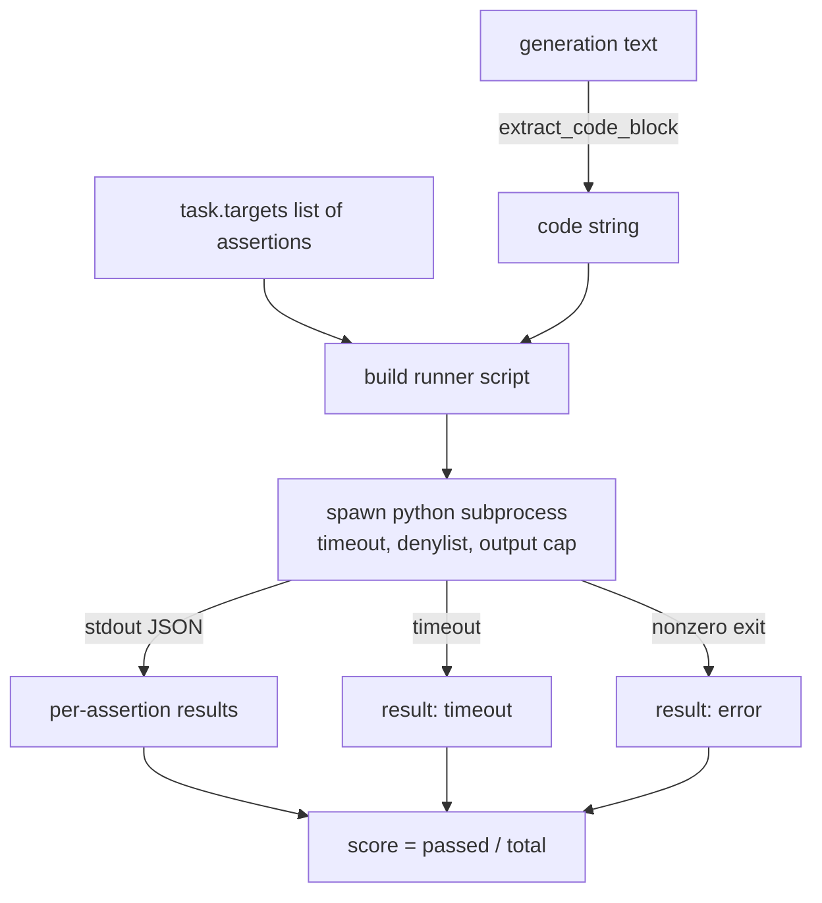
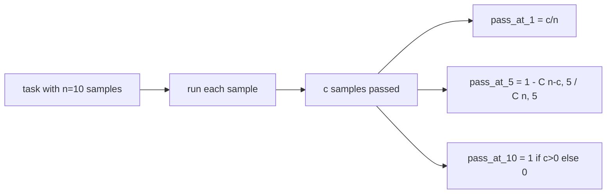

# 代码执行指标

> 生成的代码在通过测试时即为正确。评估框架必须提取代码，运行时不使主机崩溃，并诚实统计通过率。本课将构建这一表面。

**类型：** 构建
**语言：** Python
**前置条件：** 阶段19 轨道B 基础，第70和71课
**时间：** 约90分钟

## 学习目标

- 按照第70课的后处理规则，从自由形式的生成中提取代码块。
- 在隔离的子进程中执行候选代码，设置挂钟超时、输出上限和导入拒绝列表。
- 根据候选代码通过的提供的断言字符串比例来评分任务。
- 对于从单个模型采样多个生成的任务，计算pass-at-k。
- 将沙箱崩溃、语法错误和超时视为一等失败模式，具有不同的退出代码，供运行器记录。

## 为什么需要隔离的子进程

内联 `exec` 是安全和稳定性隐患。生成的 `while True: pass` 会永久阻塞评估。生成的 `import shutil; shutil.rmtree('/')` 听起来灾难性就很强。解决方法是每个候选代码生成一个新的 Python 解释器，通过 stdin 传递代码，将断言结果写入 stdout，并在超时时终止进程。主机评估进程继续保持运行。

真实的评估如 HumanEval、MBPP、BigCodeBench 和 LiveCodeBench 都使用子进程沙箱。有些还在上面叠加 Docker。我们停留在子进程是有原因的：它是可移植的，属于标准库，并且能捕获教育评估中重要的失败模式。生产环境部署会添加 seccomp、网络隔离和只读文件系统。关于加固的下节课不在本轨道内。

## 代码执行任务的结构

一个 `code_exec` 任务在 `targets` 中携带断言字符串。运行器从生成结果中提取围栏代码块，围绕它构建测试框架，然后运行结果。



分数是 `[0, 1]` 中的一个小数。一个有三个断言的任务，其中两个通过则得分为 0.667。无论什么失败，运行器都返回相同的结构：子进程崩溃映射到规范化的错误代码，而不是 Python 回溯冒泡到框架。

## 拒绝列表

拒绝列表基于导入。在运行候选代码之前，运行器脚本将危险模块的导入重写为引发 `ImportError("denied")` 的存根。该列表特意保守：`os.system`, `subprocess`, `socket`, `requests`, `urllib`, `urllib.request`, `urllib.error`, `urllib.parse`, `ctypes`, `shutil`, `http.client`, `asyncio.subprocess`。

我们不假装这是万无一失的。有决心的对抗性代码可以逃脱 Python 中的任何进程内沙箱。拒绝列表是一个后备措施。挂钟超时和输出上限是负载控制手段。

```python
DENIED = {
    "os.system": True,
    "subprocess": True,
    "socket": True,
    "shutil": True,
    "requests": True,
    "urllib": True,
    "ctypes": True,
}
```

我们通过在候选代码前添加 `import sys` 和一个猴子补丁 `os.system` 使其引发异常的守卫来包装它。完整模板在 `main.py` 中。

## 挂钟超时

每个子进程默认有 3 秒挂钟预算。运行器使用 `subprocess.run(..., timeout=t)`。如果超时触发，运行器捕获 `TimeoutExpired`，终止进程，并为任务记录 `timeout` 退出原因。该任务得分为零。运行器继续。

超时时间可通过 `task.metadata.timeout_s` 按任务配置。长时间运行的单元测试可以要求更多；第 70 课的验证器将值限制为 30 秒，以保持套件有界。

## 输出上限

子进程可以淹没 stdout，耗尽主机内存。运行器将 stdout 流式传输到缓冲区，一旦累计超过 256 KB，就终止子进程。结果记录为 `exit_code = error`，附带详细字符串 `"output overflow"`。这在实践中出现的情况是，生成结果意外写入了一个打印的无限循环。

## Pass-at-k

Pass-at-k 是 HumanEval 及其他评估使用的无偏估计量。给定每个任务 `n` 个独立样本，其中 `c` 个通过，从 `n` 中抽取大小为 `k` 的样本至少包含一个通过解的概率为：

```
pass_at_k(n, c, k) = 1 - C(n - c, k) / C(n, k)
```

当 `n - c < k` 时，分子未定义，值为 `1`。实现直接处理边界情况。我们公开 `pass_at_k(n, c, k)` 供第 74 课的排行榜层使用。



## 退出代码

运行器为每个任务返回五种结果之一：

- `pass` 当所有断言通过时。
- `pass` 当代码运行但至少一个断言失败时。
- `pass` 当代码无法导入或有语法错误时。
- `pass` 当挂钟超时时。
- `pass` 用于任何其他崩溃，包括拒绝列表命中和输出溢出（溢出会附带详细信息 `assertion_fail`）。

分数仍然是一个小数。退出代码是元数据。后续课程可以决定将超时计为零还是缺失数据。

## 本节课不做什么

它不会给你一个真正的沙箱。它不运行来自开放网络的不可信代码。它不处理像文件 I/O 或网络调用这样的有状态任务。那些需要容器或微虚拟机。本课的重点是契约：一个隔离的子进程、一个拒绝列表、一个超时、一个输出上限、一套清晰的退出代码词汇表以及 pass-at-k 数学。

## 如何阅读代码

`main.py` 定义了 `extract_code`, `run_candidate`, `score_code_exec`, 和 `pass_at_k`。子进程运行器脚本被构建为字符串，并通过 `-c` 传递给一个新的 Python 解释器。`code/tests/test_exec.py` 中的测试针对从 HumanEval 风格中提取的示例，演练了四个退出代码以及 pass-at-k。

从上到下阅读 `main.py`。运行器模板是承重部分。盯住断言循环，直到你能预测它写回父进程的 JSON 信封。

## 进一步探索

一旦子进程结构工作，下一个问题是可移植性。不同 Python 版本在 Windows 上处理 SIGKILL 的方式不同。最干净的修复是将运行器放入 Docker 镜像中。之后的下一个是用真实的单元测试文件替换断言字符串，以使评估匹配生产 CI 的做法。到那时停止称断言字符串为测试；它们是玩具测试，并且具有玩具失败模式。
