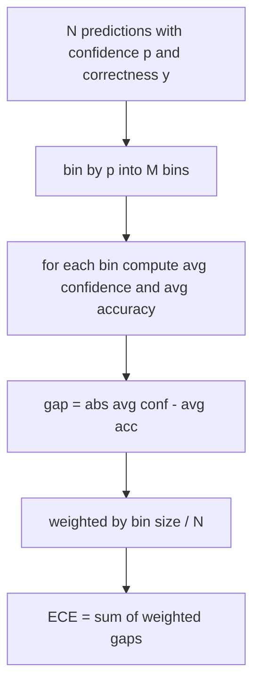
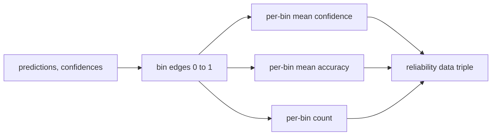

# 困惑度与校准

> 如果模型对一千个答案声称有90%的置信度，但只答对了六百个，那么它的校准性就不够好。校准性是可信评估的一半。另一半是困惑度，它告诉我们模型是否认为留出文本是合理的。

**类型：** 构建
**语言：** Python
**前置条件：** 阶段19 轨道B 基础，第70和71课
**时间：** 约90分钟

## 学习目标

- 利用模型适配器提供的词元负对数概率，计算留出语料库上的词元级困惑度。
- 根据分箱的预测概率，计算分类器或多选评估的期望校准误差(ECE)。
- 计算布里尔分数(Brier score)（与正确性指示器的均方误差），并解释它在哪些方面补充了ECE的不足。
- 构建可靠性图数据，用于绘制置信度-准确率曲线。
- 将三者集成到评估框架中，以便运行器可以向模型报告附加`perplexity`、`ece`和`brier`数字。

## 困惑度的含义

困惑度是每个词元的指数化平均负对数似然。越低越好。困惑度为1表示模型为每个实际词元分配概率1。困惑度等于词汇表大小表示模型是均匀分布且什么也没学到。实际数字介于两者之间：一个强大的2026基础模型在WikiText-103上的困惑度大约在8到12之间。一个差的模型在同一文本上困惑度超过50。

评估框架本身不计算对数概率。这些来自模型适配器。评估框架进行聚合：它接收每个词元的对数概率列表、每个序列的词元计数列表，并返回语料库困惑度。

```python
def perplexity(neg_log_probs, token_counts):
    total_nll = sum(neg_log_probs)
    total_tokens = sum(token_counts)
    return math.exp(total_nll / total_tokens)
```

实现处理零词元的边界情况，并断言负对数概率非负。一个常见错误是忘记取负值：如果适配器返回`log p`而不是`-log p`，则会导致困惑度小于1，这是不可能的。该函数将其检测为违反合约。

## ECE衡量什么

期望校准误差将预测按其置信度分组到固定数量的箱中，然后测量每个箱中置信度与准确率之间的平均差距，并按箱大小加权。



标准公式在`[0, 1]`上使用十个等宽箱。实现支持任何正整数箱数。我们暴露一个`bins`参数，以便运行器可以在发表惯例（10）和比较惯例（15）之间选择。

ECE受箱数和样本量影响产生偏差。使用十个箱和一百个预测时，无法区分0.02的ECE与随机噪声。实现会返回填充的箱数以及ECE，以便运行器在样本过少时拒绝报告单一数字。

## 布里尔分数的补充作用

ECE只关心平均差距。一个模型在半个箱上过度自信，在另一半箱上信心不足，可能具有较低的ECE，但在局部校准不佳。布里尔分数针对每个预测测量与真实结果的平方误差，因此直接惩罚弥散。

对于二分类结果，布里尔分数为`mean((p_i - y_i)^2)`。它分解为可靠性、分辨率和不确定性。我们计算分数和分解。运行器报告标量，但记录分解用于仪表板。

```python
def brier(p, y):
    return float(np.mean((p - y) ** 2))
```

## 可靠性图数据

可靠性图绘制每个箱中的预测置信度与经验准确率。对角线表示完美校准。函数返回三个数组：每个箱的平均置信度、每个箱的平均准确率和每个箱的计数。绘图代码位于下游；本课止于数据形状。



返回的元组是调用层绘制图形或计算自定义ECE变体（自适应ECE、扫描ECE等）所需的内容。我们返回numpy数组，以便下游代码无需转换。

## 置信度来源

评估框架不假设置信度来自softmax。它接受每个预测的`[0, 1]`中的任意数字。对于多选任务，自然置信度是`softmax over option log-likelihoods`。对于自由文本，自然置信度是模型自报告的概率或平均对数似然的指数。评估仅消费该数字。其来源是适配器的任务。

## 边界情况

- 所有预测都错误：ECE是平均置信度，布里尔分数高，困惑度取决于模型对文本的看法。
- 所有预测都正确且置信度高：ECE接近零，布里尔分数接近零。
- 完美不确定的预测器在p=0.5时：ECE是0.5减去准确率，布里尔分数是0.25减去修正项。
- 空输入：ECE、布里尔分数和可靠性返回`0.0`（或零填充数组）。困惑度对于零词元情况返回`NaN`。这些路径都不会发出警告；运行器检查值并决定是否报告或跳过。

这些情况已融入测试中。真实模型在真实基准上不会遇到它们，但有缺陷的适配器或极小的样本会触发，运行器不应崩溃。

## 调度

校准不像F1那样是每个任务的指标。它是每个模型的报告。运行器在整个评估过程中累积`(confidence, correct)`对，并一次计算ECE、布里尔分数和可靠性数据。困惑度是在留出文本语料库上计算的，与逐任务评分分开。

接口为：

```python
report = CalibrationReport.from_predictions(confidences, correct)
report.ece          # float
report.brier        # float
report.reliability  # tuple of three numpy arrays
report.populated_bins  # int
```

`PerplexityResult.from_token_nll(neg_log_probs, token_counts)`返回困惑度和每个词元的平均负对数似然。

## 本节课不做什么

它不调用模型。不实现softmax。不从输出词元估计置信度；那是适配器的任务。它不进行温度缩放或普拉特缩放；这些是后处理修复，属于另一课。本课的重点是使三个数字（困惑度、ECE、布里尔分数）可信且可复现。

## 如何阅读代码

`main.py`定义了`perplexity`、`expected_calibration_error`、`brier_score`、`reliability_diagram`以及`CalibrationReport`/`PerplexityResult`数据类。演示在已知真实情况的合成预测上运行：一个校准良好的模型、一个过度自信的模型和一个信心不足的模型。`code/tests/test_calibration.py`中的测试包含了每个边界情况以及合成预测器的参考值。

从头到尾阅读`main.py`。函数顺序从标量到向量再到报告。每个函数都有简短的文档字符串，包含数学和合约。

## 进一步探索

校准是已发布评估中最被忽视的维度。大多数排行榜报告单一准确率数字就算完事。一个在准确率上获胜但在布里尔分数上失败的模型，在生产部署中不如一个准确率低几分但可靠地报告不确定性的模型。一旦校准基础设施就位，在留出验证切片上添加温度缩放，重新计算ECE，观察差距缩小。那是另一课的内容，但基础在本课。
