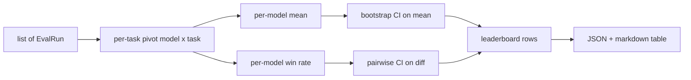
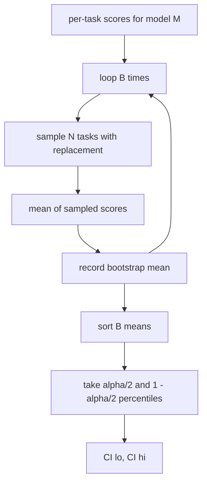

# 排行榜聚合

> 每个任务得分很容易。但跨异构任务的每个模型排名则更难。在千次预测的排行榜上，统计显著性(Statistical Significance)是每个人都跳过的那一部分。本课不会跳过它。

**类型:** 构建
**语言:** Python
**前提条件:** 第19阶段B轨基础，第70、71、73课
**时间:** 约90分钟

## 学习目标

- 将多个模型和多个任务的每个任务得分聚合到一个整洁的每个模型行中。
- 标准化(Standardize)异构得分，以便通过率(pass rates)和BLEU值不会过度影响聚合。
- 按均值(Mean)和胜率(Win-Rate)对模型排名，并解释何时每个指标是合适的汇总。
- 计算每个模型均值和成对差异的自举置信区间(Bootstrap Confidence Intervals)。
- 将排行榜输出为JSON报告和Markdown表格，以便第75课的运行器(Runner)可以粘贴到CI注释中。

## 输入形状

聚合器(Aggregator)消费一个`EvalRun`记录列表：

```python
@dataclass
class EvalRun:
    model_id: str
    task_id: str
    metric_name: str
    score: float          # in [0, 1]
    category: str
```

第75课的运行器每`(model, task)`对发出一个记录。聚合器不关心得分是如何产生的。它期望标准化已经完成：每个得分都在`[0, 1]`中。

## 输出

输出三个表格：



排行榜行包含：`model_id`、`mean_score`、`mean_ci_lo`、`mean_ci_hi`、`win_rate`、`tasks_completed`，以及一个可选的`categories`映射用于每类别均值。

## 标准化

如果一个任务得分在`[0, 1]`而另一个在`[0, 100]`中，第二个会悄然主导均值。聚合器验证每个输入得分都在`[0, 1]`中，否则拒绝运行。修复在上游：指标应该已经返回一个分数。第71到73课强制执行该契约。

## 均值与胜率

两种排名方案服务于不同的目标。

均值得分是一个模型所有任务得分的平均值。它是排行榜报告的头条数字。它对异常值和任务不平衡敏感。

胜率计算一个模型在相同任务上击败其他每个模型的频率。对于每个任务，得分最高的模型获胜（平局平分）。胜率等于获胜次数除以模型有得分的任务数量。它对异常值和尺度差异不那么敏感，但会丢失信息。

```python
def win_rate(model_id, runs_by_task, all_models):
    wins, total = 0, 0
    for task_id, runs in runs_by_task.items():
        scores = {r.model_id: r.score for r in runs if r.model_id in all_models}
        if model_id not in scores:
            continue
        total += 1
        best = max(scores.values())
        if scores[model_id] >= best:
            wins += 1
    return wins / total if total else 0.0
```

测试工具报告两者。第75课的运行器默认按均值排名；胜率的Markdown列就在那里，以防用户更喜欢它。

## 自举置信区间

每个模型均值伴随一个通过自举重采样(Bootstrap Resampling)在任务上估计的置信区间。我们替换地重采样任务ID，计算重采样集上的均值，重复`B`次，并取在水平`alpha`上的百分位区间。



对于成对比较，我们对每个任务差异`score_A - score_B`进行自举，取百分位区间并报告。用户读取该区间是否排除零。如果是，该差异在alpha水平上显著。如果不是，排行榜将模型视为并列。

低级辅助函数(`bootstrap_mean_ci`, `bootstrap_pairwise_diff`)默认设置为`B=1000`；公共聚合器(`aggregate`, `pairwise_diffs`)默认设置为`b=500`，以便演示和测试保持快速。默认alpha为0.05。本课保持自举纯numpy，不使用scipy。

## 类别

如果设置了`EvalRun.category`，聚合器还会报告每类别均值。这是每个排行榜上写着`math`、`reasoning`、`code`、`safety`的列。它让运行器发现模型是否总体良好但代码薄弱，这是头条均值隐藏的信息。

## Markdown渲染

排行榜被渲染为Markdown表格：

```text
| Rank | Model | Mean | 95% CI | Win rate | Tasks |
|------|-------|------|--------|----------|-------|
| 1    | gpt   | 0.78 | 0.74-0.82 | 0.62 | 50 |
| 2    | claude| 0.75 | 0.71-0.79 | 0.34 | 50 |
| 3    | random| 0.10 | 0.07-0.13 | 0.04 | 50 |
```

表格按均值得分排序。置信区间渲染到两位小数。较长的模型ID截断为二十个字符。

## 本节课不做什么

它不运行模型。它不调用指标层。它不实现自适应ECE或其他校准变体；那些是第73课的内容。它不实现任务加权。这里每个任务权重相同。生产环境的排行榜会对任务加权；我们通过`weight`字段保留了这个钩子，但在聚合器中忽略它。如果需要，在后续课程中添加加权。

## 如何阅读代码

`main.py`定义了`EvalRun`、`LeaderboardRow`、`aggregate`、`bootstrap_mean_ci`、`bootstrap_pairwise_diff`和`render_markdown`。演示构建了一个包含三个模型和十二个任务的合成套件，进行聚合，并打印排行榜加上成对差异表格。`code/tests/test_leaderboard.py`中的测试固定了自举、Markdown渲染、胜率边界情况和空输入行为。

从上到下阅读`main.py`。首先是数据形状(EvalRun, LeaderboardRow)，然后是聚合器，接着是自举，最后是渲染。每个函数都有明确的职责。

## 进一步探索

自然的下一步是配对任务显著性(Paired-Task Significance)而不是非配对自举。如果模型A和B都运行了相同的一百个任务，合适的检验是对逐任务差异进行配对自举，我们实现了这一点。除此之外，你还需要一个尊重任务族的分层自举(Hierarchical Bootstrap)（数学问题之间不是独立的；一个算术错误模式会影响其中十个）。那是后续内容。本课的重点是把基础打牢，使评估报告的数字经得起推敲。
