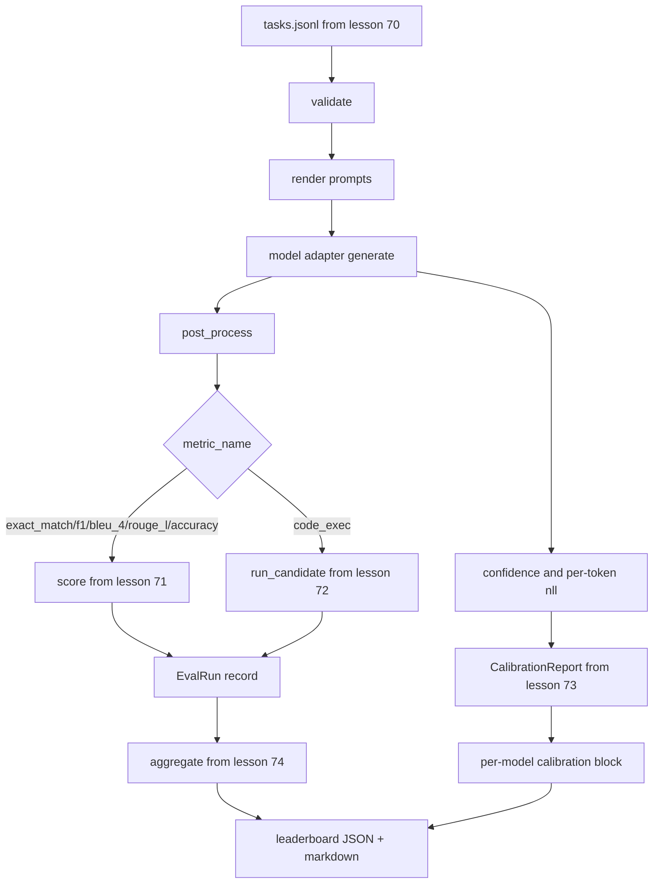

# 端到端评估运行器

> 五个连接管道课程，一个黏合课程。运行器从第70课读取任务规范，通过适配器调用模型，用第71和72课打分，附加第73课的校准报告，并输出第74课的排行榜。演示自行终止。

**类型：** 构建
**语言：** Python
**先决条件：** 阶段19轨道B基础，第70至74课
**时间：** ~90分钟

## 学习目标

- 定义一个 `ModelAdapter` 接口，任何模型（模拟、本地、API）都可以通过少量方法满足该接口。
- 在一个固定 JSONL 文件上运行评估，通过工作池并行执行任务。
- 将度量层（精确匹配、F1、BLEU-4、ROUGE-L、代码执行）与校准层组合在一次遍历中。
- 输出每个模型的 `ModelAdapter` 记录，并直接输入到排行榜聚合器。
- 输出 JSON 报告和 Markdown 表格；正常运行以退出码零自行终止，验证或运行时失败则以非零退出码终止。

## 流水线



运行器是集成点。第70至74课每课拥有一个模块，运行器将这些模块组合起来。运行器不会重复这些模块中的任何逻辑：它导入它们。

## 适配器接口

适配器是运行器与任何模型之间的接缝。接口故意设计得很小。

```python
class ModelAdapter:
    model_id: str

    def generate(self, prompt: str, task: TaskSpec) -> Generation: ...
```

`Generation` 是一个数据类，包含：

- `text`：模型的自由形式输出
- `text`：一个浮点数，位于 `confidence` 中，表示模型自我报告的答案概率
- `text`：可选，生成令牌上负对数似然之和
- `text`：可选，生成令牌数量

运行器中的模拟适配器提供三种风格：`RuleBasedAdapter`（确定性，近乎完美）、`NoisyAdapter`（过度自信，经常错误）和 `BiasedAdapter`（擅长一个类别，另一个类别极差）。演示在第70课固定数据集上运行全部三种。

## 并行执行

运行器使用 `concurrent.futures.ThreadPoolExecutor` 按模型并行运行任务。工作线程数默认为八和任务数中的较小者。线程足够，因为真实模型调用的瓶颈是网络 I/O。代码执行路径在任务内生成自己的子进程，执行器仅调度等待。

对于确定性测试，运行器暴露 `run_eval(adapters, tasks, parallel=False)`，以便测试可以固定执行顺序。

## 单次遍历评分循环

对于每个任务：

1. 渲染提示（少样本前缀加提示主体）。
2. 调用适配器并计时。
3. 根据任务规则后处理生成。
4. 分派到度量层。
5. 构建一个包含分数和度量元数据的 `EvalRun` 记录。
6. 将 `EvalRun` 对追加到校准缓冲区。

对于精确匹配风格的度量（`exact_match`、`accuracy`、`code_exec`），`correct` 信号是 `score >= 1.0`；对于分级度量，则是 `score >= 0.5`。阈值位于 `_correct_from_score` 中，运行器不暴露公共覆盖。

## 汇总

当每个任务都有结果后，运行器调用第74课的 `aggregate` 和 `pairwise_diffs` 以及第73课的 `CalibrationReport.from_predictions`。输出是一个单独的 JSON 信封：

```json
{
  "leaderboard": [...],
  "pairwise": [...],
  "calibration": {
    "model_id_a": {"ece": 0.04, "brier": 0.10, "populated_bins": 8, ...},
    ...
  },
  "summary": {
    "tasks": 10,
    "models": 3,
    "wall_seconds": 1.2
  }
}
```

运行器还会向标准输出写入一个 Markdown 表格，以便用户将结果粘贴到 PR 审查中。

## 自行终止的演示

演示在第70课的十个固定任务上运行三个模拟适配器。实际时间应控制在十秒以内。正常运行时退出码为零。

正常运行的基准是：

- 每个任务在第70课下验证。
- 每个任务在第71和72课下评分。
- 校准报告在第73课下聚合且无错误。
- 排行榜将基于规则的适配器严格排在随机适配器之上。

如果其中任何一项失败，运行器将以非零退出码退出，并在 JSON 信封中包含结构化错误。

## 本节课不做什么

它不调用真实模型。它不实现 API 密钥流程或速率限制处理。它不实现流式或部分生成；适配器每次调用返回一个生成结果。它不实现重试或缓存。这些关注点位于适配器层；运行器与度量无关且与提供者无关。

## 如何阅读代码

`main.py` 是集成中心。它通过一个小的 `_load_sibling` 辅助函数（按相对路径解析）从其他五个课程模块导入。数据类 `Generation`、`EvalReport` 和 `ModelAdapter` 在本地定义。模拟适配器位于文件底部。

从顶到底阅读 `main.py`。大致浏览导入，然后查看 `run_eval`、`_score_one`，然后是适配器。最后的演示是入口点。

`code/tests/test_runner.py` 中的测试固定了适配器接口、单次遍历循环、并行与顺序等效性、校准缓冲区和 JSON 信封形状。

## 进一步探索

这个运行器是基础。生产级评估系统添加：按 `(task_id, model_id, model_version)` 键值的结果缓存、跟踪每次运行的美元和令牌的成本账本、在速率限制时退避的重试层、用于 pass-at-k 任务的采样策略，以及用于长套件的流式输出格式。每个都是一个单独的关注点，包装运行器而不改变度量或聚合层。这种分离正是约定的要点。

在模拟适配器工作后，为真实提供者添加适配器。选择一个有免费层的，写三十行胶水代码，看着排行榜亮起来。然后添加第二个提供者，让框架完成工作。
