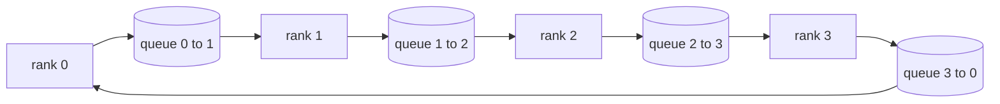

# 从头实现集合操作

> 支撑分布式训练的四种集合操作是allreduce、broadcast、allgather和reduce_scatter。训练框架提供的所有其他原语都是这些操作的封装。在`multiprocessing.Queue`网格上构建一次，并通过参考实现验证它们，其余部分就变成了管道工程。

**类型：** 构建
**语言：** Python
**先修知识：** 第19阶段C课程第42-49课
**时间：** ~90分钟

## 学习目标

- 实现两轮环形allreduce（reduce-scatter后跟allgather），并证明每个秩的通信量为每元素2(N-1)/N字节。
- 基于点对点发送在`multiprocessing.Queue`上构建broadcast、allgather和reduce_scatter。
- 对每个原语，用相同输入的`multiprocessing.Queue` gloo参考进行验证。
- 根据集群形状、延迟下限和带宽上限，论证环状与树状的选择。

## 问题

在N个秩上的朴素allreduce将N倍张量发送给根节点并广播N次。每个秩的带宽为O(N)，根节点成为瓶颈，墙上时间下限为最慢链路乘以N。环形allreduce将其压缩为2(N-1)个大小为T/N的块，因此每个秩的字节数降至2T(N-1)/N，与集群大小无关。树形allreduce在小N和高延迟链路上胜出，因为深度为log2(N)跳而非2(N-1)。为集群形状选择错误的拓扑，最慢的GPU将决定步长。

你在本阶段阅读的每个分布式训练框架都依赖这四个原语。PyTorch DDP通过每个参数桶一次allreduce同步梯度。ZeRO通过reduce_scatter分片优化器状态，并通过allgather广播更新后的参数。FSDP将完整前向变为allgather加reduce_scatter。流水线并行需要跨阶段组广播激活。如果你不能实现这四个集合操作，你就无法推理为什么训练停滞、为什么梯度不匹配出现在秩3、为什么交换拓扑时流水线气泡翻倍。

## 核心概念



### 两轮环形allreduce

将张量分成N个等大的块，索引为0..N-1。每个秩拥有与其秩相等的块索引。第1轮reduce-scatter运行N-1步。在第s步，秩r将块(r - s) mod N发送给秩(r + 1) mod N，并从秩(r - 1) mod N接收块(r - s - 1) mod N，将接收到的块累加到其本地副本中。经过N-1步后，秩r拥有块r的完整和。第2轮allgather再运行N-1步，将完成的块绕环旋转，直到每个秩拥有每个块的完整和。

|  原语  |  每秩字节数  |  步数  |  使用时机  |
|-----------|---------------|-------|-------------|
|  环形allreduce  |  2T(N-1)/N  |  2(N-1)  |  大T，大管道同质集群  |
|  树形allreduce  |  T log2(N)  |  2 log2(N)  |  小T或高延迟链路  |
|  Broadcast  |  T  |  log2(N)树  |  参数初始化，标量配置  |
|  Allgather  |  T(N-1)/N  |  N-1  |  分片前向，ZeRO解分片  |
|  Reduce_scatter  |  T(N-1)/N  |  N-1  |  ZeRO梯度分片  |

### 队列网格作为NCCL的替代

NCCL通过PCIe和NVLink运行，具有硬件卸载的规约。在CPU上你没有这个条件。每环边的`multiprocessing.Queue`为你提供有序的点对点投递，具有单个生产者和单个消费者。规约在用户空间进行，因此你承担Python开销，但线缆模式与NCCL环形allreduce相同。在队列版本上推理正确性，集群行为随之而来。

### 使用gloo验证

每个原语都附带一个单元测试，将其输出与在相同张量和相同世界大小下用gloo后端初始化的`torch.distributed`进行比较。如果环形allreduce与gloo的差异超过float32精度，则测试失败。与参考实现的验证是不可协商的；没有它，原语在真实训练运行的第10000步之前看起来都是正确的。

## 动手构建

`code/main.py` 实现：

- 将N个`multiprocessing.Queue`实例连接成环并暴露每个秩的`send(dst, tensor)`和`recv(src)`的`Mesh`类。
- 运行两轮算法的`Mesh`。
- 对数树上的`Mesh`。
- 使用N-1次旋转的`Mesh`。
- 作为allreduce前半部分的`Mesh`。
- 通过`multiprocessing.Queue`用gloo运行相同输入以进行字节相等比较的`Mesh`。

运行它：

```bash
python3 code/main.py
```

输出：每个原语的验证表，比较队列网格和gloo输出，随后是一个每秩字节计数器，证明2T(N-1)/N缩放。

## 实际中的生产模式

三种模式足以使原语达到可以发布的程度。

**在allreduce之前对梯度进行分桶。** 一个1B参数模型有成千上万个梯度张量。每个张量一次allreduce要付出N次延迟下限。DDP将梯度分桶为约25MB的块，每个桶发起一次allreduce；小张量附着在大张量后面。没有分桶，延迟开销会主导步长。

**将通信与计算重叠。** 反向传播按逆序逐层计算梯度。当最后一层的梯度准备好时，立即启动其allreduce，同时下一层继续计算。PyTorch DDP通过桶就绪钩子实现这一点。当网络有空闲时，重叠可将可见通信时间减半。

**根据消息大小而非教条选择环或树。** NCCL带有一个拓扑检测器，对约1MB以上的消息选择环，以下选择树。交叉点是带宽与延迟：1MB以上，带宽项2T(N-1)/N占主导，环胜出；1MB以下，log2(N)跳数胜出。硬编码一种拓扑会在错误的消息大小上损失吞吐量。

## 使用它

生产模式：

- **PyTorch DDP。** 在反向传播后对分桶梯度调用`dist.all_reduce`。桶大小可调；对于100Gbit以太网，默认25MB是合理的。
- **DeepSpeed ZeRO。** 发出reduce_scatter以分片梯度，并在前向之前发出allgather以重构完整参数。本课程的原语正是ZeRO所做的调用。
- **FSDP。** 前向从allgather开始以解分片该层，计算，然后用reduce_scatter规约并丢弃解分片。相同的原语，不同的调度。

## 发布

在第77-81课中使用队列网格原语。第77课将allreduce接入DDP。第78课将reduce_scatter接入ZeRO。第79课将broadcast接入流水线激活。第81课将所有四个原语组合成端到端演示。

## 练习

1. 添加一个树形allreduce变体，并根据消息大小在环和树之间切换。测量交叉点。
2. 添加一个`recv_timeout_ms`，使停滞的秩触发超时错误而不是永远挂起。
3. 将`recv_timeout_ms`替换为TCP套接字来实现四个原语。相同的测试，真实的线缆。
4. 添加一个带宽仪表化钩子，使每秩字节计数器记录到JSONL。
5. 比较4个秩上大小为1KB、1MB、16MB张量的环与树形墙上时间。凭经验论证交叉点。

## 关键术语

|  术语  |  人们的说法  |  实际含义  |
|------|----------------|------------------------|
|  Allreduce  |  "跨秩求和"  |  调用后每个秩持有相同的规约后张量  |
|  Ring  |  "快速拓扑"  |  N-1个大小为T/N的块绕环流动两次  |
|  Tree  |  "对数拓扑"  |  规约遵循二叉树；深度为log2(N)跳  |
|  Allgather  |  "拼接分片"  |  每个进程最终拥有所有其他进程的分片  |
|  Reduce_scatter  |  "拆分总和"  |  每个进程最终只得到一个数据块的总和  |
|  桶  |  "融合小张量"  |  将N个小全归约合并为一个大全归约  |

## 延伸阅读

- [PyTorch Distributed: NCCL collectives](https://pytorch.org/docs/stable/distributed.html#collective-functions)
- [PyTorch Distributed: NCCL collectives](https://pytorch.org/docs/stable/distributed.html#collective-functions)
- [PyTorch Distributed: NCCL collectives](https://pytorch.org/docs/stable/distributed.html#collective-functions)
- [PyTorch Distributed: NCCL collectives](https://pytorch.org/docs/stable/distributed.html#collective-functions)
- 阶段10第05课 - 分布式训练概述
- 阶段19第77课 - 基于这些原语构建的DDP
