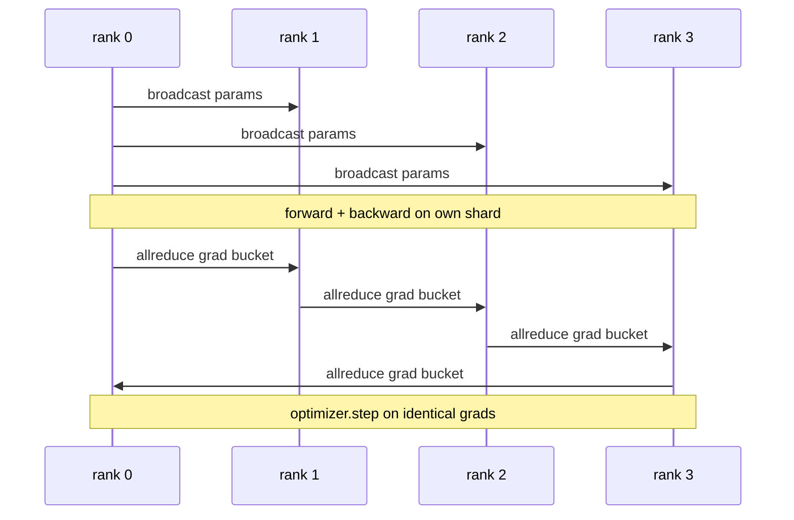

# 从头实现数据并行DDP

> DistributedDataParallel是建立在allreduce之上的一个钩子。包装模型，从rank 0广播初始参数使每个rank起始相同，在每个参数上安装反向钩子发出梯度的allreduce，其余就是梯度下降。整个模式大约200行。

**类型：** 构建
**语言：** Python
**先修知识：** 第19阶段C课程第42-49课
**时间：** ~90分钟

## 学习目标

- 编写一个`DistributedDataParallel`形状的包装器，广播初始参数并在反向传播后进行梯度的allreduce。
- 使用`DistributedDataParallel`在gloo后端上生成N个CPU进程，基于文件的集会方式。
- 通过在相同数据上顺序训练相同模型并显示每步参数等效性来证明梯度同步正确性。
- 论证使用桶（梯度融合）和重叠（反向传播期间通信）作为将工作DDP转变为生产DDP的两个变化。

## 问题

一个具有12 GB激活的10亿参数模型无法装入一块消费级GPU。即使能装下，训练也需要数周。数据并行将批次分到N个rank上，每个rank在其分片上计算前向和反向传播，每一步所有rank的梯度求和，使所有N个副本保持相同。求和后的梯度供优化器步进。

没有梯度同步，N个副本在第2步就会发散。模型不再是“一个在更多数据上训练的模型”，而是恰好共享初始权重的N个独立模型。如果梯度同步做得不好（每个参数一次allreduce，无重叠，无分桶），网络成为瓶颈，GPU空闲等待线路。DDP的技艺是使梯度同步几乎免费（相对于计算）。规范的PyTorch DDP通过将梯度分桶、将allreduce与下一层的反向传播重叠以及在NVLink上使用NCCL来实现这一点。我们可以在CPU上使用gloo完成这三件事，并学习同样的经验。

## 核心概念



### DDP需要的三个操作

|  阶段  |  集合通信  |  原因  |
|-------|-----------|-----|
|  初始化  |  从rank 0广播  |  每个rank起始相同的参数  |
|  反向传播后  |  每个梯度的allreduce  |  平均梯度供优化器步进  |
|  有时  |  缓冲区的广播  |  批归一化运行统计保持同步  |

### 为什么是均值而不是和

Allreduce-SUM除以world_size得到平均梯度。均值对world_size不变：在一个rank上调好的学习率在四个rank上同样有效，因为每步梯度大小不变。Allreduce-SUM不除的话，每次改变集群规模时都需要重新调整学习率。DDP包装SUM并做除法；本课中也这样做。

### 为什么要分桶梯度

一个变压器有数千个参数张量。每个张量一次allreduce要付出gloo延迟开销数千次。DDP将梯度分组为约25 MB的桶，每个桶发一次allreduce。相同的总字节在线路上传输，但延迟被分摊到桶上。对于本课的小模型，我们将所有内容放入一个桶；其结构是通用的。

### 为什么要固定随机种子

每个rank必须调用`torch.manual_seed(seed + rank)`进行shuffle，但`torch.manual_seed(seed)`用于参数初始化。单个共享种子意味着每个rank看到相同的批次顺序（破坏了数据并行）；针对rank的种子用于参数意味着初始参数相差浮点epsilon，梯度同步不再使副本相同。正确设置种子模式，否则参数等效性测试在第1步就会失败。

## 动手构建

`code/main.py` 实现：

- `MiniMLP`：一个3层MLP，小到能在几秒内收敛，大到足以暴露接线。
- `MiniMLP`：在构造时广播参数，返回一个包装器，其`DistributedDataParallel(model, world_size)`将累积的allreduce求和梯度除以world_size。
- `MiniMLP`：完整的训练循环，使用`MiniMLP`在gloo上初始化，前向、反向、同步、步进。
- `MiniMLP`：在单rank上顺序训练相同模型，用于测试每一步后字节级参数等效性。

运行它：

```bash
python3 code/main.py
```

输出：每步训练表，比较单进程损失和参数校验和与4个rank上的DDP运行。两条路径产生的损失曲线在浮点epsilon内相同，证明梯度同步正确。

## 实际中的生产模式

三个模式使DDP足够健壮以交付。

**发现未使用的参数。** 一些前向路径有条件地跳过参数（提前退出、混合专家路由器）。跳过的参数没有梯度，但DDP的桶就绪钩子仍然等待它们，allreduce死锁。`find_unused_parameters=True`告诉DDP在规约之前查看哪些参数获得了梯度。代价是每步进行一次图遍历，所以除非你的前向有分支，否则保持关闭。

**静态图优化。** 当前向在各步之间稳定时，`static_graph=True`让DDP预计算桶调度。该优化在大规模下很重要：预计算每步节省几毫秒，在10000步中累积。

**梯度累积需要小心。** 在不同步每个微批的情况下累积K个微批的梯度可以获得10倍吞吐量提升。DDP暴露`no_sync()`作为一个上下文管理器，暂停反向传播后的allreduce。忘记管理器就会白白allreduce K次；吞吐量降至最低。

## 使用它

生产模式：

- **PyTorch DDP。** 规范的实现。`torch.nn.parallel.DistributedDataParallel(model)`连接分桶、重叠和no_sync上下文。
- **HuggingFace Accelerate。** 添加启动器处理`torch.nn.parallel.DistributedDataParallel(model)`环境变量和模型包装。底层相同DDP。
- **Megatron-LM数据并行。** 将DDP与张量并行结合用于大模型；数据并行部分仍是allreduce-after-backward模式。

## 发布

第78课（ZeRO分片）用reduce_scatter替换每个参数的allreduce，使得每个rank只存储其优化器状态分片。第81课将DDP与ZeRO组合成端到端演示。

## 练习

1. 添加可配置大小的梯度桶，并在更深模型上测量相对于每个参数一次allreduce的加速。
2. 实现`no_sync()`作为上下文管理器，并验证梯度累积在K个微批上与单进程基线匹配。
3. 添加`no_sync()`模式，其中前向有时跳过MLP层之一；没有该标志运行时应当死锁。
4. 用`no_sync()`仅同步替换gloo，感受基于allreduce和基于屏障同步的差异。
5. 测量梯度同步开销占步时间的比例（批次大小1、16、256），并解释缩放行为。

## 关键术语

|  术语  |  人们的说法  |  实际含义  |
|------|----------------|------------------------|
|  DDP  |  "数据并行"  |  包装器，每步广播参数并对梯度进行allreduce  |
|  桶  |  "融合梯度"  |  将N个小的allreduce分组为一个大的  |
|  重叠  |  "隐藏通信"  |  在后层仍在计算反向时发出allreduce  |
|  no_sync  |  "累积"  |  跳过反向传播后的allreduce以进行梯度累积  |
|  find_unused  |  "分支前向"  |  在规约前检测没有梯度的参数  |

## 延伸阅读

- [PyTorch DistributedDataParallel docs](https://pytorch.org/docs/stable/generated/torch.nn.parallel.DistributedDataParallel.html)
- [PyTorch DistributedDataParallel docs](https://pytorch.org/docs/stable/generated/torch.nn.parallel.DistributedDataParallel.html)
- [PyTorch DistributedDataParallel docs](https://pytorch.org/docs/stable/generated/torch.nn.parallel.DistributedDataParallel.html)
- Phase 19 Lesson 76 - the collectives DDP is built on
- Phase 19 Lesson 78 - ZeRO sharding replaces the per-param allreduce with reduce_scatter
