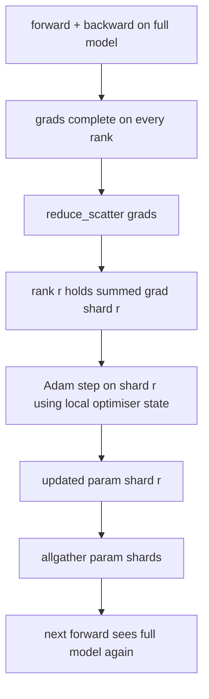

# ZeRO优化器状态分片

> Adam对每个参数存储两个动量估计，均为float32。一个7B参数的模型携带56 GB的优化器状态。ZeRO阶段1将其分片到N个rank上；每个rank拥有1/N的优化器。本地步骤后，更新后的参数分片广播回来，每个rank重建完整模型，然后开始下一步。好处是训练栈中最大单一分配上的线性内存下降。

**类型：** 构建
**语言：** Python
**先修知识：** 第19阶段C课程第42-49课
**时间：** ~90分钟

## 学习目标

- 将优化器状态（一阶动量、二阶动量、fp32主副本）分片到N个rank上，每个rank拥有1/N。
- 使用reduce_scatter只将每个rank分片的梯度总和传递给该rank，然后使用allgather广播更新后的参数分片。
- 计算阶段1、阶段2、阶段3相对于普通DDP的内存节省表。
- 根据模型大小和带宽预算论证选择阶段1、阶段2或阶段3的理由。

## 问题

普通DDP复制一切：参数、梯度和优化器状态在每个rank上完整存在。对于一个fp16的7B参数模型，这意味着每个rank有14 GB参数、14 GB梯度和28 GB优化器状态。优化器状态是最大的项，也是最容易分片的，因为它只在步骤中被触及，而不是在前向或反向中。

ZeRO阶段1分片优化器状态。每个rank持有1/N的Adam动量。反向传播后，ZeRO不是全规约全部梯度并在本地执行步骤，而是使用reduce_scatter，每个rank只接收其分片的求和梯度。该rank将优化器步骤应用于其主参数分片。然后更新后的参数分片通过allgather广播回来，每个rank拥有完整的模型用于下一次前向传播。优化器内存减少N倍。每步的通信量与DDP相同：一个reduce_scatter加一个allgather相当于一个allreduce的带宽。内存获胜，吞吐量保持不变。

## 核心概念



### ZeRO的阶段

|  阶段  |  被分片的内容  |  每个rank的内存  |  每步通信量  |
|-------|----------------|------------------|---------------|
|  DDP  |  无  |  参数+梯度+优化器  |  1x allreduce  |
|  ZeRO-1  |  优化器状态  |  参数+梯度+优化器/N  |  1x reduce_scatter + 1x allgather  |
|  ZeRO-2  |  优化器+梯度  |  参数+梯度/N+优化器/N  |  1x reduce_scatter + 1x allgather  |
|  ZeRO-3  |  优化器+梯度+参数  |  参数/N+梯度/N+优化器/N  |  每层1x allgather + 每层1x reduce_scatter  |

阶段1是最便宜的优势，因为优化器状态占主导。阶段2需要梯度分片累积逻辑，但带宽相同。阶段3（FSDP）为每个前向和反向支付每层通信，获得参数分片内存下降。本课完整实现了阶段1。

### 内存计算，实际数字

对于使用混合精度Adam训练的具有P个参数的模型：

|  项  |  普通  |  ZeRO-1  |  原因  |
|------|---------|--------|-----|
|  fp16参数  |  2P字节  |  2P字节  |  前向需要  |
|  fp16梯度  |  2P字节  |  2P字节  |  反向需要  |
|  fp32主副本  |  4P字节  |  4P/N字节  |  仅优化器使用  |
|  fp32一阶动量  |  4P字节  |  4P/N字节  |  仅优化器使用  |
|  fp32二阶动量  |  4P字节  |  4P/N字节  |  仅优化器使用  |
|  总计  |  16P字节  |  4P + 12P/N字节  |    |

当N=8时：普通16P，ZeRO-1 5.5P，降低65%。当N=64时：普通16P，ZeRO-1 4.19P，降低74%。

### 为什么reduce_scatter优于allreduce-then-shard

Allreduce给每个rank完整的求和梯度。如果只需要分片r，则已规约的梯度的(N-1)/N在rank r上被浪费。Reduce_scatter精确传递每个rank拥有的分片；每个rank的字节数与allreduce相同（因为allreduce是reduce_scatter+allgather），但后半部分被稍后的参数分片allgather替代。净通信量与DDP相同，内存被分割。

## 动手构建

`code/main.py` 实现：

- `flatten_params(module)` 和 `flatten_params(module)` 将模型参数打包成一个连续张量并解包回来。扁平布局使得按rank分片成为一个简单的切片。
- `flatten_params(module)` 拥有该rank的主副本和Adam动量分片。
- `flatten_params(module)` 在扁平梯度上执行reduce_scatter，将Adam应用于该rank的分片，并通过allgather广播更新后的参数。
- 一个演示，训练一个3层MLP 20步，并打印每步内存预算与普通DDP基线对比。

运行它：

```bash
python3 code/main.py
```

输出：每步损失和内存表，显示ZeRO-1在每个rank上持有1/N的优化器状态，与DDP的完整副本对比。

## 实际中的生产模式

三种模式使ZeRO足够健壮以用于生产。

**分片检查点很重要。** ZeRO-1的优化器状态在rank之间分割；检查点必须记录哪个rank拥有什么。第80课构建了分片检查点清单，可以在相同的world size下恢复ZeRO运行。没有它，保存的状态在重启时不可读。

**混合精度是关键。** ZeRO是一种混合精度技术；被分片的是fp32主副本。在没有混合精度的情况下运行ZeRO，会为fp32主副本支付内存税，而没有相应的fp16前向收益。生产运行总是将ZeRO与autocast或bf16权重结合。

**阶段1几乎是免费的胜利。** 通信带宽与DDP相同。内存节省与N线性相关。唯一代价是优化器分片的记账。生产栈默认使用阶段1，除非参数分片内存也成为问题；此时阶段2或3以通信换取内存。

## 使用它

生产模式：

- **DeepSpeed ZeRO.** 参考实现。`deepspeed_config.json` 选择 stage 1/2/3 和分区大小。
- **PyTorch FSDP.** PyTorch 原生等价物。`deepspeed_config.json` 是 ZeRO-2；`ShardingStrategy.SHARD_GRAD_OP` 是 ZeRO-3。
- **HuggingFace Accelerate.** 在统一配置下封装了 DeepSpeed 和 FSDP。

## 发布

第79课（流水线并行）是正交的分片轴：不是将优化器状态分片到同一模型上，而是流水线将层分片到不同 ranks 上。第81课在端到端演示中组合了 DDP + ZeRO。

## 练习

1. 通过分片梯度扩展到 ZeRO-2：每个 rank 只存储其分片的梯度，通过在反向传播后将非分片部分置零实现。
2. 添加一个内存分析器，输出 rank 0 上实际的 fp32 字节使用与公式预测的对比。
3. 测量普通 DDP 与 ZeRO-1 的每个步骤的挂壁时间，并分解为前向、反向、通信。
4. 在 ZeRO-1 下实现梯度裁剪：必须通过所有分片上的 local_norm_squared 的 allreduce 计算 L2 范数。
5. 实现一个使用 allreduce 代替 reduce_scatter 的“朴素 ZeRO”，测量线路时间差异。用数据论证 reduce_scatter 的选择。

## 关键术语

|  术语  |  人们的说法  |  实际含义  |
|------|----------------|------------------------|
|  ZeRO-1  |  “分片优化器”  |  每个 rank 持有 1/N 的 fp32 主副本 + Adam 动量  |
|  ZeRO-2  |  “也分片梯度”  |  每个 rank 还在 reduce_scatter 后丢弃非分片梯度  |
|  ZeRO-3  |  “分片参数”  |  每个 rank 持有 1/N 的 fp16 参数；在前向中每层 allgather  |
|  主副本  |  “fp32 权重”  |  优化器更新的高精度参数副本  |
|  Reduce_scatter  |  “拆分总和”  |  仅向每个 rank 传递其分片的梯度总和  |

## 延伸阅读

- [Rajbhandari et al, ZeRO: Memory Optimizations Toward Training Trillion Parameter Models](https://arxiv.org/abs/1910.02054)
- [Rajbhandari et al, ZeRO: Memory Optimizations Toward Training Trillion Parameter Models](https://arxiv.org/abs/1910.02054)
- [Rajbhandari et al, ZeRO: Memory Optimizations Toward Training Trillion Parameter Models](https://arxiv.org/abs/1910.02054)
- 第19阶段 第76课 - 本课所依赖的 reduce_scatter 和 allgather
- 第19阶段 第80课 - 分片检查点必须使用的 ZeRO 状态
