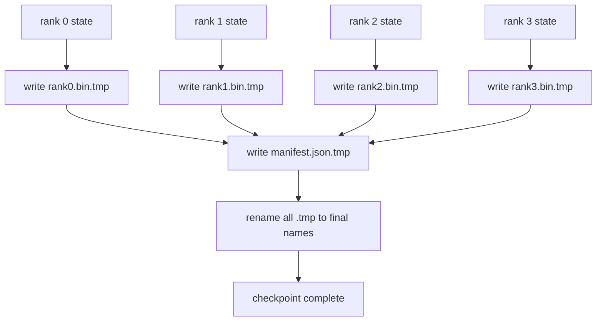

# 分片检查点(Sharded Checkpoint)与原子恢复(Atomic Resume)

> 一个70B参数训练任务每隔几小时就会因节点故障而暂停。检查点格式决定了你是损失30分钟还是30小时。分片检查点并行写入每个秩(Rank)的分片，并在清单(Manifest)中记录所有权。恢复时每个秩从其自己的文件加载分片，在相同世界大小(World Size)下重建状态，优化器步骤就像什么都没发生过一样继续。原子写入(Atomic Write)可防止不完整的检查点污染下一次恢复。

**类型：** 构建
**语言：** Python
**先修知识：** 第19阶段C课程第42-49课
**时间：** ~90分钟

## 学习目标

- 将一个多秩检查点保存为每个秩的分片文件加上一个记录哪个秩拥有什么内容的清单。
- 使用原子写入模式（写入临时路径然后重命名），这样写入中途崩溃永远不会产生不完整的检查点。
- 从清单恢复，验证所有秩上fp16参数和ZeRO优化器状态的字节相等性。
- 保护清单模式免受三种故障模式的影响：世界大小变化、分片计数不匹配和部分写入。

## 问题

普通的检查点将所有参数和优化器状态读入秩0，汇聚，并写入单个文件。对于一个70B模型，通过一个秩的网络端口传输1.1TB的状态。写入操作阻塞了所有其他秩，因为它们空闲等待汇聚。IO带宽是单个最慢GPU的网络链接，而不是总和。在实际集群上，汇聚然后写入的步骤可能比之前的一小时训练时间还要长，这意味着每个训练日能保存的检查点不到一个。

分片检查点翻转了这一模式：每个秩并行写入自己的分片到自己的文件。清单记录哪个秩拥有哪个分片，这样恢复时可以将每个分片放回原来的位置。总写入带宽随集群规模扩展。一个1TB的检查点通过单个秩需要4小时，通过64个秩只需要4分钟。此外，清单提供了一种应对不兼容恢复的契约：世界大小变化可检测，部分写入可检测，加载路径可以响亮地失败，而不是静默地使用过时数据。

## 核心概念



### 清单模式(Manifest schema)

```json
{
  "world_size": 4,
  "step": 1234,
  "wall_clock_seconds": 4521,
  "shards": [
    {"rank": 0, "path": "rank0.bin", "sha256": "...", "param_shard_offset": 0, "param_shard_numel": 65536},
    {"rank": 1, "path": "rank1.bin", "sha256": "...", "param_shard_offset": 65536, "param_shard_numel": 65536}
  ],
  "schema_version": 1
}
```

三个字段是关键的。`world_size` 使在不同大小上恢复时响亮地失败而不是静默地损坏。每个分片的 `sha256` 捕获部分或损坏的写入。每个分片的 `param_shard_offset` 和 `param_shard_numel` 让加载器在正确位置重建平坦参数张量。

### 原子写入(Atomic write)

标准模式：将每个分片写入 `<name>.tmp` ，将清单写入 `manifest.json.tmp` ，逐个fsync，然后重命名。同一文件系统内的POSIX重命名是原子的；要么新文件完全存在，要么旧文件仍然存在。最终重命名之前的崩溃会保留上一个检查点作为活动检查点。没有原子写入，崩溃可能留下一个部分分片和一个指向它的清单，从而在恢复时损坏优化器状态。

### 模式必须防御的三种故障模式

|  故障  |  症状  |  防御  |
|---------|---------|---------|
|  世界大小变化  |  在N=8上恢复时清单来自N=4  |  清单中world_size不匹配，响亮地失败  |
|  分片计数不匹配  |  恢复时看到的文件数少于清单中的分片数  |  列举分片，验证每个都存在  |
|  部分写入  |  分片文件在刷新中途被截断  |  加载时进行sha256验证  |

每种防御都尽早拒绝错误加载；替代方案是静默损坏，在100步后当损失变为NaN时才显现。

### 为什么使用每个秩的文件，而不是一个大文件

通过 `O_APPEND` 对单个文件进行并发写入在POSIX上对字节对齐写入是可行的，但实践中一个分片内的偏移跨越MB级区域，锁定开销占主导地位。每个秩的文件没有竞争，并且当底层文件系统是并行的（Lustre, GPFS）时，还可以受益于条带化。生产栈（DeepSpeed, FSDP, NeMo）都因此而使用每个秩的文件。

## 动手构建

`code/main.py` 实现：

- 一个包含上述模式加上 `to_json`/`from_json` 的 `ShardManifest` 数据类。
- 一个 `ShardManifest` ，使用原子的临时-然后-重命名模式将每个秩的二进制状态写入其自己的文件，然后写入清单。
- 一个 `ShardManifest` ，读取清单，验证每个分片的sha256，并返回每个秩的状态字典。
- 一个往返测试：构建每个秩的状态，保存，加载，断言字节相等。

运行它：

```bash
python3 code/main.py
```

输出：4个分片文件加上写入的清单，然后重新加载并进行字节相等验证。

## 实际中的生产模式

三种模式加固检查点以用于交付。

**异步写入(Async write)。** 生产栈在单独的线程或进程中发起检查点写入，以便训练继续进行。屏障在下一个检查点处：在完成前一个保存之前，不要开始下一个保存。DeepSpeed的 `async_io` 标志正是这样做的。本课保持写入同步，以便步骤可见。

**先本地快速磁盘，再异步上传。** 写入本地NVMe（快速），然后异步上传到S3或GCS。这种两层模式使集群内的检查点快速恢复，同时将持久副本发送到集群外进行归档。清单携带本地路径；上传清单携带远程路径。

**轮转(Rotation)很重要。** 生产运行保留最后K个检查点（通常3-5个），并轮换最旧的。没有轮转，磁盘会在运行中途填满，导致下一个检查点失败。有了轮转，下一个保存会先删除最旧的，释放预算。

## 使用它

生产模式：

- **DeepSpeed检查点。** `deepspeed.save_checkpoint(tag=step)` 写入每个秩的文件和一个指向活动标签的 `latest` 文件。
- **PyTorch FSDP检查点。** `deepspeed.save_checkpoint(tag=step)` 保存分片状态，并带有一个决定每个秩布局的 `latest` 。
- **NeMo。** 用统一的 `deepspeed.save_checkpoint(tag=step)` API封装DeepSpeed和FSDP，添加元数据。

## 发布

第81课保存了端到端DDP+ZeRO运行的分片检查点，并在相同世界大小上重新加载，以证明恢复契约成立。

## 练习

1. 添加异步写入：在线程中发起保存，让训练继续。阻止下一个保存直到前一个完成。
2. 添加 `last_5_steps` 轮转：保留最近的5个检查点，保存新检查点之前删除最旧的。
3. 添加仅CRC的快速验证路径用于内部循环重新加载（轮转使一个检查点成为新的活动检查点，而无需完整的sha256）。
4. 添加跨世界大小加载：读取清单，拼接，重新分片，实现从N=4到N=8的分片重新平衡。
5. 添加上传到模拟S3（第二个目录），并写入上传清单。保护两层存储策略。

## 关键术语

|  术语  |  人们的说法  |  实际含义  |
|------|----------------|------------------------|
|  分片检查点  |  "Per-rank save"  |  每个秩并行写入自己的分片文件  |
|  清单(Manifest)  |  "Index"  |  JSON文件，记录分片路径、偏移量和sha256  |
|  原子写入  |  "tmp then rename"  |  写入.tmp，然后POSIX重命名，这样崩溃时前一个文件仍然存活  |
|  部分写入  |  "Truncated shard"  |  写入期间崩溃产生损坏的分片；sha256捕获它  |
| 旋转（Rotation）  |  “保留最后K个（Keep last K）”  |  在写入新检查点之前删除最旧的检查点以限制磁盘使用量 |

## 延伸阅读

- [DeepSpeed checkpointing](https://www.deepspeed.ai/tutorials/checkpointing/)
- [DeepSpeed checkpointing](https://www.deepspeed.ai/tutorials/checkpointing/)
- [DeepSpeed checkpointing](https://www.deepspeed.ai/tutorials/checkpointing/)
- 第19阶段第78课——此检查点设计保存的ZeRO状态
- 第19阶段第81课——端到端演示对保存状态进行往返传输
