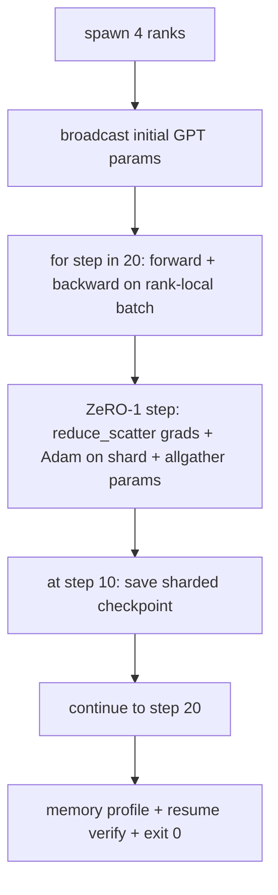

# 端到端分布式训练

> 第76至80课分别构建了一个组件。这是组合：一个微型GPT跨越4个模拟等级进行训练，使用DDP进行梯度同步，ZeRO-1进行优化器状态分片，并在中途保存了一个分片检查点。演示运行20步，自动终止，打印损失曲线和内存概况，并写入一个可恢复的检查点。

**类型：** 构建
**语言：** Python
**先修知识：** 第19阶段C课程第42-49课
**时间：** ~90分钟

## 学习目标

- 将DDP（第77课）、ZeRO-1（第78课）和分片检查点（第80课）组合成一个训练循环。
- 在一个小型合成语料库上训练一个2层Transformer语言模型，跨越4个模拟等级运行20步。
- 打印每步的损失表、每等级的内存概况，以及在相同世界大小下可字节等恢复的检查点清单。
- 证明组合：每个组件在之前的课程中独立可测试，本课程证明它们能够组合。

## 问题

毕业设计是证明各组件能够协同工作的证据。第76课实现了集合通信。第77课将其封装为DDP。第78课使用reduce_scatter对优化器状态进行了分片。第79课分析了流水线。第80课保存了分片检查点。每课独立存在并有自己的测试。实际的训练运行会同时使用所有原语；如果组合错误，损失会发散，检查点拒绝恢复，或者每等级内存本应减少时反而增加。

本课运行端到端演示并验证四个不变性：(a) 损失在20步内单调递减（在浮点噪声范围内），(b) 每一步所有等级持有相同的参数范数，(c) 每等级优化器内存等于ZeRO-1公式12P/N字节，(d) 第10步的检查点在重启时字节等恢复。演示自动终止：20步，单条命令，退出码0。

## 核心概念



### 微型GPT

模型特意设计得较小：2个Transformer块，嵌入维度32，4个注意力头，词汇量64，序列长度16，批次大小4。参数只有几千个。足够大以演练每个连接决策（多头注意力运行标准掩码路径；层归一化有权重需要同步；语言模型头是单独的线性投影回到词汇空间）。足够小使得在4个CPU等级上运行20步只需几秒。

### 组合规则

|  组件  |  负责  |  留给循环的部分  |
|--------------|--------------|----------------------------|
|  DDP广播  |  初始参数同步  |  在构造时调用一次  |
|  ZeRO-1步骤  |  梯度同步、主副本更新、参数广播  |  每步调用一次，替代optimizer.step  |
|  分片检查点  |  持久化每等级状态，包含sha256清单  |  在等级0上通过allgather收集状态后调用  |
|  训练循环  |  前向、反向、损失记录  |  按顺序调用上述三个组件  |

循环不了解reduce_scatter或会合文件。ZeRO和检查点模块暴露狭窄的接口，由循环进行组合。

### 为什么用微型GPT而不是MLP

第77课中的MLP足以验证梯度同步。微型GPT增加了三个要素：独立的语言模型头（本课中为了清晰起见不使用权重共享；完整的GPT通常将头与词嵌入共享权重）、softmax加交叉熵损失（比均方误差有更多数值边缘情况）、以及非对称前向传播（每层依次进行嵌入、注意力、MLP）。用MLP作为毕业设计会隐藏组合是否正确处理层归一化或嵌入层的梯度形状。

### 自动终止意味着退出码0

循环运行固定的20步然后退出。没有`while True`，无需人工干预，不从外部状态恢复。你可以让毕业设计无人值守地运行，并在完成后找到完整的日志，这证明系统连接正确。如果任何组件死锁，演示不会返回，测试架会检测到。

## 动手构建

`code/main.py` 实现：

- `MiniGPT`：带掩码自注意力和独立语言模型头的2层Transformer。
- `MiniGPT`：确定性的下一个词预测数据。
- `MiniGPT`：每个等级生成子进程；广播初始参数，运行循环，调用ZeRO步骤，在第10步写入分片检查点。
- `MiniGPT`：主运行后，在进程中重新加载第10步检查点，并断言保存的主分片与内存快照逐字节匹配。
- `MiniGPT`：编排整个演示，打印损失表、内存概况和验证结果。

运行它：

```bash
python3 code/main.py
```

输出：一个20行的损失表、一个4行的每等级内存概况、一个检查点清单，以及成功时的"RESUME VERIFIED"行。

## 实际中的生产模式

三个模式完善了实际运行的组合。

**每K分钟检查点，而不是每K步。** 每步时间随序列长度和微批次数量变化。10分钟的检查点节奏可以捕获相同的计算量，与模型大小无关。本课为了简单起见使用基于步的检查点；生产环境使用基于挂钟时间的检查点。

**早期检测发散。** 生产运行在反向传播后添加NaN保护器和损失尖峰检测器；如果损失在一步内跳升超过2倍，则回退到上一个检查点，而不是让优化器进入退化状态。本课的损失曲线平滑，因此保护器未使用但保留钩子。

**跨等级聚合内存概况。** 实际运行中每等级内存因等级而异（具有最大流水线阶段的等级持有更多激活）。生产环境记录跨等级的最大值和平均值；本课打印每等级以证明公式匹配。

## 使用它

生产模式：

- **DeepSpeed。** 在一个配置下组合了DDP + ZeRO + 流水线 + 激活检查点。本课的组合是DeepSpeed的微型形式。
- **PyTorch FSDP。** 原生等价物。`FullyShardedDataParallel`加上`ShardingStrategy.SHARD_GRAD_OP`相当于ZeRO-2。
- **NeMo和Megatron-LM。** 针对极大型模型增加张量并行；否则组合形式相同。

## 发布

完整课程到此结束。这6课一起构成了一个真实团队在采用DeepSpeed之前会构建的分布式训练子系统；抽象已经针对gloo进行了验证，失效模式也已经演练过。第17阶段（基础设施和生产）是将此内容应用到真实集群的地方。

## 练习

1. 添加注意力头的张量并行拆分，并验证损失与单等级基线匹配。两个等级：每等级一半的头，注意力输出的allreduce。
2. 添加跨4个微批次的梯度累积，并证明梯度等于单个大批次的梯度。
3. 添加从第10步恢复并实际继续训练到第20步的路径，并产生与原始运行相同的最终损失。
4. 添加指标导出（损失、梯度范数、每步时间）到JSONL，以便在运行后可视化。
5. 添加NaN保护器，在损失尖峰时回滚到前一个检查点，并通过单步学习率乘数强制产生尖峰以演练回滚。

## 关键术语

|  术语  |  人们的说法  |  实际含义  |
|------|----------------|------------------------|
|  端到端  |  "全部连接起来"  |  一次运行组合所有组件，而不是每个组件的单元测试  |
|  内存概况  |  "每等级GB"  |  每个等级上持有的参数、梯度、优化器状态字节数  |
|  恢复契约  |  "保存和加载"  |  检查点往返后每等级状态字节等  |
| 自终止  |  "有界运行"  |  固定步数，完成后退出0，无人工干预 |

## 延伸阅读

- [DeepSpeed end-to-end training tutorial](https://www.deepspeed.ai/getting-started/)
- [DeepSpeed end-to-end training tutorial](https://www.deepspeed.ai/getting-started/)
- [DeepSpeed end-to-end training tutorial](https://www.deepspeed.ai/getting-started/)
- 阶段19 课程76-80 - 本课中的每个片段组合
- 阶段17 - 将组合移动到真实集群
