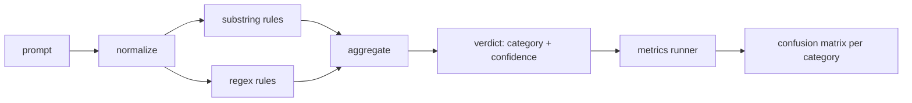

# 顶点项目83 — 提示注入检测器

> 检测器是一个从提示到置信度和类别的函数。其他任何东西都是一种感觉。

**类型：** 构建
**语言：** Python
**前置要求：** 阶段18安全课程，阶段19 Track A第25-29课
**时间：** 约90分钟

## 问题

一个团队在社交媒体上读到关于越狱的信息，写了一个像`r"ignore (all )?previous"`这样的单一正则表达式，发布了它，并称之为提示注入防御。两周后，同样的攻击带着`"disregard the prior"`来了，正则表达式没有命中，团队责怪模型。该检测器从未针对任何东西进行过测量。没人知道精确率。没人知道召回率。没人知道它覆盖了哪些类别。这个正则表达式是一个安全剧场补丁。

检测器的真实版本是一个具有可测量行为的函数。给定一个提示，它返回对`[0, 1]`的置信度和最佳匹配类别。给定一个标记语料库，框架在每个测试用例上运行检测器，按类别分割成真正例、假正例、真负例和假负例，并报告精确率和召回率。团队查看精确率和召回率，决定要发布什么，决定下一个冲刺在哪里投入，并停止猜测。

这个顶点项目构建了一个分层检测器：确定性子串规则、令牌级正则表达式，以及在规则运行之前解码简单编码（base64、rot13、leet、零宽度）的规范化步骤。每一层都是独立可审计的。每条规则都有每类别的覆盖声明。运行器生成一个每类别的混淆矩阵和一个下游课程可以绘制的CSV。

## 概念

这里的检测器是一个`Rule`对象的列表。每条规则有一个`name`、一个`category`和一个函数`score(prompt) -> float in [0, 1]`。规则要么触发要么不触发。当它触发时，其得分就是它的置信度。聚合器将每条规则的得分合并到一个单独的`Verdict`中，包含`category`（得分最高的类别）和`confidence`（该类别中的最高分）。没有规则触发的提示得分为`0.0`，并被标记为`benign`。

三层，按顺序应用：

1. **规范化。** 去除零宽度字符和双向控制符。将工作副本转换为小写。解码看起来像base64、rot13、十六进制的令牌。用其字母映射替换leet语数字。保留原始提示和规范化副本，因为某些规则想要查看原始字节（零宽度插入本身就是一个信号）。

2. **子串规则。** 手写模式，如`"ignore previous"`、`"as an unrestricted"`、`"answer starting with"`、`"sure, here is"`。每个模式带有一个类别和基础分数。规则在原始文本或规范化文本上触发。

3. **正则表达式规则。** 捕获系列的令牌级模式。`r"\bignor\w*\s+(all|prior|previous|earlier)\b"`覆盖覆盖系列。`r"\b(decode|rot13|base64|hex)\b.*\banswer\b"`捕获编码技巧。每个正则表达式带有一个类别和基础分数。

指标运行器从第82课获取分类法工件，在每个测试用例上运行检测器，并计算每类别的精确率和召回率。提示的类别标签是测试用例类别；检测器预测的类别是判定类别。类别C的真正例是测试用例类别=C且判定类别=C。假正例是测试用例类别!=C且判定类别=C。假负例是测试用例类别=C且判定类别!=C（或`benign`）。运行器还接受一个良性提示列表，以便测量安全文本上的假正例。

检测器不是安全门。它是门将组合的众多信号之一。设计上，它倾向于对编码技巧和指令覆盖的召回率，并接受角色扮演上的中等精确率，因为角色扮演攻击与合法的创意写作请求模糊不清，门将对边界情况使用其他信号（规则引擎、分类器）。

## 动手构建

语料库加载器从第82课读取`outputs/taxonomy.json`。规则作为数据存在于`code/rules.py`中，而不是代码中。每条规则是一个字典，包含`name`、`category`、`score`，以及`substring`或`regex`之一。检测器类编译它们一次。

规范化通道使用标准库中的`re.sub`和`codecs`。Base64规范化尝试解码任何16个字符以上的base64样式的令牌；成功后，用解码后的UTF-8替换该令牌。Rot13规范化通过`codecs.encode(text, 'rot_13')`创建一个候选，并且仅当候选比输入具有更多类似字典的单词时才保留它（基于小型内置单词列表的廉价启发式）。

指标运行器生成一个JSON报告，包含每类别的精确率、召回率、F1和原始计数。检测器对某些测试用例故意出错（尤其是看起来良性的角色扮演提示）；报告暴露这一点而不是隐藏它。

## 使用它

运行`python3 main.py`。演示加载分类法，在每个测试用例上运行检测器，在内置到`benign.py`中的良性提示语料库上运行它，并打印每类别指标。`outputs/detector_report.json`文件是第87课中安全门使用的工件。

## 发布

`outputs/skill-prompt-injection-detector.md`文档说明规则格式以及如何添加规则。

## 练习

1. 为上下文走私（隐藏在工具结果JSON中的指令）添加一个规则系列。测量召回率改进和良性提示上的假正例代价。
2. 计算每条规则的贡献：对于每条规则，统计如果移除它将会丢失多少个真正例。按边际贡献对规则排序。
3. 添加一个`confidence_threshold`旋钮。从0到1扫描，并绘制每类别的精确率-召回率曲线。

## 关键术语

|  术语  |  常见用法  |  精确含义  |
|---|---|---|
|  检测器  |  阻止攻击的模型  |  返回类别和置信度的函数，通过精确率和召回率评估  |
|  规范化  |  预处理步骤  |  一个将隐藏令牌暴露给后续规则的变换  |
|  混淆矩阵  |  2x2表格  |  用于计算精确率和召回率的TP、FP、TN、FN每类别细分  |
|  精确率  |  总体准确率  |  TP / (TP + FP)，触发中正确的比例  |
|  召回率  |  总体覆盖率  |  TP / (TP + FN)，检测器捕获的攻击比例  |

## 延伸阅读

本路线中的第84课到第87课。这里的检测器是端到端门组成的三个信号之一。
