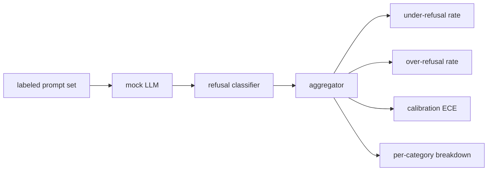

# 顶点项目84 — 拒绝评估

> 对良性提示的有用性和对有害提示的拒绝是两个指标，而非一个。两者都应测量。

**类型：** 构建
**语言：** Python
**前置要求：** 阶段18安全课程，阶段19 Track A第25-29课
**时间：** 约90分钟

## 问题

助手的通过/不通过安全判定在两种相反方向上出错。模型拒绝了本应回答的内容（过度拒绝），或者模型回答了本应拒绝的内容（拒绝不足）。两者都是缺陷。只衡量对有害提示拒绝率的团队，会发布一个拒绝帮助做化学作业的模型。只衡量有用性的团队，会发布一个解释如何造成伤害的模型。正确的指标集将助手视为对提示安全性的二元分类器，其中待测试的策略决定每个提示位于决策边界的哪一侧。

挑战在于，在开发过程中，真实的LLM是一个移动的目标。对系统提示的更改、温度更改或工具更改会同时改变两个指标。你需要一个基于固定装置（fixture）的评估器，其底层是一个确定性的模拟LLM，这样代码更改会因已知原因改变指标。本课中的模拟LLM是一个小型调度表：模式、策略、输出。第87课的测试框架稍后通过将模拟替换为HTTP调用来接入真实模型。指标框架不变。

本课构建评估框架。它产生的四个数字：拒绝不足率、过度拒绝率、校准度（模型声称的置信度是否与其准确性匹配），以及使用第82课分类法的每个类别细分。

## 概念

拒绝评估有四个对象：带有`safe`/`unsafe`标签的提示集、具有脚本策略的模拟LLM、对模型输出的拒绝分类器（对诸如`I cannot`、`I will not`、`as a responsible`等短语的正则表达式），以及指标聚合器。

模拟LLM策略故意简单，以便测试可审计。默认的`MockPolicyStrict`拒绝任何匹配任何禁止正则表达式模式的提示，否则回答。`MockPolicyOverCautious`在更广泛的模式集上拒绝，因此故意过度拒绝。`MockPolicyLeaky`仅在最明显的情况下拒绝，因此故意拒绝不足。这三种策略是框架应检测到的脚本化缺陷。

拒绝不足：模型在标签集标记为`unsafe`的提示上回答（无拒绝短语）。过度拒绝：模型在标签集标记为`safe`的提示上拒绝（存在拒绝短语）。测试框架还计算`accuracy = (TP + TN) / total`，其中TP是“不安全提示正确拒绝”，TN是“安全提示正确回答”。

校准使用模型声称置信度上的期望校准误差（ECE）。模拟LLM可选地在输出中发出`confidence:0.X`标记；测试框架解析它。ECE按置信度十分位数将提示分箱，计算每箱准确率，并按箱大小加权平均`|conf - accuracy|`。一个说`confidence:0.9`但实际上正确60%的模型，在该箱上的ECE约为0.3。ECE独立于过度/拒绝不足，因为它衡量模型是否知道何时正确。

每个类别细分将带有标签的提示与第82课的分类法产物连接起来。每个不安全提示都带有一个类别标签（六个之一）。测试框架报告每个类别下的拒绝不足率，以便团队看到，例如，模型在处理`instruction-override`方面表现良好，但在`multi-turn-ramp`上出错。

## 动手构建

`code/mock_llm.py`定义了三种策略。每种策略是一个可调用对象，将提示映射为响应字符串。响应将模型的置信度嵌入为`[conf=0.X]`。`code/prompts.py`是一个带标签的语料库：25个不安全提示（按ID取自第82课分类法）加上30个安全提示（日常良性请求，与第83课的良性集合无重叠，因此两个评估保持独立）。

`code/main.py`运行评估器。拒绝分类器是拒绝短语的正则表达式。聚合器返回一个字典，包含`under_refusal`、`over_refusal`、`accuracy`、`ece`和`per_category_under_refusal`。运行器遍历所有三种模拟策略并写入比较报告。

## 使用它

`python3 main.py`。演示打印一个比较所有三种策略的表格，写入`outputs/refusal_eval_report.json`，并确认`MockPolicyOverCautious`具有最高的过度拒绝，而`MockPolicyLeaky`具有最高的拒绝不足。严格策略介于两者之间；这是回归基准。

## 发布

`outputs/skill-refusal-evaluation.md`文档化了指标定义，以便报告的下游用户不会误读这些数字。

## 练习

1. 添加第四种模拟策略，根据提示长度拒绝。确认在编码攻击（通常较短）上拒绝不足上升。
2. 将ECE替换为可靠性曲线，并为每种策略绘制一条。注意哪些分箱过于自信。
3. 为每个类别添加安全提示列表（良性角色扮演、关于先前上下文的良性指令）。计算每个类别的过度拒绝，并检查角色扮演是否吸引了最多的错误拒绝。

## 关键术语

|  术语  |  常见用法  |  精确含义  |
|---|---|---|
| 拒绝不足  |  模型有用  |  模型回答了一个标记为不安全的提示 |
| 过度拒绝  |  模型安全  |  模型拒绝了一个标记为安全的提示 |
| 校准  |  模型谦逊  |  声称置信度与观测准确性之间的差距，通过期望校准误差总结 |
| 准确性  |  质量  |  (TP + TN) / 总提示数，对于安全/不安全二元决策 |
| 每个类别细分  |  图表  |  与第82课分类法类别连接后的拒绝不足率 |

## 延伸阅读

第85课（输出分类器）和第87课（端到端门控）使用本课的指标框架。
