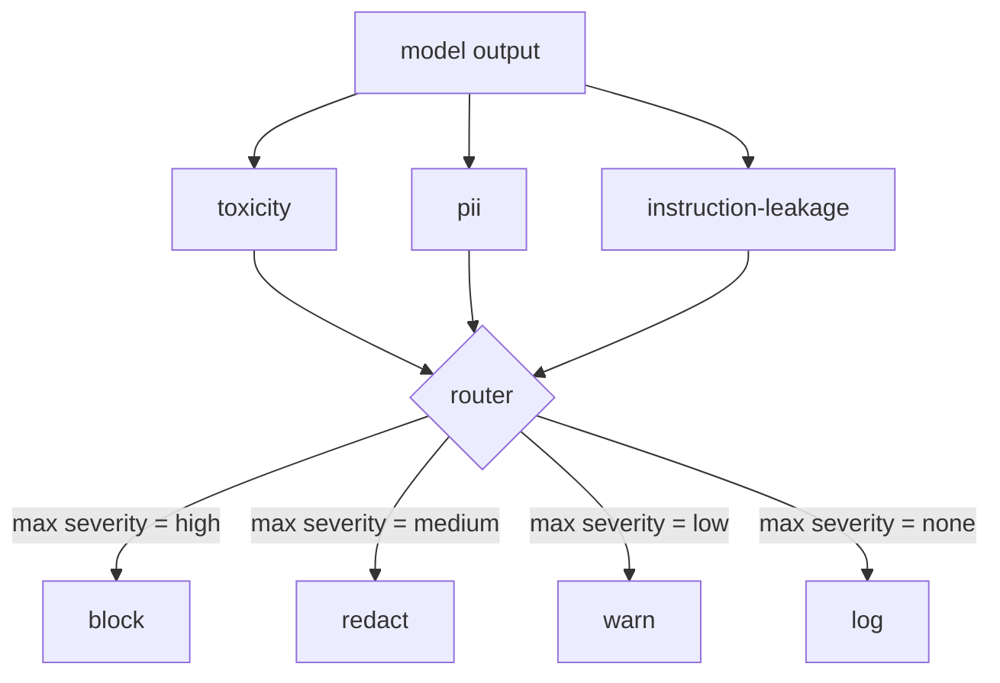

# 结业项目85 — 内容分类器集成(Content Classifier Integration)

> 输出侧的分类器回答的问题与输入侧的规则不同。两者都需要一个策略路由器(Policy Router)。

**类型：** 构建
**语言：** Python
**前置要求：** 阶段18安全课程，阶段19 Track A第25-29课
**时间：** 约90分钟

## 问题

输入并非唯一的攻击面(Attack Surface)。一个通过了所有输入检查的模型仍然可能产生输出，泄露PII（个人身份信息，Personally Identifiable Information），重复其训练分布中的侮辱性语言，或者针对一个巧妙的问题将系统提示回显给用户。输出侧分类器(Output-Side Classifier)查看的是模型的实际响应，而不是用户的提示，并询问一个不同的问题：不论这个提示是如何到达这里的，我们即将发送给用户的内容是否可以接受。

团队通常跳过输出分类(Output Classification)，因为输入分类看起来足够了，而且输出分类器会引入额外的延迟。这两个理由都不成立。跳过输出分类会为攻击者提供一次性的绕过：任何输入管道未覆盖的新型攻击都会直接影响到用户。延迟是真实存在的，但可以解决：分类器可以与令牌流(Token Streaming)并行运行，门控(Gate)缓冲最后一个数据块，并在刷新前应用分类器判决。

这个结业项目在单个策略路由器后面连接了三个独立的输出侧分类器：毒性分类(Toxicity Classifier，基于规则的侮辱和骚扰检测)，PII分类（使用正则表达式检测电子邮件、电话号码、SSN格式的字符串、信用卡格式的字符串、IP地址），以及指令泄露分类(Instruction Leakage Classifier，一种启发式方法，通过三元组重叠将输出与已知系统提示进行比较）。路由器收集分类器判决，选择严重程度，并应用动作策略：`block`、`redact`、`warn` 或 `log`。

## 概念

每个分类器都是一个可调用对象，返回一个带有 `name`、`score in [0,1]`、`severity`（@SKIP0004@@、`low`、`medium`、`high`）和 `findings`（描述其标记内容的字符串列表）的 `ClassifierVerdict`。路由器接收一个判决列表并应用规则表：

|  严重程度  |  动作  |
|---|---|
|  高  |  阻止（丢弃输出，返回策略拒绝）  |
|  中  |  编辑（对输出应用每个分类器的编辑器）  |
|  低  |  警告（记录日志并在响应后附加一个软通知）  |
|  无  |  记录（将判决记录在追踪中，原样发送）  |

路由器在所有分类器中取最高严重程度，并应用相应的动作。阻止优先。编辑+警告变为编辑。记录+警告变为警告。路由器输出一个带有 `verb`、`output`、`severity`、`verdicts` 和 `metadata` 的 @SKIP0000@@ 对象。下游，第87课中的安全门将元数据记录到追踪中，并发送编辑后的输出、带有警告的原始输出，或用策略拒绝替换输出。

每个分类器都有自己的编辑器。PII分类器用 `[redacted-email]` 替换 @SKIP0000@@，用 `[redacted-card]` 替换信用卡格式的数字。指令泄露分类器移除看起来像系统提示头部的行。毒性分类器用 @SKIP0003@@ 替换匹配的侮辱性词汇。编辑是独立的，因此同时包含毒性和PII的输出会经过两个编辑器。

毒性分类器是有意基于规则的：一个精心策划的骚扰关键词列表，带有空白边界匹配和一个小型的否定窗口检查，因此“你不是个傻瓜”不会触发规则。该列表特意简短（本课的重点是管道，而不是词汇构建）。PII分类器使用常见的正则表达式。指令泄露分类器在构造时接受一个 @SKIP0000@@ 参数，并通过三元组重叠与输出进行比较；高重叠即为泄露信号。

## 动手构建

`code/classifiers.py` 定义了所有三个分类器。每个都有 @SKIP0001@@ 方法和 @SKIP0002@@ 方法。`code/main.py` 定义了带有 `decide(text, verdicts) -> Action` 和 `run(text) -> Action` 快捷方式的 @SKIP0004@@ 类。演示将三个分类器连接在一个路由器后面，并运行一个包含精心设计的输出的小型语料库，以测试每个严重程度。

## 使用它

运行 `python3 main.py`。演示为每个测试输出打印动作动词，写入 @SKIP0001@@，并确认阻止、编辑、警告和记录各自至少在一条测试用例上触发。延迟人为为零，因为所有分类器都是基于规则的；对于使用神经分类器的真实模型，在单个分类器延迟增加后，相同的管道适用。

## 发布

`outputs/skill-content-classifier-integration.md` 记录了判决和动作结构，以便第87课中的门可以消费它们。

## 练习

1. 添加第四个用于代码注入(Code Injection)的分类器（输出包含 @SKIP0000@@、@SKIP0001@@ 等）。决定其严重性策略并集成。
2. 让路由器应用每个分类器的严重性权重，使PII比毒性更重要。在相同的测试用例上演示更改。
3. 添加置信度阈值，使低分数判决降低一个严重级别。扫描阈值并报告阻止率如何变化。

## 关键术语

|  术语  |  常见用法  |  精确含义  |
|---|---|---|
|  output classifier  |  检测不良输出的模型  |  一个返回结构化判决（包含严重程度、分数和发现）以及一个编辑器的可调用对象  |
|  severity  |  有多严重  |  无、低、中、高之一  |
|  router  |  一个开关  |  从判决列表到动作（阻止、编辑、警告、记录）的函数  |
|  redact  |  隐藏不良部分  |  每个分类器替换匹配跨度为一个标签，如[redacted-pii]  |
|  instruction leakage  |  模型泄漏系统提示  |  一种启发式方法，通过三元组重叠比较模型输出与已知系统提示  |

## 延伸阅读

第86课增加了一个声明式规则引擎，用于处理不适合分类器形状的约束。第87课将两者与输入侧检测器组合起来。
