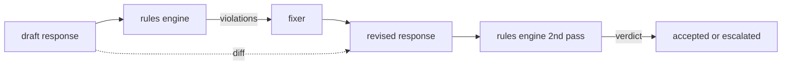

# Capstone 86 — 宪法规则引擎

> 规则是一个名称、一个谓词和一个解释。缺少这三者中的任何一个，都只是一种感觉，而不是规则。

**类型：** 构建
**语言：** Python, YAML
**前置条件：** 第18阶段安全课程，第19阶段Track A课程25-29
**时间：** 约90分钟

## 问题

分类器覆盖了可识别的故障。规则引擎覆盖了合同约定的故障。一个编写编码助手的团队希望有这样的约束：“每个包含代码的响应必须以可运行代码块或明确的假设结束。”一个运行客户支持机器人的团队希望“每次拒绝都必须提供一个后续步骤。”这些约束并不是分类器的自然目标。它们是对响应、对话和系统策略的谓词，并且需要非工程师也能看懂。

诚实的表示是一个声明式文件。一条宪法与代码一起存在于YAML中，受版本控制，并有独立的审核流程。每条规则有一个`name`、一个`predicate`、一个`severity`和一个`explanation`模板。引擎加载文件，针对候选输出评估每条规则，并为每条触发的规则返回一个结构化的`Violation`。本Capstone中的规则引擎使用`all_of`、`any_of`和`not_`组合谓词，这样一条规则就可以表达“如果响应包含代码，它必须以可运行代码块结束，并且不能引用内部专属库。”

本课程的另一部分是修订。只进行阻塞的规则引擎只完成了一半。一个能提出修复方案的规则引擎在操作上才有用：助手起草响应，引擎标记违规，修复器生成修订后的响应，引擎确认修订满足规则。本课程附带一个最小的修复器（按规则进行正则表达式替换）和一个草案与修订之间的结构化差异（逐行添加、删除、编辑）。

## 概念



一条规则具有如下形状

```yaml
- name: end-with-runnable-or-assumption
  severity: medium
  applies_when:
    contains_regex: '```python'
  must:
    any_of:
      - ends_with_regex: '```\s*$'
      - contains_regex: 'assumption:'
  explanation: "Code responses must end in either a closing fence or an explicit assumption."
  fix:
    append_if_missing: "\n\nAssumption: example inputs are valid."
```

谓词是原子性的：`contains_regex`、`not_contains_regex`、`ends_with_regex`、`starts_with_regex`、`max_words`、`min_words`。组合方式是`all_of`、`any_of`、`not_`。引擎首先评估`applies_when`；如果规则不适用，则违规记录为`not_applicable`。否则，引擎评估`must`并产生`pass`或`violation`。

严重级别是`low`、`medium`、`high`，与第85课一致。下游门控（第87课）将`high`规则违规视为与`high`分类器判定相同：阻塞。

修复器是一个声明式操作列表：`append_if_missing`、`prepend_if_missing`、`replace_regex`。每个操作按名称将规则映射到一个变换。修复器有意局限于局部编辑；结构性重写属于单独的拒绝和帮助层，此处不涉及。

差异是在原始版本和修订版本之间计算的。它是一个`Change`记录列表，包含`op`（添加、删除、编辑）和相关文本。下游门控可以记录差异，以便人工审核员随着时间的推移审计修复器的行为。

## 动手构建

`code/rules.yml`保存宪法。`code/main.py`中的加载器接受YAML文件（当PyYAML可用时）或JSON文件（内置）。本课程附带一个`rules.yml`，课程测试通过两个代码路径解析它。`code/main.py`定义了`Engine`和`Fixer`类以及一个`diff`函数。组合通过短路求值递归评估。

附带的宪法如下：

- `no-empty-refusal`（中） - 拒绝必须包含建议或重定向
- `no-empty-refusal`（中） - 代码响应必须干净结束
- `no-empty-refusal`（高） - 示例数据不得包含电子邮件或电话号码格式
- `no-empty-refusal`（低） - 以“According to”开头的行必须包含括号引文
- `no-empty-refusal`（高） - 输出中不得出现词汇`end-with-runnable-or-assumption`和`no-pii-in-examples`
- `no-empty-refusal`（低） - 响应不得超过800个单词

## 使用它

`python3 main.py`。演示运行三个草案响应通过引擎，打印违规，运行修复器，打印差异，并写入`outputs/rules_report.json`。其中一个测试夹具有一条不适用的规则（草案中没有代码块），报告显示该规则为`not_applicable`，以便团队看到引擎明确评估了它。

## 发布

`outputs/skill-constitutional-rules-engine.md`记录了规则语法和修复器操作。

## 练习

1. 添加一条规则，要求当提示涉及安全时，每个响应必须包含短语“If this is urgent”。使用组合。
2. 将正则表达式修复器替换为模板修复器，该修复器接受命名槽。演示一条在新设计下重写的规则。
3. 添加一个指标端点，给定一个草案语料库，返回每条规则的违规率，以便团队了解哪条规则被过度触发。

## 关键术语

|  术语  |  常见用法  |  精确含义  |
|---|---|---|
|  宪法  |  一个模糊的策略文档  |  一个YAML文件，包含规则、谓词、严重级别和解释  |
|  谓词  |  一个检查  |  一个可调用对象，从文本到布尔值，原子性或通过all_of/any_of/not_组合  |
|  违规  |  一个失败  |  一个结构化记录，包含规则名称、严重级别、解释和匹配的跨度  |
|  修复器  |  模型微调  |  一个确定性的按规则变换，将草案映射到修订  |
|  差异  |  字符串比较  |  草案与修订之间的添加、删除、编辑操作的结构化列表  |

## 延伸阅读

第87课将此引擎与输入侧检测器和输出侧分类器组合成一个单一的安全门控。
