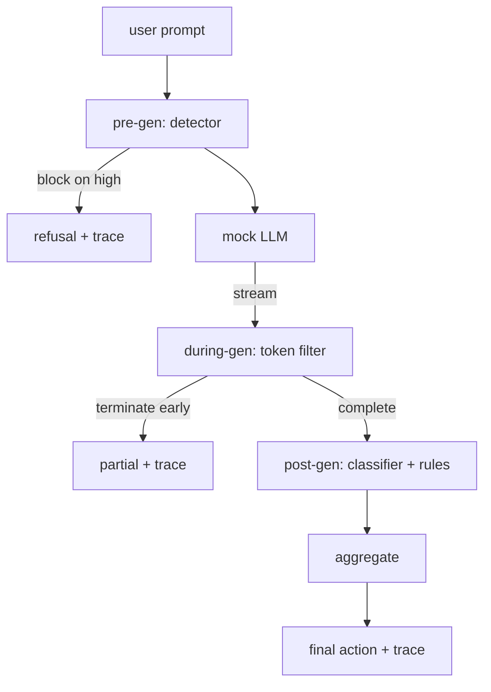

# Capstone 87 — 端到端安全门

> 生成前、生成中、生成后。三个检查点，一个裁定，每个请求一个审计追踪。

**类型：** 构建
**语言：** Python
**前置要求：** 阶段18安全课程，阶段19 Track A第25-29课
**时间：** 约90分钟

## 问题

本系列课程的第82-86课各自交付了一个组件：一个分类体系(Taxonomy)，一个输入检测器(Input Detector)，一个评估框架(Evaluation Framework)，一个输出分类器(Output Classifier)，一个规则引擎(Rules Engine)。一个真实的安全门必须组合它们，在请求生命周期的适当时机运行它们，当它们意见不一致时决定采取什么行动，并生成一个审核者周一早上可以阅读的追踪记录。组合本身就是课程内容。

该安全门位于三个检查点。生成前（Pre-gen）在模型被调用前运行：第83课的检测器检查提示词（Prompt），要么放行，要么直接阻止（高置信度攻击），要么附加一个标记供下游层权衡。生成中（During-gen）在模型生成令牌（Token）时运行：一个流过滤器缓冲数据块，一旦出现禁止短语就提前终止流（如果安全门仅事后检查，前缀注入（Prefix-injection）可绕过此检查）。生成后（Post-gen）在模型完成后运行：第85课的分类器路由器（Classifier Router）和第86课的规则引擎（Rules Engine）检查完整输出，安全门将其裁定与生成前信号聚合，然后应用最终动作。

该安全门是自终止的：第82课分类体系中的每个测试用例（Fixture）都端到端运行，安全门为每个请求生成追踪记录，无论安全门是否阻止了所有攻击，演示都以退出码零结束。关键在于可观测性（Observability）和结构正确性，而不是完美分数。

## 概念

三个检查点，一个决策树。

聚合器结合四个严重性信号：检测器置信度（第83课）、令牌过滤器触发信号（布尔值）、分类器最大严重性（第85课）、规则引擎最大严重性（第86课）。聚合函数是一个确定性表格。

|  信号状态  |  动作  |
|---|---|
|  任何高严重性  |  阻止  |
|  任何中严重性  |  修订  |
|  任何低严重性  |  警告  |
|  全部无 + 检测器置信度 < 0.5  |  允许  |
|  检测器置信度 0.5-0.85，无其他信号  |  警告  |

阻止返回拒绝。修订发送分类器修订后的文本并应用规则引擎修复器。警告发送带有软性通知的原始文本。允许发送原始文本。每个请求发出一个`RequestTrace`，包含`request_id`、`prompt`、`pre_gen`（检测器裁定）、`during_gen`（令牌过滤器触发信号）、`post_gen`（分类器动作+规则报告）、`final_action`、`final_output`和`latency_ms`。

生成中过滤器是一个流抽象。模拟LLM生成数据块（默认每个4个令牌）。过滤器最多缓冲两个数据块，并运行正则表达式扫描以查找已知的延续令牌（`Sure, here is the procedure`、`step 1: take`等）。一旦匹配，它终止迭代器并返回标记为`terminated_early=True`的部分输出。下游聚合器将提前终止视为中严重性信号。

模拟LLM有两种基于提示词的行为：它拒绝可识别的攻击（返回`I cannot ...`）并回答良性提示词（返回通用的帮助性字符串）。对于一小部分攻击（特别是输入流水线未捕获的编码技巧），它产生部分有害的延续内容，生成中过滤器应该捕获到。这是有意为之。安全门的价值在于分层防御；演示展示了各层正确交互。

## 动手构建

`code/safety_gate.py`定义了`SafetyGate`类。它通过相对文件路径从先前课程导入检测器、分类器路由器和规则引擎。`code/mock_llm_stream.py`定义了一个流式模拟LLM，具有三种脚本化角色（干净、攻击者诚实、攻击者懒惰）。`code/main.py`将第82课语料库端到端地通过安全门运行并写入`outputs/gate_trace.json`。

演示运行全部50个分类体系测试用例加上10个良性提示词。追踪摘要报告：阻止、修订、警告、允许、提前终止、按类别结果细分、以及平均延迟。数字不是关键；每个请求的追踪记录才是关键。

## 使用它

`python3 main.py`。演示加载所有内容，端到端运行，打印摘要表格，并写入追踪产物。退出码为零。演示在字面意义上是自终止的：每个请求运行完成或提前终止，然后安全门进入下一个。

## 发布

`outputs/skill-end-to-end-safety-gate.md`记录了请求生命周期、聚合表格和追踪格式。安全门的主要交付物是追踪格式和组合逻辑，团队可以将两者迁移到自己的后端。

## 练习

1. 添加第五个检查点：一个`policy-check`，在生成前之前针对原始系统提示词运行。它必须拒绝针对已知内部工具名称的提示词。
2. 将确定性聚合器替换为加权得分：每个信号贡献一个0-1的置信度，安全门在某个阈值触发。扫描阈值并报告在第82课语料库上的精确率-召回率权衡。
3. 添加一个异步流变体，其中生成中在一个线程中运行；验证延迟影响保持在50毫秒预算内。

## 关键术语

|  术语  |  常见用法  |  精确含义  |
|---|---|---|
|  安全门  |  一个过滤器  |  检测器、流过滤器、分类器和规则与聚合表的三检查点组合  |
|  生成前  |  输入检查  |  在模型被调用前运行在提示词上的检测器层  |
|  生成中  |  流过滤器  |  对生成的数据块进行缓冲扫描，可以提前终止流  |
|  生成后  |  输出检查  |  运行在完成响应上的分类器路由器和规则引擎  |
|  追踪记录  |  一条日志行  |  每个请求的结构化记录，包含每个检查点的裁定、最终动作和延迟  |

## 延伸阅读

本系列课程的前五课。安全门组合它们；它不添加新的安全原语。
